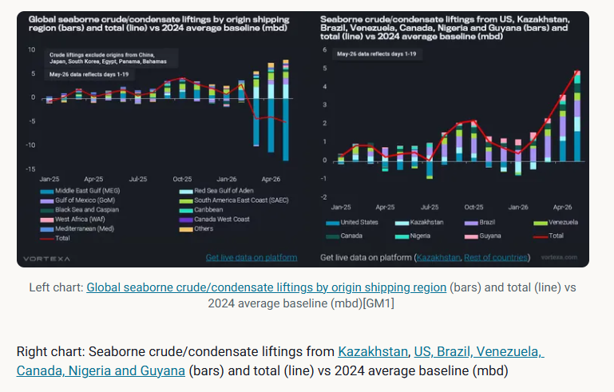
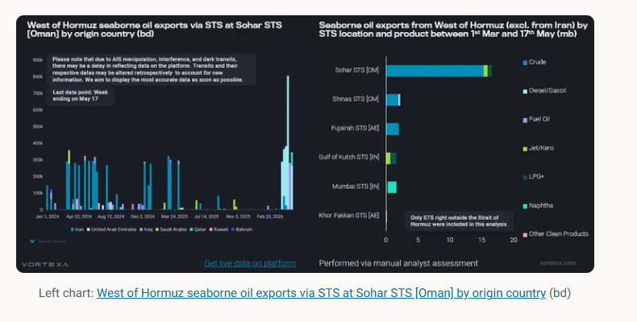
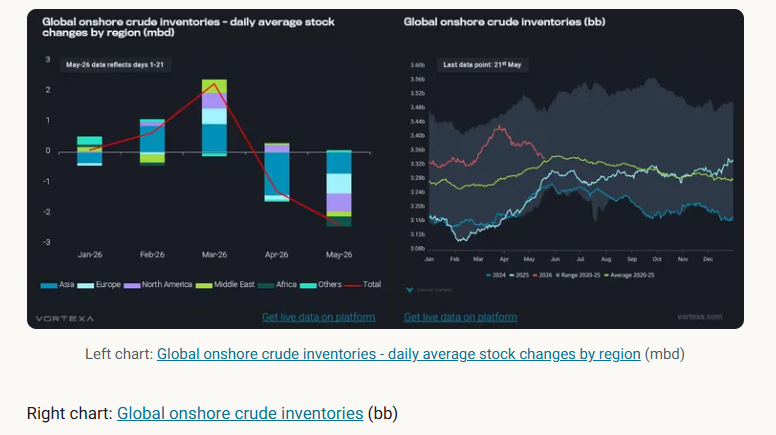

# 3 months into the conflict: What’s new?

**Date:** May 22, 2026  
**Publisher:** Breakwave Advisors | **Category:** Market Insights  
**Original URL:** [https://www.breakwaveadvisors.com/insights/2026/5/22/3-months-into-the-conflict-whats-new](https://www.breakwaveadvisors.com/insights/2026/5/22/3-months-into-the-conflict-whats-new)  

---

This article examines some of the repercussions after almost three months into the conflict

*By*[*Xavier Tang*](https://www.linkedin.com/in/xavier-tang/)

Following up on[my previous article](https://www.vortexa.com/insights/hormuz-blockade-requires-stockdraws)about the loss of oil supplies from the Strait of Hormuz, this article examines some of the repercussions after almost three months into the conflict and reflects on how seaborne flows and crude inventories have evolved since then. In this analysis, the 2024 average will serve as the baseline to standardise exports and imports for comparison.

Despite the record loss in oil exports via the Strait of Hormuz, Brent front-month futures have remained mostly rangebound between $90/bbl and $115/bbl since the conflict began, suggesting the market is now pricing oil within a new range relative to pre-conflict levels, as long as the supply disruption continues. From a supply perspective, the net-loss in global crude/condensate liftings (excluding re-export origins) between March and May has stabilised at around -4 mbd relative to the 2024 average baseline (see chart below). These volumes would have been more adverse if compared to the 2025 average baseline, as crude liftings increased last year.

The additional supplies from the rest of the world outside the Middle East Gulf have contributed significantly to covering the shortfall in crude/condensate supplies. Notably, the redirection of pipeline flows via the Red Sea was by far the largest contributor, though it does not constitute additional supply to the market; rather, it reduces supply loss. Other regions such as the Gulf of Mexico, South America East Coast, Black Sea and Caspian, Caribbean, and West Africa contributed about 80% of the increases in overall crude/condensate liftings (excluding from the Red Sea). Most of this growth in May came from seven countries: US, Kazakhstan, Brazil, Venezuela, Canada, Nigeria and Guyana (see chart).

[US crude/condensate sendout](https://analytics.vortexa.com/Flows?dateRange=2016-01-01T00%3A00%3A00.000Z__2026-05-18T23%3A59%3A59.999Z&filtersEnabled=%5B%22p%22%2C%22o%22%2C%22d%22%2C%22d_r%22%2C%22v%22%2C%22intra_d%22%2C%22sts_o%22%2C%22c_o%22%2C%22w%22%5D&from=%5B%222d92cc08f22524dba59f6a7e340f132a9da0ce9573cca968eb8e3752ef17a963%22%5D&intraMovementDropdown=all&metric=bpd&page=Flows&products=%5B%2254af755a090118dcf9b0724c9a4e9f14745c26165385ffa7f1445bc768f06f11%22%5D&tabId=61cafa26-5e5c-4635-ad46-7a7aed607d01&timeSeriesBaselineEnd=2024-12-31T23%3A59%3A59.999Z&timeSeriesBaselineStart=2024-01-01T00%3A00%3A00.000Z&timeSeriesProperty=product_group&tsAnalysisTotalToggle=1&v=3)hit record highs in May, largely due to SPR releases, which will bring additional supplies to the market at least through June ([Read more here](https://analytics.vortexa.com/InsightsHubPage?articleId=FJEA8d4w8oym95iKpJrEw&articleType=highlight&authorFilters=%5B%226TWPJMfzNLv5dR7pNOvzhv%22%5D&categoryFilters=%5B%22article%22%2C%22highlight%22%5D&page=InsightsHubPage&searchTerm=&tabId=184bc451-c0a7-4065-a23c-b533b8459744)). Kazakhstan increased its crude production by 16% m-o-m in April, supported by higher output at Tengiz (Reuters), while[Venezuela secured additional naphtha imports](https://analytics.vortexa.com/Flows?dateRange=2025-01-01T00%3A00%3A00.000Z__2026-05-18T23%3A59%3A59.999Z&filtersEnabled=%5B%22p%22%2C%22o%22%2C%22d%22%2C%22d_r%22%2C%22v%22%2C%22intra_d%22%2C%22sts_o%22%2C%22c_o%22%2C%22w%22%5D&intraMovementDropdown=all&metric=bpd&page=Flows&products=%5B%223e4db72ef7027de928ce55703a213a546fd86d2debe6f2e9c85f3a5f9d53e8dd%22%5D&tabId=61cafa26-5e5c-4635-ad46-7a7aed607d01&timeSeriesBaselineEnd=2024-12-31T23%3A59%3A59.999Z&timeSeriesBaselineStart=2024-01-01T00%3A00%3A00.000Z&timeSeriesProperty=origin_country&to=%5B%22a1acb291bb339d07faa0d9c7b62ea292aa0ea1a01813b26c890aeeb4e2334b09%22%5D&tsAnalysisTotalToggle=1&v=3)for use as a diluent, enabling the country to increase its crude exports. The rest of the countries may have ramped up their crude production to supply more volumes to the market; however, it remains to be seen whether the trend can be sustained in the months ahead.

> **Figure 1: Στιγμιότυπο Οθόνης 2026 05 22 133956**  
> **Interactive Data & Source:** [Analytics Vortexa](https://analytics.vortexa.com/Flows?dateRange=2024-01-01T00%3A00%3A00.000Z__2026-05-19T23%3A59%3A59.999Z&filtersEnabled=%5B%22p%22%2C%22o%22%2C%22d%22%2C%22d_r%22%2C%22v%22%2C%22intra_d%22%2C%22sts_o%22%2C%22c_o%22%2C%22w%22%5D&metric=bpd&movementEvent=unloading_start&page=Flows&products=%5B%2254af755a090118dcf9b0724c9a4e9f14745c26165385ffa7f1445bc768f06f11%22%5D&tabId=61cafa26-5e5c-4635-ad46-7a7aed607d01&timeSeriesBaselineEnabled=1&timeSeriesBaselineEnd=2024-12-31T23%3A59%3A59.999Z&timeSeriesBaselineStart=2024-01-01T00%3A00%3A00.000Z&timeSeriesProperty=destination_region&v=3) | [Local Asset](file:///C:/Users/Dell/Github/Shipping/corpus/03-breakwave/insights/2026/assets/2026-05-22_3-months-into-the-conflict-whats-new_img_cea3cf84ceb9ceb3cebcceb9cf8ccf84cf85_7833a4842264.png)

## Middle East Countries Turn to Sts Right Outside Hormuz for Oil Sales

Since the conflict began, vessel transits through the Strait of Hormuz have fallen sharply, as vessel owners and operators are unwilling to take the risk of entering the waterway and becoming stuck there. As a result, oil sales have plunged drastically despite massive discounts offered by some Middle Eastern companies (Reuters).

Middle Eastern countries have begun turning to ship-to-ship transfers (STS) outside the Strait of Hormuz, including STS zones in Oman, the UAE, and India. Sohar became the most popular STS hotspot among others due to lower vessel traffic compared to Fujairah and its proximity to the Strait of Hormuz. The STSes conducted in these areas helped mitigate the buyer's risk of loading from within the Strait of Hormuz, as most oil cargoes are sold on an FOB basis.

UAE was the first country to implement this strategy for its crude sales, offering Upper Zakum to the market via STS at Fujairah (Argus), though most of these STSes were conducted at Sohar instead. These extra supplies from STSes helped alleviate tightness in both the crude and oil products supplies, especially since Asian refiners are currently short of medium-sour crude from the Middle East. Since then, other countries such as Iraq and Qatar have followed suit, and hopefully, more oil supplies could be brought to market.

> **Figure 2: Στιγμιότυπο Οθόνης 2026 05 22 134044**  
> **Interactive Data & Source:** [Analytics Vortexa](https://analytics.vortexa.com/Flows?dateRange=2024-01-01T00%3A00%3A00.000Z__2026-05-19T23%3A59%3A59.999Z&filtersEnabled=%5B%22p%22%2C%22o%22%2C%22d%22%2C%22d_r%22%2C%22v%22%2C%22intra_d%22%2C%22sts_o%22%2C%22c_o%22%2C%22w%22%5D&metric=bpd&movementEvent=unloading_start&page=Flows&products=%5B%2254af755a090118dcf9b0724c9a4e9f14745c26165385ffa7f1445bc768f06f11%22%5D&tabId=61cafa26-5e5c-4635-ad46-7a7aed607d01&timeSeriesBaselineEnabled=1&timeSeriesBaselineEnd=2024-12-31T23%3A59%3A59.999Z&timeSeriesBaselineStart=2024-01-01T00%3A00%3A00.000Z&timeSeriesProperty=destination_region&v=3) | [Local Asset](file:///C:/Users/Dell/Github/Shipping/corpus/03-breakwave/insights/2026/assets/2026-05-22_3-months-into-the-conflict-whats-new_img_cea3cf84ceb9ceb3cebcceb9cf8ccf84cf85_747b55c370b5.png)

## Global Onshore Crude Stock Draws Continue to Accelerate in May

Global onshore crude inventories grew by 2.2 mbd in March, with increases across Asia, Europe, North America, and the Middle East. Middle East crude stocks grew by 460kbd as crude liftings stalled due to the disruption at the Strait of Hormuz, before crude production was cut to allow some spare capacity to ramp up once the Strait of Hormuz is reopened.

The gains seen in global onshore inventories from the first three months of the year have been utilised in April and May, with volumes falling to the 6-year seasonal average. Asian countries were among the first to tap their onshore crude inventories and strategic petroleum reserves to cover their supply shortfalls in April, as the[massive loss of crude imports over the past two months](https://analytics.vortexa.com/Flows?dateRange=2024-01-01T00%3A00%3A00.000Z__2026-05-19T23%3A59%3A59.999Z&filtersEnabled=%5B%22p%22%2C%22o%22%2C%22d%22%2C%22d_r%22%2C%22v%22%2C%22intra_d%22%2C%22sts_o%22%2C%22c_o%22%2C%22w%22%5D&metric=bpd&movementEvent=unloading_start&page=Flows&products=%5B%2254af755a090118dcf9b0724c9a4e9f14745c26165385ffa7f1445bc768f06f11%22%5D&tabId=61cafa26-5e5c-4635-ad46-7a7aed607d01&timeSeriesBaselineEnabled=1&timeSeriesBaselineEnd=2024-12-31T23%3A59%3A59.999Z&timeSeriesBaselineStart=2024-01-01T00%3A00%3A00.000Z&timeSeriesProperty=destination_region&v=3)was concentrated in Asia.

In May, the stock draw spread to other regions, including North America, Europe, and Africa. North American refiners were ramping up their runs to peak utilisation rates amid strong refinery margins, processing more crude and supplying more refined products to the market. As a result,[North America refined product exports on a 28-day moving average](https://analytics.vortexa.com/Flows?dateRange=2025-01-01T00%3A00%3A00.000Z__2026-05-19T23%3A59%3A59.999Z&filtersEnabled=%5B%22p%22%2C%22o%22%2C%22d%22%2C%22d_r%22%2C%22v%22%2C%22intra_d%22%2C%22sts_o%22%2C%22c_o%22%2C%22w%22%2C%22sts%22%5D&frequency=day&from=%5B%22ae06d7e47d6ca2a5bcd7625b8ad402d39e5e92fcc740157dc3301a6d2a6bb207%22%5D&metric=bpd&page=Flows&products=%5B%22b68cbb746f8b9098c50e2ba36bcad83001a53bd362e9031fb49085d02c36659c%22%2C%225de0b00094e0fd7542c10f9f8a71b4008d55750f21dc905cda9b0f7f5f76bc08%22%5D&productsExcluded=%5B%22364ccbb996c944055b479810a8e74863267885dc1b01407cb0f00ab26dafe1e1%22%2C%22cbb5acffa542aad31d26712a8cdfd9884301aa7658ac95c40f86ddb31bc29d9b%22%2C%22a75fcc09bfc7d16496de3336551bc52b5891838bb7c22356d2cb65451587d1e5%22%5D&tabId=61cafa26-5e5c-4635-ad46-7a7aed607d01&timeSeriesBaselineEnd=2025-12-31T23%3A59%3A59.999Z&timeSeriesBaselineStart=2024-01-01T00%3A00%3A00.000Z&timeSeriesChartView=seasonal&timeSeriesProperty=product_group_product&tsAnalysisTotalToggle=1&tsSeasonalMovingAvg=1&tsSeasonalMovingAvgWindow=28d&v=3)exceeded seasonal highs since late March and continued to hit record highs in April. At the same time, the US SPR release program brought[US crude/condensate exports](https://analytics.vortexa.com/Flows?dateRange=2025-01-01T00%3A00%3A00.000Z__2026-05-19T23%3A59%3A59.999Z&filtersEnabled=%5B%22p%22%2C%22o%22%2C%22d%22%2C%22d_r%22%2C%22v%22%2C%22intra_d%22%2C%22sts_o%22%2C%22c_o%22%2C%22w%22%2C%22sts%22%5D&frequency=day&from=%5B%222d92cc08f22524dba59f6a7e340f132a9da0ce9573cca968eb8e3752ef17a963%22%5D&metric=bpd&page=Flows&products=%5B%2254af755a090118dcf9b0724c9a4e9f14745c26165385ffa7f1445bc768f06f11%22%5D&tabId=61cafa26-5e5c-4635-ad46-7a7aed607d01&timeSeriesBaselineEnd=2025-12-31T23%3A59%3A59.999Z&timeSeriesBaselineStart=2024-01-01T00%3A00%3A00.000Z&timeSeriesChartView=seasonal&timeSeriesProperty=origin_country&tsAnalysisTotalToggle=1&tsSeasonalMovingAvg=1&tsSeasonalMovingAvgWindow=28d&v=3)to record highs, further eroding crude stocks in North America.

In Asia, May was the first time[China shielded its crude supply shortfall with onshore crude stocks](https://analytics.vortexa.com/Flows?dateRange=2025-01-01T00%3A00%3A00.000Z__2026-05-19T23%3A59%3A59.999Z&filtersEnabled=%5B%22p%22%2C%22o%22%2C%22d%22%2C%22d_r%22%2C%22v%22%2C%22intra_d%22%2C%22sts_o%22%2C%22c_o%22%2C%22w%22%2C%22sts%22%5D&frequency=day&from=%5B%22ae06d7e47d6ca2a5bcd7625b8ad402d39e5e92fcc740157dc3301a6d2a6bb207%22%5D&metric=bpd&page=Flows&products=%5B%22b68cbb746f8b9098c50e2ba36bcad83001a53bd362e9031fb49085d02c36659c%22%2C%225de0b00094e0fd7542c10f9f8a71b4008d55750f21dc905cda9b0f7f5f76bc08%22%5D&productsExcluded=%5B%22364ccbb996c944055b479810a8e74863267885dc1b01407cb0f00ab26dafe1e1%22%2C%22cbb5acffa542aad31d26712a8cdfd9884301aa7658ac95c40f86ddb31bc29d9b%22%2C%22a75fcc09bfc7d16496de3336551bc52b5891838bb7c22356d2cb65451587d1e5%22%5D&tabId=61cafa26-5e5c-4635-ad46-7a7aed607d01&timeSeriesBaselineEnd=2025-12-31T23%3A59%3A59.999Z&timeSeriesBaselineStart=2024-01-01T00%3A00%3A00.000Z&timeSeriesChartView=seasonal&timeSeriesProperty=product_group_product&tsAnalysisTotalToggle=1&tsSeasonalMovingAvg=1&tsSeasonalMovingAvgWindow=28d&v=3)since the conflict began, while other[Northeast Asian countries have tapped into their onshore crude stocks](https://analytics.vortexa.com/Flows?dateRange=2025-01-01T00%3A00%3A00.000Z__2026-05-19T23%3A59%3A59.999Z&filtersEnabled=%5B%22p%22%2C%22o%22%2C%22d%22%2C%22d_r%22%2C%22v%22%2C%22intra_d%22%2C%22sts_o%22%2C%22c_o%22%2C%22w%22%2C%22sts%22%5D&frequency=day&from=%5B%222d92cc08f22524dba59f6a7e340f132a9da0ce9573cca968eb8e3752ef17a963%22%5D&metric=bpd&page=Flows&products=%5B%2254af755a090118dcf9b0724c9a4e9f14745c26165385ffa7f1445bc768f06f11%22%5D&tabId=61cafa26-5e5c-4635-ad46-7a7aed607d01&timeSeriesBaselineEnd=2025-12-31T23%3A59%3A59.999Z&timeSeriesBaselineStart=2024-01-01T00%3A00%3A00.000Z&timeSeriesChartView=seasonal&timeSeriesProperty=origin_country&tsAnalysisTotalToggle=1&tsSeasonalMovingAvg=1&tsSeasonalMovingAvgWindow=28d&v=3)since April. Even though[Europe onshore crude stocks](https://analytics.vortexa.com/OnShoreCrudeInventories?dateRange=2024-01-01T00%3A00%3A00.000Z__2026-05-21T23%3A59%3A59.999Z&frequency=day&multiSelect=1&onshoreInventoriesLocations=%5B%22934c47f36c16a58d68ef5e007e62a23f5f036ee3f3d1f5f85a48c572b90ad8b2%22%2C%225e0cb0b66780a00576309aecff1b65934fc580d775bab29ac2a79397d8544e04%22%2C%2270425373a1836d6d0390dc6fef838a468717fba7776d66065a5043488f9f041b%22%2C%22bcd7dddaf951959ebf6076a3a594b426a246d3bffe13339b10d04e45f222e011%22%2C%2250182d9d05051a6c8d24f0514d4ee828da6eaa29eacbb11cfe368f51526328ce%22%2C%227fed43c640957555ddac588be64822538078409a0acdaf22126623203ef9954a%22%2C%22e1638e7a3cb9bd9c9b75f8903770c6fb3abe09f3aebca59447b2750c73b77fd5%22%2C%22b15970adfcd316d11d698d13de23e2291a60e1fb05070feab30957c6645e576e%22%2C%223267ef2a83a749052c87e981f1bb12c6396acf590b4b1cd3316cf8f8c5aeb7bc%22%2C%22612eeab9024bfb733a1bb626524d40d7ace1c637097bf76d36d9395e269f4170%22%2C%22833d6983cdb9e4c6c12bf3022bdae163f91a51f1cf9876c955137e5f996f9763%22%5D&page=OnShoreCrudeInventories&selectedRegion=%5B%22934c47f36c16a58d68ef5e007e62a23f5f036ee3f3d1f5f85a48c572b90ad8b2%22%5D&tabId=dc121c50-76ac-4e63-b8ca-b3343b38e79f&tsVisualType=seasonal)fell by about 650kbd in May, current volumes seem to follow seasonal trends observed over the past two years, suggesting that the stock draws in Europe are probably a function of seasonality.

> **Figure 3: Στιγμιότυπο Οθόνης 2026 05 22 134132**  
> **Interactive Data & Source:** [Analytics Vortexa](https://analytics.vortexa.com/Flows?dateRange=2024-01-01T00%3A00%3A00.000Z__2026-05-18T23%3A59%3A59.999Z&filtersEnabled=%5B%22p%22%2C%22o%22%2C%22d%22%2C%22d_r%22%2C%22v%22%2C%22intra_d%22%2C%22sts_o%22%2C%22c_o%22%2C%22w%22%5D&metric=bpd&movementEvent=unloading_start&page=Flows&products=%5B%22deda35eb9ca56b54e74f0ff370423f9a8c61cf6a3796fcb18eaeeb32a8c290bb%22%2C%229256907ba7e4ed11ff03aa297a7e62e14484ce5a85c8118c7495b9120ad0e268%22%2C%22d72edbab2b5e2e249d8c216909945922a02eb017dd200f90876fee6fa180c743%22%5D&tabId=61cafa26-5e5c-4635-ad46-7a7aed607d01&timeSeriesBaselineEnabled=1&timeSeriesBaselineEnd=2024-12-31T23%3A59%3A59.999Z&timeSeriesBaselineStart=2024-01-01T00%3A00%3A00.000Z&timeSeriesChartView=seasonal&timeSeriesProperty=product_group_product&to=%5B%2267be333ea46a3cd312e207b05e2c5c4502a9353e39ec81642a93e3b23cc3c10a%22%5D&tsAnalysisTotalToggle=1&v=3) | [Local Asset](file:///C:/Users/Dell/Github/Shipping/corpus/03-breakwave/insights/2026/assets/2026-05-22_3-months-into-the-conflict-whats-new_img_cea3cf84ceb9ceb3cebcceb9cf8ccf84cf85_cd6fbb4892fc.png)

As the US/Israel – Iran conflict continues and the flows via the Strait of Hormuz remain mostly shut, the question is how long can this go on? The additional crude/condensate supplies from the Atlantic Basin are reducing the overall oil deficit; however, the scale of these supplies could be curtailed if the SPR programs are not extended.

Seasonal demand for transportation fuels – gasoline, diesel, jet - is on the rise in the Northern hemisphere during the summer, potentially increasing the shortage of these oil products as the growth in[Atlantic Basin transportation fuel imports](https://analytics.vortexa.com/Flows?dateRange=2024-01-01T00%3A00%3A00.000Z__2026-05-18T23%3A59%3A59.999Z&filtersEnabled=%5B%22p%22%2C%22o%22%2C%22d%22%2C%22d_r%22%2C%22v%22%2C%22intra_d%22%2C%22sts_o%22%2C%22c_o%22%2C%22w%22%5D&metric=bpd&movementEvent=unloading_start&page=Flows&products=%5B%22deda35eb9ca56b54e74f0ff370423f9a8c61cf6a3796fcb18eaeeb32a8c290bb%22%2C%229256907ba7e4ed11ff03aa297a7e62e14484ce5a85c8118c7495b9120ad0e268%22%2C%22d72edbab2b5e2e249d8c216909945922a02eb017dd200f90876fee6fa180c743%22%5D&tabId=61cafa26-5e5c-4635-ad46-7a7aed607d01&timeSeriesBaselineEnabled=1&timeSeriesBaselineEnd=2024-12-31T23%3A59%3A59.999Z&timeSeriesBaselineStart=2024-01-01T00%3A00%3A00.000Z&timeSeriesChartView=seasonal&timeSeriesProperty=product_group_product&to=%5B%2267be333ea46a3cd312e207b05e2c5c4502a9353e39ec81642a93e3b23cc3c10a%22%5D&tsAnalysisTotalToggle=1&v=3)has strengthened over the past few years.[Global transportation fuel liftings](https://analytics.vortexa.com/Flows?dateRange=2025-01-01T00%3A00%3A00.000Z__2026-05-18T23%3A59%3A59.999Z&filtersEnabled=%5B%22p%22%2C%22o%22%2C%22d%22%2C%22d_r%22%2C%22v%22%2C%22intra_d%22%2C%22sts_o%22%2C%22c_o%22%2C%22w%22%5D&intraMovementDropdown=all&metric=bpd&page=Flows&products=%5B%22deda35eb9ca56b54e74f0ff370423f9a8c61cf6a3796fcb18eaeeb32a8c290bb%22%2C%229256907ba7e4ed11ff03aa297a7e62e14484ce5a85c8118c7495b9120ad0e268%22%2C%22d72edbab2b5e2e249d8c216909945922a02eb017dd200f90876fee6fa180c743%22%5D&tabId=61cafa26-5e5c-4635-ad46-7a7aed607d01&timeSeriesBaselineEnabled=1&timeSeriesBaselineEnd=2024-12-31T23%3A59%3A59.999Z&timeSeriesBaselineStart=2024-01-01T00%3A00%3A00.000Z&timeSeriesChartView=seasonal&timeSeriesProperty=product_group_product&tsAnalysisTotalToggle=1&v=3)have fallen under the 10-year seasonal range since March and are declining as countries withhold refined product supplies from the market, prioritising local demand. This could eventually lead to a knock-on effect, whereby[transportation fuel flows from the Atlantic Basin to the Pacific Basin](https://analytics.vortexa.com/Flows?dateRange=2025-01-01T00%3A00%3A00.000Z__2026-05-18T23%3A59%3A59.999Z&filtersEnabled=%5B%22p%22%2C%22o%22%2C%22d%22%2C%22d_r%22%2C%22v%22%2C%22intra_d%22%2C%22sts_o%22%2C%22c_o%22%2C%22w%22%5D&from=%5B%2267be333ea46a3cd312e207b05e2c5c4502a9353e39ec81642a93e3b23cc3c10a%22%5D&intraMovementDropdown=all&metric=bpd&page=Flows&products=%5B%22deda35eb9ca56b54e74f0ff370423f9a8c61cf6a3796fcb18eaeeb32a8c290bb%22%2C%229256907ba7e4ed11ff03aa297a7e62e14484ce5a85c8118c7495b9120ad0e268%22%2C%22d72edbab2b5e2e249d8c216909945922a02eb017dd200f90876fee6fa180c743%22%5D&tabId=61cafa26-5e5c-4635-ad46-7a7aed607d01&timeSeriesBaselineEnabled=1&timeSeriesBaselineEnd=2024-12-31T23%3A59%3A59.999Z&timeSeriesBaselineStart=2024-01-01T00%3A00%3A00.000Z&timeSeriesChartView=seasonal&timeSeriesProperty=product_group_product&to=%5B%22715b6aab56723cb55c3ddbdc12a2851b379919010f119cf98765d4debbdb793d%22%5D&tsAnalysisTotalToggle=1&v=3)could slow, forcing Asian refiners to continue drawing down their inventories, albeit at a higher rate.

Data Source:[Vortexa](https://www.vortexa.com//oil-gas-data-traders-analysts-data-scientists?gclid=Cj0KCQjw8_qRBhCXARIsAE2AtRZKOvMnbilZ_6_91d7huSFFy71pWLrnPwGwOHVzXsmsG-1a1mZnQw8aAt89EALw_wcB&hsa_acc=1782073842&hsa_ad=548425387665&hsa_cam=14746637662&hsa_grp=125038601902&hsa_kw=&hsa_mt=&hsa_net=adwords&hsa_src=g&hsa_tgt=dsa-1431852288425&hsa_ver=3&utm_campaign=%5BCD%5D%20-%20DSA%20-%20EMEA&utm_medium=cpc&utm_medium=ppc&utm_source=google&utm_source=adwords&utm_term=)

---

**Tags:** Geopolitics, Crude, Tankers  
