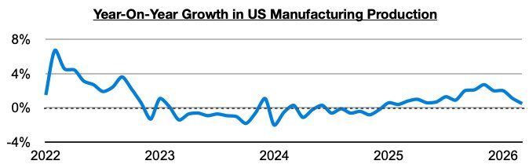
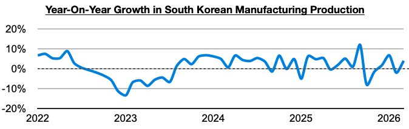
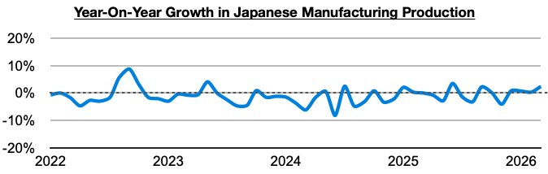
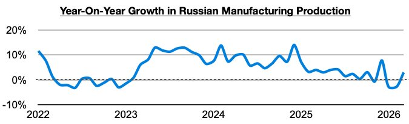

# Ongoing Global Industrial Improvement

**Date:** May 25, 2026  
**Publisher:** Breakwave Advisors | **Category:** Market Insights  
**Original URL:** [https://www.breakwaveadvisors.com/insights/2026/5/25/ongoing-global-industrial-improvement](https://www.breakwaveadvisors.com/insights/2026/5/25/ongoing-global-industrial-improvement)  

---

*By*[*Jeffrey Landsberg*](https://www.linkedin.com/in/jeffrey-landsberg-70ab957/)

During large portions of 2024 and 2025, there was sustained industrial weakness in the global economy, but in Commodore Research's Weekly Executive Reports, we have continued to stress that there remains significant improvement. Several major economies are now collectively enjoying year-on-year growth in manufacturing production (**manufacturing specifically refers to using raw materials to create finished products and is the largest component of overall industrial production**). In addition to manufacturing production continuing to enjoy long periods of year-on-year growth in China and India, the United States, Russia, South Korea, and Japan have most recently enjoyed year-on-year growth as well.

In the United States, manufacturing production has grown on a year-on-year basis for fifteen straight months. Previously, it had contracted on a year-on-year basis in nineteen of the prior twenty-two months.

> **Figure 1: Chart 1**  
> [Local Asset](file:///C:/Users/Dell/Github/Shipping/corpus/03-breakwave/insights/2026/assets/2026-05-25_ongoing-global-industrial-improvement_img_chart1_b5616ae66088.jpg)

In South Korea, manufacturing production has grown on a year-on-year basis in ten of the last fourteen months. This includes during three of the last four months.

> **Figure 2: Chart 2**  
> [Local Asset](file:///C:/Users/Dell/Github/Shipping/corpus/03-breakwave/insights/2026/assets/2026-05-25_ongoing-global-industrial-improvement_img_chart2_2b7e5627a346.jpg)

In Japan manufacturing production has grown on a year-on-year basis in six of the last seven months. This includes during each of the last four months.

> **Figure 3: Chart 3**  
> [Local Asset](file:///C:/Users/Dell/Github/Shipping/corpus/03-breakwave/insights/2026/assets/2026-05-25_ongoing-global-industrial-improvement_img_chart3_736e07702408.jpg)

In Russia, manufacturing production has most recently grown on a year-on-year basis by 3%. Previously, it had contracted on a year-on-year basis for two straight months.

> **Figure 4: Chart 4**  
> [Local Asset](file:///C:/Users/Dell/Github/Shipping/corpus/03-breakwave/insights/2026/assets/2026-05-25_ongoing-global-industrial-improvement_img_chart4_36fd27d91f8a.jpg)

---

**Tags:** Economy, Markets  
