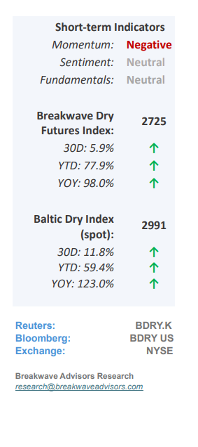
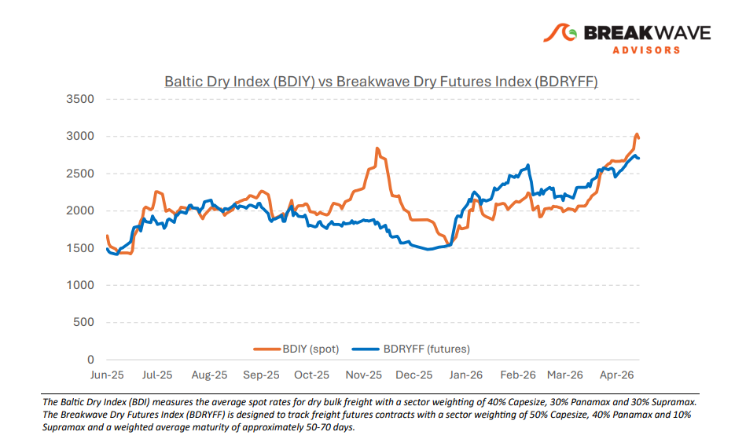
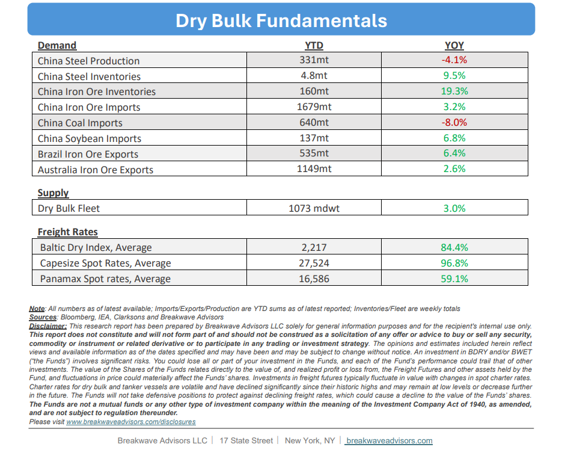

# Breakwave Bi-Weekly Dry Bulk Report - May 26, 2026

**Date:** May 26, 2026  
**Publisher:** Breakwave Advisors | **Category:** Market Insights  
**Original URL:** [https://www.breakwaveadvisors.com/insights/5262026db-report2026nh478jj](https://www.breakwaveadvisors.com/insights/5262026db-report2026nh478jj)  

---

•**Calm Spot Market Hovering at 15-Year Seasonal Highs**– The dry bulk shipping market continues to demonstrate**notable stability and resilience**, remaining insulated from the acute volatility impacting other major commodity sectors. Robust cargo flows and sustained transportation demand support the current market equilibrium, a stability mirrored in the flat trajectory of the freight futures curve over recent weeks. Supply dynamics are reinforced by**West Africa's newly operational Simandou project,**which is introducing fresh iron ore volumes into the seaborne market, while**Guinea's bauxite**exports remain steady despite persistent rumors of imminent export restrictions. Over the past few years, a structural demand shift toward the Atlantic basin has significantly boosted ton-mile demand, effectively tightening vessel availability. However,**macro headwinds cloud the outlook**, specifically the risk of an H2 economic slowdown driven by elevated energy prices. While ongoing US-Iran negotiations could offer some relief to oil prices, any meaningful reversal of structural damage to global energy balances will require considerable time to materialize.

> **Figure 1: Cea3cf84ceb9ceb3cebcceb9cf8ccf84cf85**  
> [Local Asset](file:///C:/Users/Dell/Github/Shipping/corpus/03-breakwave/insights/2026/assets/2026-05-26_5262026db-report2026nh478jj_img_cea3cf84ceb9ceb3cebcceb9cf8ccf84cf85_76bebafd362d.png)

•**Steel Production in China dropped again in April**– Chinese steel production remains constrained,**contracting**by approximately 4% year-over-year in April. The China Iron and Steel Association (CISA) anticipates persistent macroeconomic headwinds through the summer months, driven by global economic uncertainty, high input costs, and the traditional seasonal demand lull. Paradoxically,**despite this downward trend**in steel output,**iron ore imports continue**to outpace historical baselines. This multi-year divergence highlights an underlying structural shift, primarily reflecting aggressive domestic inventory builds, a higher proportion of lower-grade (low-Fe content) ore imports, and a deliberate scale-back in domestic mining activity. While market normalization remains highly speculative, elevated stockpiles and stringent environmental regulations on permissible raw material quality present a**hard lower bound**on the technical grade of iron ore Chinese mills can realistically process.

•**Our Long-term View**– The last few years have been characterized by increased geopolitical uncertainty. Going forward, we expect such events to continue to affect global trade and have a meaningful impact on effective vessel supply. Combined with the potential for a multi-year cyclical rebound in China’s economic activity following the recent economic turmoil, dry bulk shipping should experience higher volatility on top of a secular tightness driven by stable bulk commodity demand and rather steady fleet growth.

> **Figure 2: Στιγμιότυπο Οθόνης 2026 05 26 090720**  
> [Local Asset](file:///C:/Users/Dell/Github/Shipping/corpus/03-breakwave/insights/2026/assets/2026-05-26_5262026db-report2026nh478jj_img_cea3cf84ceb9ceb3cebcceb9cf8ccf84cf85_e2120d14f14a.png)

> **Figure 3: Στιγμιότυπο Οθόνης 2026 05 26 094753**  
> [Local Asset](file:///C:/Users/Dell/Github/Shipping/corpus/03-breakwave/insights/2026/assets/2026-05-26_5262026db-report2026nh478jj_img_cea3cf84ceb9ceb3cebcceb9cf8ccf84cf85_5db5e86ca5cd.png)

### Subscribe:
