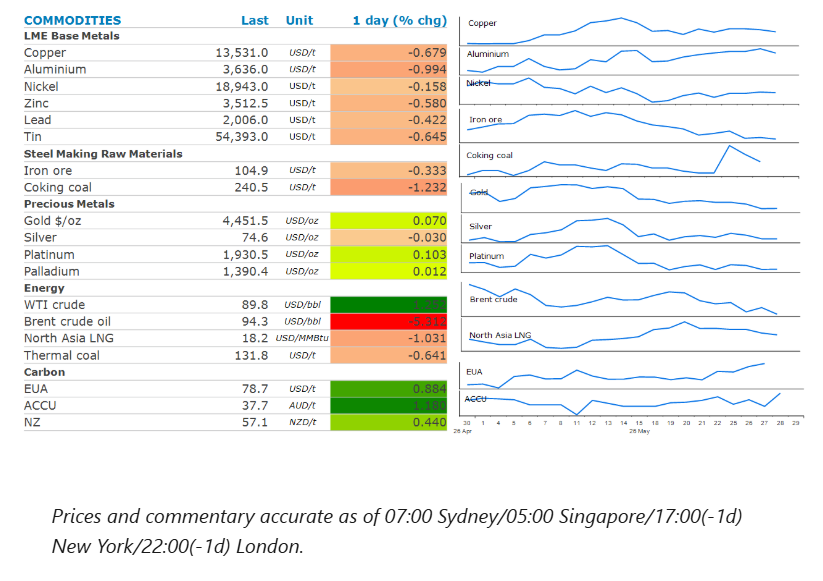
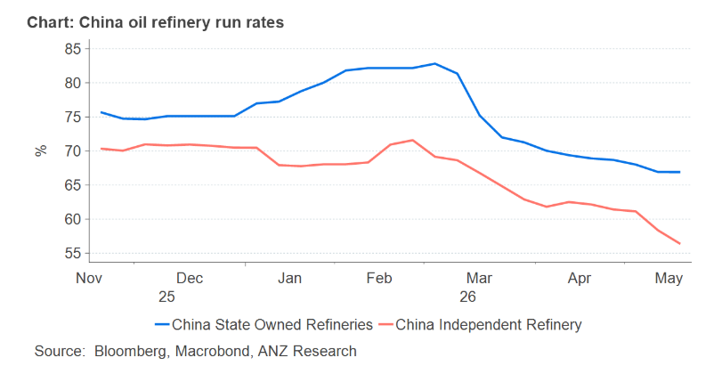

# Oil selloff continues over peace deal optimism

**Date:** May 28, 2026  
**Publisher:** Breakwave Advisors | **Category:** Market Insights  
**Original URL:** [https://www.breakwaveadvisors.com/insights/2026/5/28/oil-selloff-continues-over-peace-deal-optimism](https://www.breakwaveadvisors.com/insights/2026/5/28/oil-selloff-continues-over-peace-deal-optimism)  

---

The energy sector fell on reports the US and Iran are close to an interim peace deal. Base metals were broadly lower, while the precious metals sector fell on concerns of higher borrowing costs.

*By*[*Daniel Hynes*](https://www.linkedin.com/in/dahynes/)

> **Figure 1: Στιγμιότυπο Οθόνης 2026 05 28 110304**  
> **Interactive Data & Source:** [Linkedin](https://www.linkedin.com/newsletters/commodities-wrap-6692196755876012032/?fbclid=IwAR3kiXJqZdxmp9ZcRwBNI7FsBySI-XSC0pfPur1qzjt7OZp7PTE59Tsl1QI) | [Local Asset](file:///C:/Users/Dell/Github/Shipping/corpus/03-breakwave/insights/2026/assets/2026-05-28_oil-selloff-continues-over-peace-deal-optimism_img_cea3cf84ceb9ceb3cebcceb9cf8ccf84cf85_7a10b1f9af70.png)

### Market Commentary

**Crude oil**prices sold off, as markets became increasingly convinced that a US-Iran deal was imminent. The confidence was triggered by an Iranian state television report on the draft interim peace agreement, which said maritime traffic through the Strait of Hormuz could return to normal within a month of a pact coming into effect. The US denied the report, and President Trump said he was not satisfied with negotiations to end the three-month long conflict. Traders have become increasingly cautious about holding long exposure to the oil market ahead of headlines showing progress in ending the conflict. This has seen a wave of selling in recent days, exacerbated by thin trading in Brent’s July contract, which is due to expire at the end of the week.

Oil supply remains constrained, and key sticking points have yet to be resolved. Iran appears determined to see its USD24bn of frozen assets released and wants to maintain control of the Strait of Hormuz. That is a red line for the US, with Trump saying that no one nation should control the strait, but the US would “watch over it”. He also downplayed the possibility of Iranian sanctions relief, saying “we’re not talking about any easing of sanctions, no money, no nothing”.

**European natural gas**futures fell, dragged down by losses in the crude oil market. Nevertheless, the selloff was contained by fear of price competition with Asia as Europe refills its depleted stockpiles ahead of the next northern winter. Currently, seaborne shipments to Europe are running below seasonal norms.**North Asia LNG**was lower, despite increased activity in the spot market. China’s LNG imports have recovered to levels seen this time last year. This appears to have been triggered by improving demand from the transport sector.

**Base metals**were mixed as the risk-on tone across markets was tempered by signs that talks between the US and Iran remain challenging. Metals have previously benefitted from signs the Middle East conflict would end. Copper has gained more than 5% since the start of May and benefited from renewed optimism over demand, triggered by enthusiasm over artificial intelligence. Use of copper in the transmission lines, transformers and electrical equipment needed to power Australia has become a pillar in its bullish outlook. There are concerns that renewed imports to the US will tighten the global market, as copper traders are again importing increasing volumes due to renewed speculation about import tariffs. This has been aided by a pick-up in the spread between COMEX and the London Metal Exchange. The US commerce secretary has a deadline of 30 June to deliver an update on the US copper market that could pave the way for duties to start by January 2027.

**Gold**fell for a second day on concerns that the Middle East conflict will prolong inflation and keep interest rates high. Even the likelihood of a Middle East peace deal doesn’t seem to temper those inflationary concerns. This is complicated by a recent surge in grocery prices in the US, due to a combination of bad weather, tariffs and a dwindling cattle herd. The latest USDA food price outlook projects a 3.2% advance in grocery prices this year.

### Chart of the Day

China’s appears to be using a different strategy to shield its self from the massive supply disruption in the Middle East. Instead of dipping into its strategic reserves, it appears to be slowing down its refinery runs. State owned refineries have seen their utilisation rate fall from around 82% in early March to 67% in late May. Independent refineries have seen a similar fall. While its unsustainable over the longer term, it will delay the time it needs to dip into its strategic reserves.

> **Figure 2: Στιγμιότυπο Οθόνης 2026 05 28 110353**  
> **Interactive Data & Source:** [Linkedin](https://www.linkedin.com/newsletters/commodities-wrap-6692196755876012032/?fbclid=IwAR3kiXJqZdxmp9ZcRwBNI7FsBySI-XSC0pfPur1qzjt7OZp7PTE59Tsl1QI) | [Local Asset](file:///C:/Users/Dell/Github/Shipping/corpus/03-breakwave/insights/2026/assets/2026-05-28_oil-selloff-continues-over-peace-deal-optimism_img_cea3cf84ceb9ceb3cebcceb9cf8ccf84cf85_67fd97099bc9.png)

Data source:[Commodities Wrap](https://www.linkedin.com/newsletters/commodities-wrap-6692196755876012032/?fbclid=IwAR3kiXJqZdxmp9ZcRwBNI7FsBySI-XSC0pfPur1qzjt7OZp7PTE59Tsl1QI)

---

**Tags:** Crude, Commodities, Shipping  
