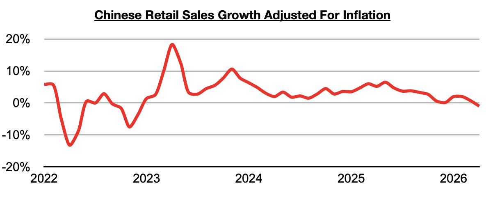
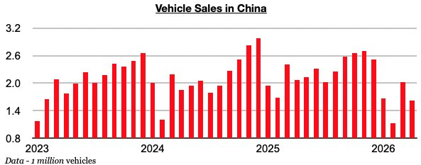
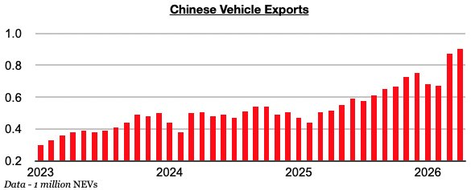

# China's Consumer Sector Reaches Breaking Point

**Date:** May 29, 2026  
**Publisher:** Breakwave Advisors | **Category:** Market Insights  
**Original URL:** [https://www.breakwaveadvisors.com/insights/2026/5/29/chinas-consumer-sector-reaches-breaking-point](https://www.breakwaveadvisors.com/insights/2026/5/29/chinas-consumer-sector-reaches-breaking-point)  

---

*By*[*Jeffrey Landsberg*](https://www.linkedin.com/in/jeffrey-landsberg-70ab957/)

As we discussed in Commodore Research's most recent Weekly China Report, China’s retail sales in April grew year-on-year by only 0.2%. This has marked the lowest growth since December 2022. Taking April’s 1.2% inflation into account, retail sales adjusted for inflation/deflation contracted year-on-year by 1%.

> **Figure 1: Chart 1**  
> [Local Asset](file:///C:/Users/Dell/Github/Shipping/corpus/03-breakwave/insights/2026/assets/2026-05-29_chinas-consumer-sector-reaches-breaking-point_img_chart1_563d51da8e98.jpg)

Last month marked the first time since December 2022 that inflation in China exceeded retail sales growth. This is a sign of contraction/recession as consumers in China last month managed to buy less actual goods than they did during the previous year. Of note on the consumer side is that sales of household appliances and electronics, furniture, automobiles, and petroleum all again contracted on a year-on-year basis. Automobile sales have fared the worse.

> **Figure 2: Chart 2**  
> [Local Asset](file:///C:/Users/Dell/Github/Shipping/corpus/03-breakwave/insights/2026/assets/2026-05-29_chinas-consumer-sector-reaches-breaking-point_img_chart2_a63a3897e7dc.jpg)

Meanwhile, Chinese vehicle exports continue to set new records.

> **Figure 3: Chart 3**  
> [Local Asset](file:///C:/Users/Dell/Github/Shipping/corpus/03-breakwave/insights/2026/assets/2026-05-29_chinas-consumer-sector-reaches-breaking-point_img_chart3_3e312ad88e08.jpg)

---

**Tags:** China, Economy, Markets  
