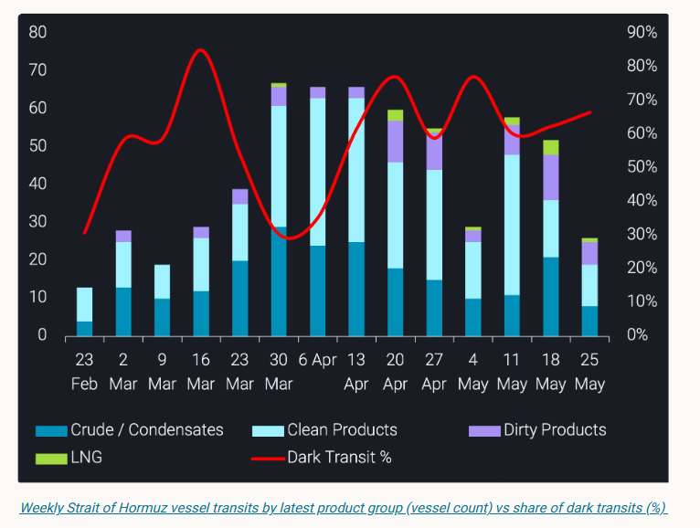
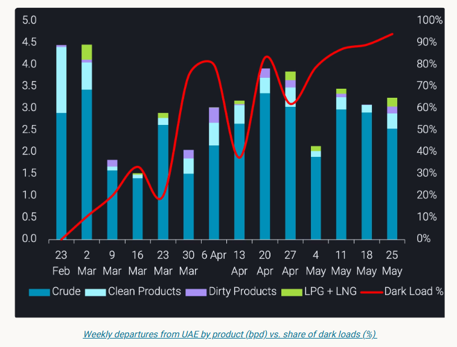

# Dark Hormuz transits

**Date:** May 29, 2026  
**Publisher:** Breakwave Advisors | **Category:** Market Insights  
**Original URL:** [https://www.breakwaveadvisors.com/insights/2026/5/29/dark-hormuz-transits](https://www.breakwaveadvisors.com/insights/2026/5/29/dark-hormuz-transits)  

---

Dark Hormuz transits are rising as more Gulf flows go dark, reducing visibility on cargo origin, timing and availability.

*By*[*Claire Jungman*](https://www.linkedin.com/in/claire-jungman-b40a78110/)

Vortexa has tracked hundreds of dark transits through the Strait of Hormuz since March 1, representing 57% of all transits recorded over the period. This trend has only intensified through the crisis: the share of outbound laden vessels transiting dark stood at 58.5% in March, dipped to 54% in April as overall transit volumes peaked, and rose to 65.2% in May. As total transit activity moderated, the vessels still willing to cross are increasingly doing so dark.

But the more important shift is not just the scale of dark activity; it is who is participating.

What began as a behaviour largely associated with Iran-linked tonnage has broadened materially. Non-Iranian operators now account for the majority of dark outbound laden transits through the Strait. AIS-off movements through Hormuz are no longer only a sanctions-evasion signal. They have become a wider commercial response to conflict risk, operational uncertainty, and the need to keep Gulf cargo moving through one of the world’s most important energy chokepoints.

For the market, the implication is clear: Gulf exports have not stopped, but a growing share of the physical flow is becoming harder to observe in real time. That matters for load timing, origin attribution, destination reads, and near-term availability signals.

> **Figure 1: Στιγμιότυπο Οθόνης 2026 05 29 102238**  
> **Interactive Data & Source:** [Vortexa](https://www.vortexa.com//oil-gas-data-traders-analysts-data-scientists?gclid=Cj0KCQjw8_qRBhCXARIsAE2AtRZKOvMnbilZ_6_91d7huSFFy71pWLrnPwGwOHVzXsmsG-1a1mZnQw8aAt89EALw_wcB&hsa_acc=1782073842&hsa_ad=548425387665&hsa_cam=14746637662&hsa_grp=125038601902&hsa_kw=&hsa_mt=&hsa_net=adwords&hsa_src=g&hsa_tgt=dsa-1431852288425&hsa_ver=3&utm_campaign=%5BCD%5D%20-%20DSA%20-%20EMEA&utm_medium=cpc&utm_medium=ppc&utm_source=google&utm_source=adwords&utm_term=) | [Local Asset](file:///C:/Users/Dell/Github/Shipping/corpus/03-breakwave/insights/2026/assets/2026-05-29_dark-hormuz-transits_img_cea3cf84ceb9ceb3cebcceb9cf8ccf84cf85_750f1902f3a7.png)

## Dark Loads Outside Hormuz Are Surging

The Hormuz transit data captures only one channel. Vortexa-confirmed dark loading activity simultaneously increased sharply from April to May. Early in the crisis, dark loads were more concentrated around Gulf terminals inside the Strait, including Das Island, Zirku, and Jebel Dhanna. By May, the centre of gravity had shifted outward, with Fujairah terminal loads and Fujairah-area STS activity becoming a much larger part of the picture.

The UAE departures chart makes the scale of this shift explicit. Overall departures from UAE have remained substantial throughout the crisis, but the share of those loads occurring dark has risen from negligible levels in early March to above 90% in the most recent weeks. The export system is adapting, not stopping – with more cargo moving through channels where the loading event is harder to observe through AIS.

> **Figure 2: Στιγμιότυπο Οθόνης 2026 05 29 102330**  
> **Interactive Data & Source:** [Vortexa](https://www.vortexa.com//oil-gas-data-traders-analysts-data-scientists?gclid=Cj0KCQjw8_qRBhCXARIsAE2AtRZKOvMnbilZ_6_91d7huSFFy71pWLrnPwGwOHVzXsmsG-1a1mZnQw8aAt89EALw_wcB&hsa_acc=1782073842&hsa_ad=548425387665&hsa_cam=14746637662&hsa_grp=125038601902&hsa_kw=&hsa_mt=&hsa_net=adwords&hsa_src=g&hsa_tgt=dsa-1431852288425&hsa_ver=3&utm_campaign=%5BCD%5D%20-%20DSA%20-%20EMEA&utm_medium=cpc&utm_medium=ppc&utm_source=google&utm_source=adwords&utm_term=) | [Local Asset](file:///C:/Users/Dell/Github/Shipping/corpus/03-breakwave/insights/2026/assets/2026-05-29_dark-hormuz-transits_img_cea3cf84ceb9ceb3cebcceb9cf8ccf84cf85_651e4ba41983.png)

VLCC-class vessels have consistently represented around 59% of dark loads across April and May, making them the dominant size class by a significant margin. That points to a clear commercial incentive: when visibility and routing are constrained, operators are still trying to move the largest possible parcels through whichever channel remains available.

## Inside Hormuz, the Dark Trend Spans Every Major Product Class

For vessels still transiting the Strait, crude and condensates remain the largest category of dark outbound laden movements, accounting for around 40% of the total. But the breadth of the trend is notable.

Clean products account for nearly a quarter of dark outbound laden transits, dirty products close to 18%, and LPG around 14%. LNG also appears in the data from April into May, showing that the deterioration in visibility is not limited to crude or sanctioned flows.

That matters because the market impact is broader than crude balances alone. When clean products, LPG, and LNG also move with reduced AIS visibility, the uncertainty extends into refinery supply, product availability, regional inventories, and destination-level demand reads.

Around a quarter to a third of dark outbound laden transits each month are VLCC+ class vessels. Some of these movements appear to feed into the same offshore transfer and staging zones now becoming more prominent outside Hormuz.

## The Emerging Signal Is Non-Iranian Participation

The most important development is the changing operator profile.

In March, non-Iranian operators accounted for 37% of dark outbound laden transits through the Strait. By April, that had risen to 56%. In May, it reached 67%.

That shift suggests AIS-off behaviour is becoming an accepted operating protocol, not an exceptional measure. Iran-linked vessels helped establish the template before and during the early phase of the crisis. Non-sanctioned Gulf tonnage is now increasingly using similar methods — and, in volume terms, beginning to dominate them.

Among non-Iranian dark outbound laden movements, UAE-linked vessels account for the largest share at around 27%, followed by Iraq at approximately 11% and Qatar at around 10%. Saudi Arabia, Kuwait, and Bahrain together account for a further 9%.

This means dark activity through Hormuz can no longer be treated as a proxy for Iranian or sanctioned flows. That framing no longer holds.

## Gulf Flow Visibility Has Materially Deteriorated

The practical consequence is that origin transparency for Gulf exports has deteriorated materially since March.

Cargo that would previously have moved with a clear AIS trail from load port to discharge is now arriving with significant gaps in its journey – in some cases vessels are going dark at the Strait and resurfacing days or weeks later, thousands of miles away, with no intermediate signal. That affects how export volumes, prompt availability, destination data, and regional balances across crude, products, LPG, and LNG are interpreted.

This is not only a sanctions story. It is a physical market transparency story.

Vortexa data shows that Gulf energy flows have not stopped. But the way they are moving has changed. More barrels are travelling through dark transits, dark loads, and offshore transfer chains. The risk is not simply missing a vessel movement. It is misreading the timing, origin, and availability of cargo in one of the world’s most important supply regions.

In this environment, cargo-level visibility matters more than ever.

Data Source:[Vortexa](https://www.vortexa.com//oil-gas-data-traders-analysts-data-scientists?gclid=Cj0KCQjw8_qRBhCXARIsAE2AtRZKOvMnbilZ_6_91d7huSFFy71pWLrnPwGwOHVzXsmsG-1a1mZnQw8aAt89EALw_wcB&hsa_acc=1782073842&hsa_ad=548425387665&hsa_cam=14746637662&hsa_grp=125038601902&hsa_kw=&hsa_mt=&hsa_net=adwords&hsa_src=g&hsa_tgt=dsa-1431852288425&hsa_ver=3&utm_campaign=%5BCD%5D%20-%20DSA%20-%20EMEA&utm_medium=cpc&utm_medium=ppc&utm_source=google&utm_source=adwords&utm_term=)

---

**Tags:** Geopolitics, Crude, Tankers  
