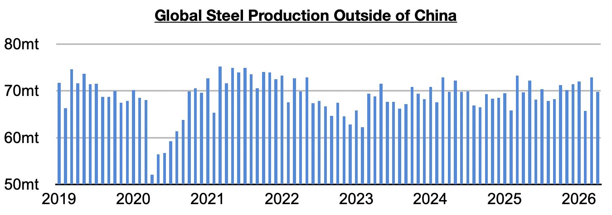
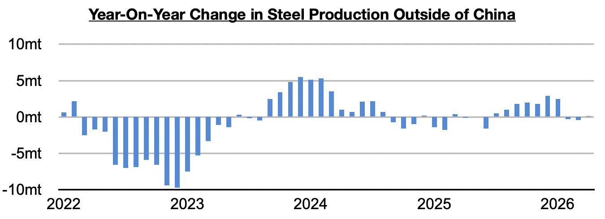
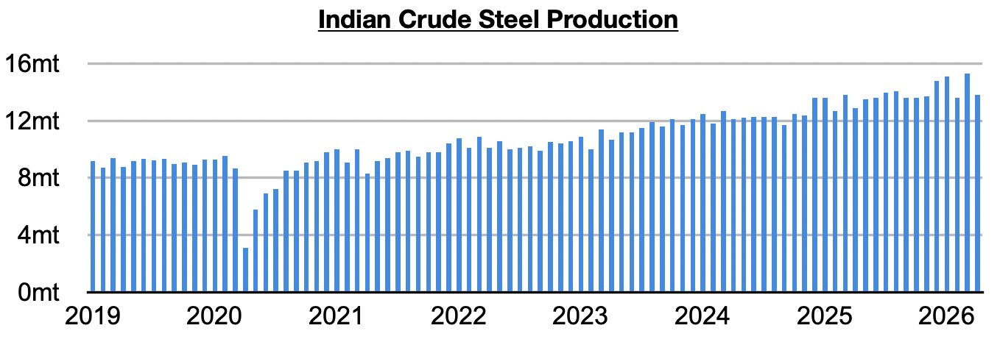

# Small Improvement in Steel Output Ex-China

**Date:** June 01, 2026  
**Publisher:** Breakwave Advisors | **Category:** Market Insights  
**Original URL:** [https://www.breakwaveadvisors.com/insights/2026/6/1/small-improvement-in-steel-output-ex-china](https://www.breakwaveadvisors.com/insights/2026/6/1/small-improvement-in-steel-output-ex-china)  

---

*By*[*Jeffrey Landsberg*](https://www.linkedin.com/in/jeffrey-landsberg-70ab957/)

Global steel production totaled approximately 153.4 million tons in April. This is down month-on-month by 6.5 million tons (-4%) and is down year-on-year by 2.3 million tons (-2%). Steel production ex-China totaled approximately 69.8 million tons. This is down month-on-month by 3.1 million tons (-4%) but is up year-on-year by 100,000 tons.

> **Figure 1: Chart 1**  
> [Local Asset](file:///C:/Users/Dell/Github/Shipping/corpus/03-breakwave/insights/2026/assets/2026-06-01_small-improvement-in-steel-output-ex-china_img_chart1_2e4fcff39284.jpg)

Previously, steel production ex-China had contracted on a year-on-year basis for two straight months. Prior to those two months, steel production ex-China had increased for seven straight months.

> **Figure 2: Chart 2**  
> [Local Asset](file:///C:/Users/Dell/Github/Shipping/corpus/03-breakwave/insights/2026/assets/2026-06-01_small-improvement-in-steel-output-ex-china_img_chart2_18bbc5328f0c.jpg)

Taking India out of the equation, though, production contracted year-on-year by 800,000 tons (-1%). Steel production ex-Chin/India has now contracted on a year-on-year basis for three straight months.

Indian steel production totaled 13.8 million tons last month. This is down month-on-month by 1.5 million tons (-10%) but up year-on-year by 900,000 tons (7%). Production has now grown on a year-on-year basis for thirty-eight straight months.

> **Figure 3: Chart 3**  
> [Local Asset](file:///C:/Users/Dell/Github/Shipping/corpus/03-breakwave/insights/2026/assets/2026-06-01_small-improvement-in-steel-output-ex-china_img_chart3_13925290ce04.jpg)

---

**Tags:** Ironore, Shipping, Markets  
