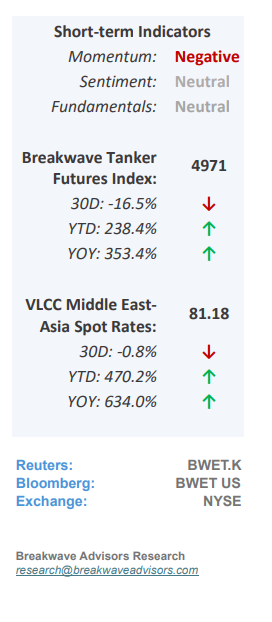
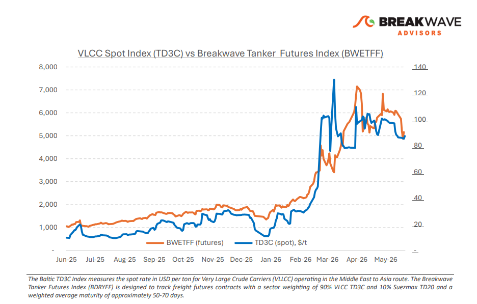
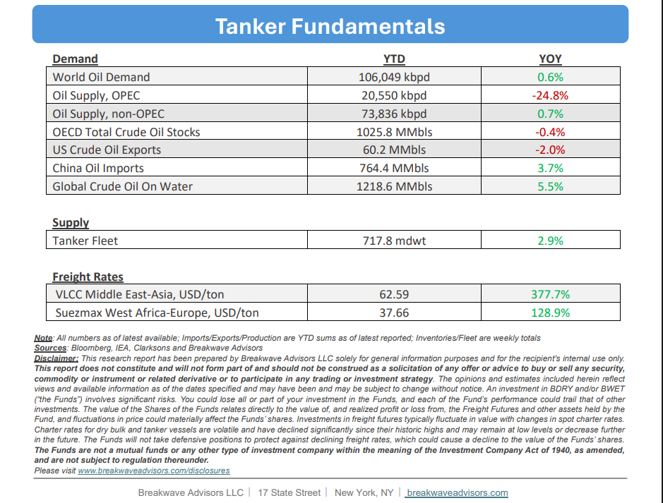

# Breakwave Bi-Weekly Tanker Report - June 2, 2026

**Date:** June 02, 2026  
**Publisher:** Breakwave Advisors | **Category:** Market Insights  
**Original URL:** [https://www.breakwaveadvisors.com/insights/622026wetreportkjujune2kjm](https://www.breakwaveadvisors.com/insights/622026wetreportkjujune2kjm)  

---

•**VLCC Gulf Strength Persists as Atlantic Softens**– The month of May marked a turning point for the VLCC market.**Geopolitical risk**in the Middle East continued to drive extraordinary earnings in the Arabian Gulf, while the Atlantic Basin increasingly reflected**softer freight fundamentals**. This validates our prior view that Atlantic weakness would emerge as vessel supply outpaced cargo demand. By month-end, AG-China earnings stood roughly 3X above WAFR-China and as well as above USG-China, a regional dislocation that remains extraordinary by historical standards.**Sentiment**in the Arabian Gulf and Red Sea stayed dominated by**uncertainty**over US-Iran negotiations and the security of transit through the Strait of Hormuz.**Owners exercised caution**while charterers showed little urgency amid adequate availability and limited fresh enquiry. Strait of Hormuz activity remains a key signal. Outbound crude flows are particularly subdued: only three laden VLCCs transited in the past seven days, carrying an estimated 6 million barrels, against roughly 105 million in a normal week. As VLCC earnings (ex AG) fall below $100,000/day for the first time in 19 weeks, it is now clear that**earnings are no longer being held up by Middle East disruptions**alone as market balance shifts to oversupply.

> **Figure 1: Cea3cf84ceb9ceb3cebcceb9cf8ccf84cf85**  
> [Local Asset](file:///C:/Users/Dell/Github/Shipping/corpus/03-breakwave/insights/2026/assets/2026-06-02_622026wetreportkjujune2kjm_img_cea3cf84ceb9ceb3cebcceb9cf8ccf84cf85_1015222f5d81.png)

•**Oil Prices Ease as Expectations for a Piece Deal Soar**– While ongoing US-Iran discussions regarding the Strait of Hormuz have recently pushed oil prices to the bottom of their trading range, market volatility remains high due to geopolitical headline sensitivity. Despite current diplomatic efforts, a full**return to the pre-war status quo in the Strait appears highly unlikely**, which should continue to tighten the global oil market over the coming months. Concurrently, structural shifts are redefining major consumption centers.**China**has considerably eased its oil purchases,**revealing that its recent demand strength was largely an illusion**driven by inventory accumulation rather than organic consumption. With accelerated electrification, aggressive energy conservation, and rapid sustainable energy expansion, China's demand for transportation fuels has essentially plateaued. Consequently, while the current supply shock temporarily masks this profound structural demand shift, any**eventual normalization of global supply**will likely result in a**market balance that is considerably looser**than pre-war levels.

•**Our Long-term View**– The tanker market has been recovering from a long period of staggered rates as the growth in new vessel supply shrunk while oil demand remained elevated in line with the global economy. The recent rapid increase in freight rates has led to significant new vessel ordering, with the orderbook now standing at above average levels, and although in the near term such a supply/demand misbalance is small, we expect a meaningful negative balance to develop longer term leading to a potential downcycle.

> **Figure 2: Στιγμιότυπο Οθόνης 2026 06 02 084844**  
> [Local Asset](file:///C:/Users/Dell/Github/Shipping/corpus/03-breakwave/insights/2026/assets/2026-06-02_622026wetreportkjujune2kjm_img_cea3cf84ceb9ceb3cebcceb9cf8ccf84cf85_1915bb522590.png)

> **Figure 3: Στιγμιότυπο Οθόνης 2026 06 02 132349**  
> [Local Asset](file:///C:/Users/Dell/Github/Shipping/corpus/03-breakwave/insights/2026/assets/2026-06-02_622026wetreportkjujune2kjm_img_cea3cf84ceb9ceb3cebcceb9cf8ccf84cf85_3eb398a597d2.png)

### Subscribe:
