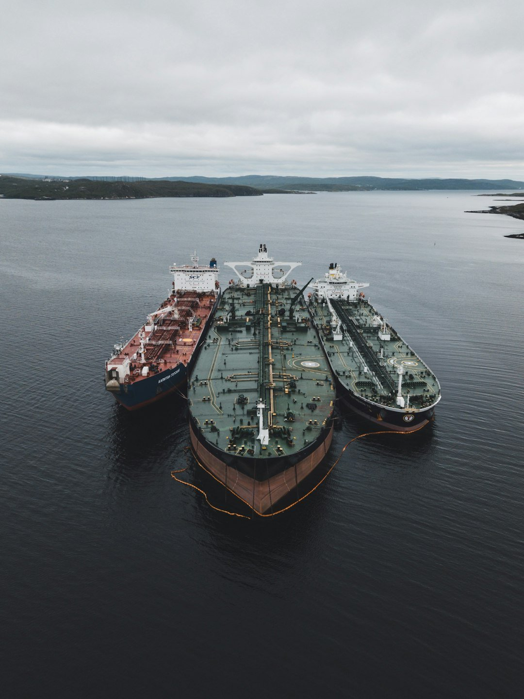

# Why VLCCs and Suezmaxes work better together

**Date:** June 03, 2026  
**Publisher:** Breakwave Advisors | **Category:** Market Insights  
**Original URL:** [https://www.breakwaveadvisors.com/insights/2026/6/3/why-vlccs-and-suezmaxes-work-better-together](https://www.breakwaveadvisors.com/insights/2026/6/3/why-vlccs-and-suezmaxes-work-better-together)  

---

> **Figure 1: Bymette Frederiksen**  
> *ByMette Frederiksen*  
> **Interactive Data & Source:** [Linkedin](https://www.linkedin.com/in/mette-frederiksen-2a826216/) | [Local Asset](file:///C:/Users/Dell/Github/Shipping/corpus/03-breakwave/insights/2026/assets/2026-06-03_why-vlccs-and-suezmaxes-work-better-together_img_unsplash-image-983knf8azec_efb549cc7057.jpg)

The crude tanker market is entering a new era – one that is increasingly dynamic, fragmented and opportunity-driven. In this environment, scale alone is no longer enough; flexibility, optionality, and intelligence are the defining commercial advantages. That is why integrating VLCC and Suezmax tonnage into a single pooling platform represents a significant evolution in tanker commercial management.

For decades, VLCCs have been the backbone of long-haul crude transportation, delivering unmatched economies of scale on major export routes. But shifting trade flows, changing refinery demand patterns, geopolitical disruption and evolving port constraints are reshaping the market. Cargo programmes today often require greater agility than a single vessel class can provide.

This is where the commercial synergies between VLCCs and Suezmaxes become increasingly compelling.

### Two Vessel Classes, One Crude Market

By combining both vessel classes within a broader commercial ecosystem, a pool can offer charterers a more adaptable transportation solution. VLCCs remain the optimal choice for high-volume, long-haul movements, particularly on core Middle East-to-Asia routes. Suezmaxes, meanwhile, provide flexibility where draft restrictions, regional trades or smaller parcel sizes make VLCC employment less efficient.

Together, the two segments create a complementary offering that allows cargoes to be matched more efficiently to vessel capability, route economics and logistical optionality.

### The Infrastructure Argument

Our recent pool expansion into the Suezmax market reflects exactly this strategic thinking. The move was driven by the need for greater agility and flexibility amid a rapidly changing global market.

The rationale is straightforward, broader platforms enable operators to pursue overlapping crude flows with greater precision. Cargoes that were previously inaccessible to a VLCC platform can now be served by Suezmax tonnage, while charterers benefit from a wider range of transportation options under one commercial umbrella.

From a commercial perspective, this creates multiple layers of synergy.

First, it increases cargo coverage and market access. Having both VLCCs and Suezmaxes allows the pool to compete across a broader spectrum of crude movements and regional arbitrage opportunities. In volatile markets, this optionality becomes a meaningful earnings advantage.

There are also significant operational synergies that come from managing complementary vessel classes within the same platform. Many of the commercial processes, operational workflows and digital systems used to manage VLCCs can be applied seamlessly to Suezmax operations. From voyage planning and market analysis to performance monitoring and post-fixture operations, the infrastructure already exists to support both segments efficiently.

Equally important is the transfer of expertise and market knowledge across teams. Decades of experience in tanker pooling, freight optimisation and chartering strategy create a strong foundation for managing adjacent vessel types. Shared personnel, established customer relationships and integrated commercial teams help create consistency for both owners and charterers while reducing duplication across the organisation.

Combining vessel types deepens market intelligence. One of the most valuable assets within any tanker pool is data such as cargo flows, charterer behaviour, port trends, fixture timing and regional demand signals. Expanding into adjacent segments increases both the quantity and quality of market intelligence available to pool participants.

The collective scale, intelligence and expertise across the entire fleet support better commercial decisions for both VLCC and Suezmax partners.

### What This Means for Charterers

There is also an important customer dimension. Charterers increasingly value reliability, responsiveness and simplicity. A platform capable of offering multiple vessel classes can respond faster to changing requirements and provide greater continuity across complex trading programmes.

In many ways, the combination of VLCCs and Suezmaxes mirrors the broader direction of the energy transportation market itself – more interconnected, more flexible and more data-driven.

The traditional boundaries between tanker segments are becoming less rigid as trade patterns evolve. Commercial models must evolve alongside them.

### Pooling’s Next Chapter

Pooling has always been about creating strength through collaboration. The next phase of that evolution is not simply bigger pools but smarter, more adaptable platforms capable of navigating an increasingly complex market landscape. The combination of VLCC and Suezmax capability is a natural progression of that strategy.

In a market where optionality drives performance, the ability to respond quickly and efficiently across different trade flows is becoming a core competitive advantage. Agility is increasingly becoming the new stability.

In many ways, this reflects a broader shift in the energy transportation market itself, where success is no longer driven purely by scale, but by responsiveness, optionality and execution quality across changing conditions.

Data Source:[Tankers International](https://tankersinternational.com/)

---

**Tags:** Tankers, Markets, Geopolitics  
