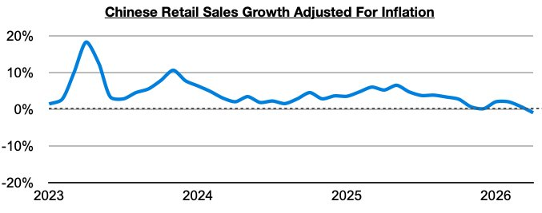
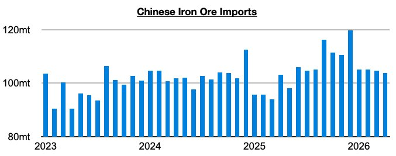
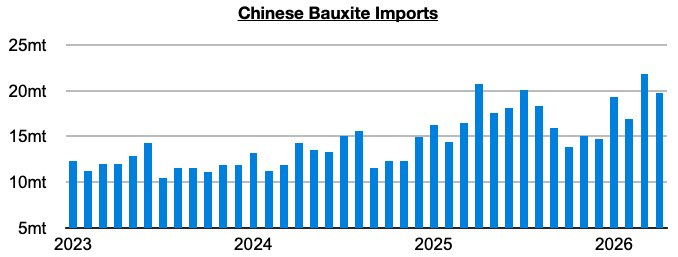

# China’s Industrial And Consumer Markets Are Not Strongly Correlated

**Date:** June 04, 2026  
**Publisher:** Breakwave Advisors | **Category:** Market Insights  
**Original URL:** [https://www.breakwaveadvisors.com/insights/2026/6/4/chinas-industrial-and-consumer-markets-are-not-strongly-correlated](https://www.breakwaveadvisors.com/insights/2026/6/4/chinas-industrial-and-consumer-markets-are-not-strongly-correlated)  

---

*By*[*Jeffrey Landsberg*](https://www.linkedin.com/in/jeffrey-landsberg-70ab957/)

As we discussed in Commodore Research's most recent Weekly Executive Report, retail sales growth in China most recently came in below inflation — which has marked the first time since December 2022 that such a troubling contractionary event has occurred. China’s consumer market has now turned so weak that consumers are collectively buying less actual goods than they did one year prior.

> **Figure 1: Chart 1**  
> [Local Asset](file:///C:/Users/Dell/Github/Shipping/corpus/03-breakwave/insights/2026/assets/2026-06-04_chinas-industrial-and-consumer-markets-are-not-strongly-correlated_img_chart1_e5b6d2e68c92.jpg)

We have been examining the deterioration in China’s consumer market closely in our weekly reports (significant is that a year ago, retail sales growth adjusted for inflation set a peak of a robust 6.5%) but each month we have also made sure to stress that our bullishness for Chinese dry bulk import demand has stayed the same regardless of the deterioration in the consumer market. This view has been proven correct, and we cannot stress strongly enough that a strong dry bulk market can coexist at the same time that China’s consumer market is struggling.

The fact remains that China’s industrial and consumer markets are not extremely correlated — and on the industrial side, demand for imports including iron ore and bauxite have remained especially strong for the capesize market as we have been predicting. As we have continued to publish updates on each month, steel production in particular has been mired in a year-on-year contraction since September (and iron ore port stockpiles have also long been at near or record levels), and yet iron ore imports have grown on a year-on-year basis for eleven straight months. So far this year, they are up by 7% and on pace to set yet another annual record.

> **Figure 2: Chart 2**  
> [Local Asset](file:///C:/Users/Dell/Github/Shipping/corpus/03-breakwave/insights/2026/assets/2026-06-04_chinas-industrial-and-consumer-markets-are-not-strongly-correlated_img_chart2_7f62e1204451.jpg)

China’s bauxite imports have been even stronger this year, with imports so far up year-on-year by 15%.

> **Figure 3: Chart 3**  
> [Local Asset](file:///C:/Users/Dell/Github/Shipping/corpus/03-breakwave/insights/2026/assets/2026-06-04_chinas-industrial-and-consumer-markets-are-not-strongly-correlated_img_chart3_2c98d2c91e64.jpg)

---

**Tags:** Ironore, Markets, China  
