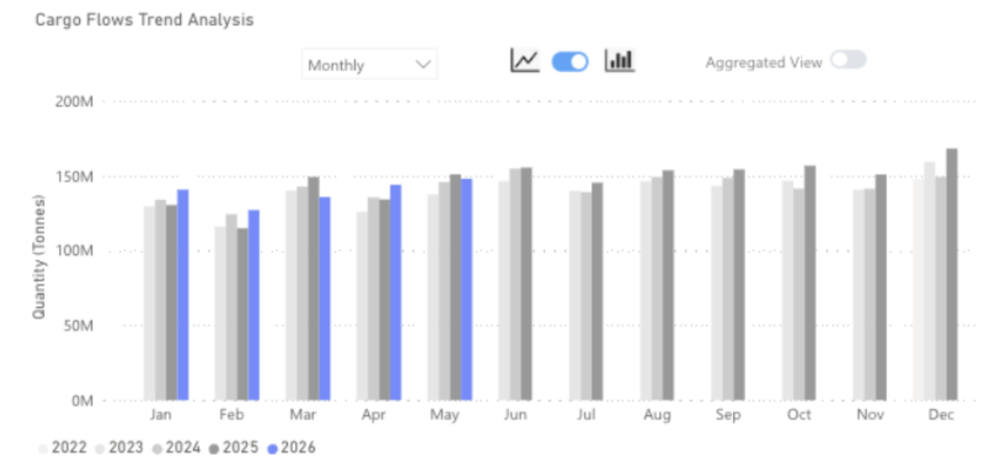
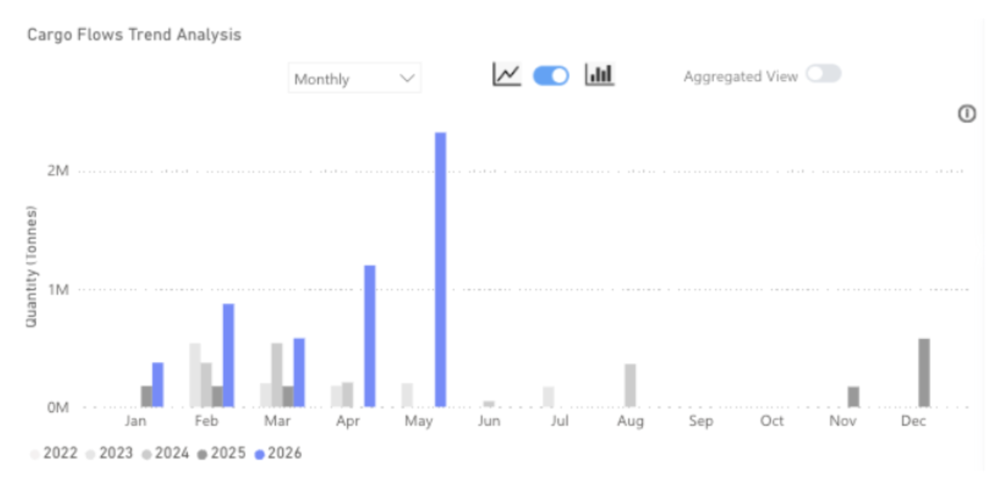
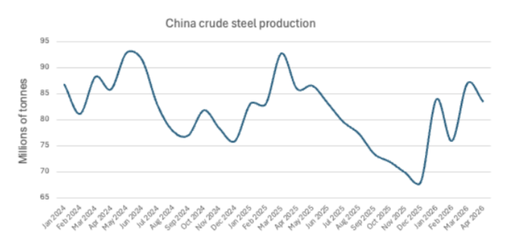

# Disconnect between Chinese iron ore imports and steel production widens

**Date:** June 05, 2026  
**Publisher:** Breakwave Advisors | **Category:** Market Insights  
**Original URL:** [https://www.breakwaveadvisors.com/insights/2026/6/5/disconnect-between-chinese-iron-ore-imports-and-steel-production-widens](https://www.breakwaveadvisors.com/insights/2026/6/5/disconnect-between-chinese-iron-ore-imports-and-steel-production-widens)  

---

Chinese iron ore imports continue to grow even as domestic steel output weakens, driving port inventories toward record highs. Until Simandou's accelerating ramp-up is offset by cuts elsewhere in the supply chain, the inventory overhang is set to deepen, complicating the demand outlook for traditional exporters.

> **Figure 1: Market Chart 1**  
> **Interactive Data & Source:** [Signal Ocean Platform](https://www.thesignalgroup.com/signal-ocean-platform) | [Local Asset](file:///C:/Users/Dell/Github/Shipping/corpus/03-breakwave/insights/2026/assets/2026-06-05_disconnect-between-chinese-iron-ore-imports-and-steel-production-widens_img_unnamed_d1042380c748.png)

### Key Takeaways

● Global iron ore flows in May 2026 were down 2% y/y.

● Flows to China increased by 3% y/y.

● Flows destined to ports outside of China fell by 15% y/y.

● Iron ore flows from Guinea reached 2.1mt in May as Simandou continued to ramp up.

Global iron ore flows reached 145mt in May 2026, down 2% on the same month last year. Flows to China continued to increase, by 3% this month, but growth was the lowest it has been since March, as the steel industry in China faces mounting headwinds.

Outside of China, demand for iron ore remains subdued as steel production is still under pressure. As a result, iron ore flows destined for ports outside of China fell by 15% y/y in May 2026.

> **Figure 2: Iron Ore Flows From Guinea | Signal Ocean**  
> **Interactive Data & Source:** [Signal Ocean Platform](https://www.thesignalgroup.com/signal-ocean-platform) | [Local Asset](file:///C:/Users/Dell/Github/Shipping/corpus/03-breakwave/insights/2026/assets/2026-06-05_disconnect-between-chinese-iron-ore-imports-and-steel-production-widens_img_unnamed28129_d54816c208e5.png)

## Guinea to China to Boost Cape Rates Even If Total Volumes Fall

Iron ore flows from Guinea reached over 2 million tons in May, a record and almost double the previous record from the previous month. Despite this, Guinea still only accounted for 2% of all global iron ore flows in May 2026. Australia and Brazil continued to dominate, exporting 86mt and 33mt respectively.

> **Figure 3: China Crude Steel Production | Nbs**  
> **Interactive Data & Source:** [Signal Ocean Platform](https://www.thesignalgroup.com/signal-ocean-platform) | [Local Asset](file:///C:/Users/Dell/Github/Shipping/corpus/03-breakwave/insights/2026/assets/2026-06-05_disconnect-between-chinese-iron-ore-imports-and-steel-production-widens_img_unnamed28229_b5a650a9f0ec.png)

The NBS reports Chinese crude steel production tracking 4% below prior-year levels year-to-date, yet iron ore imports have moved in the opposite direction, up 3% over the same period. The result is a port inventory build that has taken Chinese stockpiles to 160mt as of the week ending May 22nd, within touching distance of the 165mt record set in March 2026 and some 22% above the July 2025 trough. The disconnect between import strength and steel output is the defining feature of this market, and it is now correcting: import growth is decelerating as portside rebalancing mechanics take hold.

The near-term demand trajectory for Australian exporters is unfavourable on two counts. Aggregate Chinese import demand is expected to ease from current levels as the inventory overhang is absorbed, reducing overall seaborne volumes. Simultaneously, the structural shift toward higher-grade feedstock, accelerated by Simandou's commercial ramp-up, reduces the relative attractiveness of Australian mid-grade fines at a time when Chinese mills are under margin pressure and incentivised to optimise blend economics.

For the capesize market, however, the Simandou narrative is a meaningful structural offset. Guinea-to-China adds approximately 25% in tonne-miles relative to an equivalent Australian voyage; at Simandou's projected plateau of 10mt per month, the incremental tonne-mile generation is substantial. Critically, this freight uplift occurs regardless of whether overall Chinese import volumes grow — it is a trade-route effect, not a volume effect. Even a gradual displacement of Australian tonnes, well ahead of full ramp, should provide durable underlying support for capesize rates through the balance of the year.

Data Source:[Signal Ocean Platform](https://www.thesignalgroup.com/signal-ocean-platform)

---

**Tags:** Ironore, Drybulk, China  
