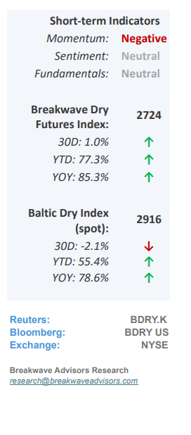
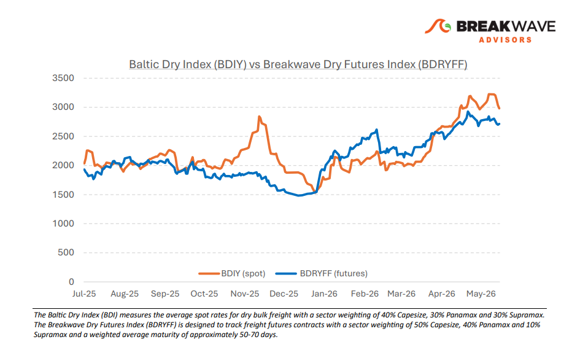
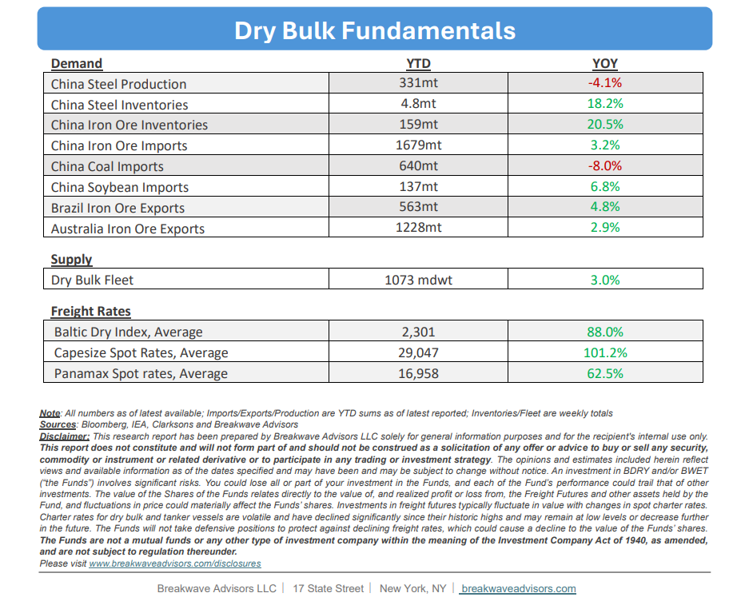

# Breakwave Bi-Weekly Dry Bulk Report - June 9, 2026

**Date:** June 09, 2026  
**Publisher:** Breakwave Advisors | **Category:** Market Insights  
**Original URL:** [https://www.breakwaveadvisors.com/insights/692026db-report2026junkki1](https://www.breakwaveadvisors.com/insights/692026db-report2026junkki1)  

---

•**Capesize Rates Drop to One-Month lows as Fixing Frenzy Stalls**– Following an**exceptionally strong performance**in May, during which Capesize spot rates reached a 15-year seasonal high, the market has begun to soften, with spot rates subsequently dropping to one-month lows. Due to historically weak seasonal trends in June, this**downward trajectory is anticipated to persist**in the near term; however, freight futures continue to indicate a robust third quarter despite recent market volatility. The**Pacific**spot market currently represents the**weakest segment**as the fiscal year-end push approaches its conclusion this month (some Australian miners report on a June 30 Fiscal Year basis). Year-to-date strength in dry bulk shipping has primarily been driven by**widespread inefficiencies in bunkering**operations, where limited availability and high fuel prices have extended average voyage lengths and effectively**tightened global vessel supply**across all asset sizes. Given the ongoing geopolitical conflict in the Middle East and the resulting lack of visibility regarding a resolution in the oil markets, this**supply tightening**is expected to**endure for the foreseeable future**, thereby providing sustained structural support for dry bulk freight rates.

> **Figure 1: Cea3cf84ceb9ceb3cebcceb9cf8ccf84cf85**  
> [Local Asset](file:///C:/Users/Dell/Github/Shipping/corpus/03-breakwave/insights/2026/assets/2026-06-09_692026db-report2026junkki1_img_cea3cf84ceb9ceb3cebcceb9cf8ccf84cf85_6ce5a95b416f.png)

•**China Iron Ore Imports Rise as Steel Productions Declines**– Despite a 4% contraction in Chinese steel production, year-to-date iron ore imports remain robust with approximately 8% growth, sustaining a**puzzling 18-month disconnect alongside rising portside inventories**. This discrepancy raises the possibility that China is accumulating strategic stockpiles outside conventional analytical visibility, mirroring the**"black box" of Chinese oil inventories**that historically introduces substantial uncertainty into global oil balances. It is plausible that a similar unrecorded inventory buildup exists, accounting for the otherwise unexplained tonnage of imported iron ore. On the price front, iron ore prices have retraced to the $100 per ton threshold as the recent upward pressure driven by elevated energy prices begins to subside. The iron ore market seems well supplied and the macro risk continues to increase as**geopolitical uncertainty is elevated.**

•**Our Long-term View**– The last few years have been characterized by increased geopolitical uncertainty. Going forward, we expect such events to continue to affect global trade and have a meaningful impact on effective vessel supply. Combined with the potential for a multi-year cyclical rebound in China’s economic activity following the recent economic turmoil, dry bulk shipping should experience higher volatility on top of a secular tightness driven by stable bulk commodity demand and rather steady fleet growth.

> **Figure 2: Στιγμιότυπο Οθόνης 2026 06 09 084718**  
> [Local Asset](file:///C:/Users/Dell/Github/Shipping/corpus/03-breakwave/insights/2026/assets/2026-06-09_692026db-report2026junkki1_img_cea3cf84ceb9ceb3cebcceb9cf8ccf84cf85_536244c6a279.png)

> **Figure 3: Στιγμιότυπο Οθόνης 2026 06 09 091450**  
> [Local Asset](file:///C:/Users/Dell/Github/Shipping/corpus/03-breakwave/insights/2026/assets/2026-06-09_692026db-report2026junkki1_img_cea3cf84ceb9ceb3cebcceb9cf8ccf84cf85_460e9b08509b.png)

### Subscribe:
