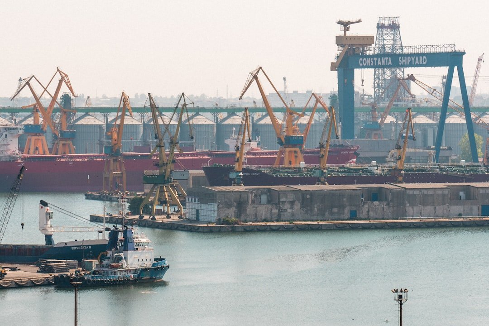

# Beyond Posidonia: Tracking the Pulse of Greek Dry Bulk Transactions:

**Date:** June 09, 2026  
**Publisher:** Breakwave Advisors | **Category:** Market Insights  
**Original URL:** [https://www.breakwaveadvisors.com/insights/2026/6/9/beyond-posidonia-tracking-the-pulse-of-greek-dry-bulk-transactions](https://www.breakwaveadvisors.com/insights/2026/6/9/beyond-posidonia-tracking-the-pulse-of-greek-dry-bulk-transactions)  

---

> **Figure 1: Byeirini Diamantara&dimitris Roumeliotis**  
> *ByEirini Diamantara&Dimitris Roumeliotis*  
> **Interactive Data & Source:** [Linkedin](https://www.linkedin.com/in/eirini-diamantara-58b269105/) | [Local Asset](file:///C:/Users/Dell/Github/Shipping/corpus/03-breakwave/insights/2026/assets/2026-06-09_beyond-posidonia-tracking-the-pulse-of-greek-dry-bulk-transactions_img_unsplash-image-vdbfcdzscuw_cd5e00f8650c.jpg)

As Posidonia week drew to a close, it offered an opportune moment to reflect on activity levels in the dry bulk Sale & Purchase (S&P) and newbuilding (NB) markets during the first five months of 2026, with particular focus on the presence and positioning of Greek interests. The S&P market has demonstrated notable momentum. A total of 378 dry bulk vessels changed hands during the Jan–May period, marking a 21% increase compared to the corresponding period in 2025. Activity was broadly distributed across vessel segments, with Handysize units leading the way at 86 transactions (22% of total sales), followed closely by the Supramax sector with 79 deals (21%), and Kamsarmax vessels accounting for 52 sales (14%). This distribution highlights the continued liquidity and attractiveness of the smaller and mid-sized segments, which tend to offer greater trading flexibility amid prevailing market conditions.

Greek owners have once again maintained a prominent role in the S&P arena, particularly on the selling side. Leading the market in sales, Greek-controlled entities accounted for 87 vessel disposals ytd, being the first on the list and representing approximately 23% of total dry bulk transactions. In value terms, these sales are estimated at USD 968 million, out of an overall market value of about USD 7.2 billion, a 13% share. This suggests a strategic approach by Greek owners to monetize assets, likely taking advantage of firm secondhand values observed in certain sizes. Segment-wise, Greek sales were primarily concentrated in the Handysize sector with 21 vessels, followed by Supramax units (18 vessels) and Kamsarmax vessels (15 units). Notably, around 50% of the vessels sold fell within the 11–15-year age bracket, indicating a tendency among Greek owners to divest mid-life tonnage, optimizing fleet age profiles and releasing capital for reinvestment. On the acquisition front, Greek buyers have remained active, albeit more selective. A total of 48 bulk carriers were acquired, with an estimated value of USD 952 million, second only to Chinese buyers, who led the market with 85 vessels. The Handy segment emerged as the preferred target with 17 purchases, followed by Kamsarmax (13 units) and Ultramax (7 units). Similar to their selling patterns, the majority of acquisitions were concentrated in the 11–15-year age group, reflecting a balanced approach between value and remaining earning potential.

Turning to the newbuilding sector, ordering activity has also been robust. During the first five months of 2026, a total of 153 bulk carriers were contracted, with an estimated aggregate value of USD 7 billion. Greek owners accounted for a significant share of this activity, placing orders for 35 vessels, equivalent to 23% of total contracts. In value terms, their investment is estimated at approximately USD 2 billion, representing a notable 28.5% of total newbuilding expenditure. Greek newbuilding interest has been predominantly focused on larger vessel sizes, particularly the Kamsarmax and Capesize segments. Orders for 13 Kamsarmax vessels and 12 Capesize units underline a forward-looking strategy aimed at positioning fleets for anticipated demand in major bulk trades, including iron ore and coal, while also benefiting from economies of scale.

Overall, the data underscores the continued influence of Greek shipping interests across both the secondhand and newbuilding markets. Their dual role as both active sellers and disciplined buyers, combined with a strong presence in newbuilding contracting, highlights a dynamic and opportunistic approach. As market conditions evolve through the remainder of 2026, Greek owners are expected to remain key drivers of activity, leveraging their experience and market insight to navigate an increasingly complex freight and asset pricing environment.

Data source:[Xclusiv Shipbrokers Inc.](https://www.linkedin.com/company/xclusiv-shipbrokers-inc/)

---

**Tags:** Drybulk, Shipping, Markets  
