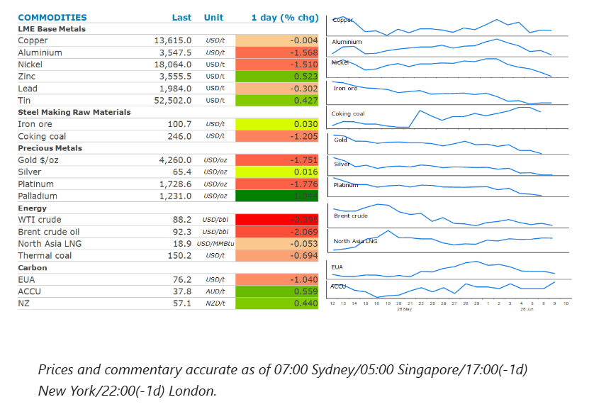
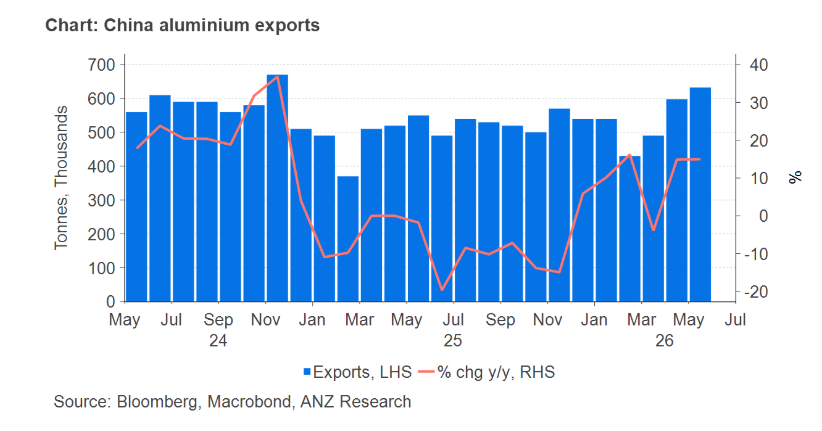

# Oil drops as Middle East tensions ease

**Date:** June 10, 2026  
**Publisher:** Breakwave Advisors | **Category:** Market Insights  
**Original URL:** [https://www.breakwaveadvisors.com/insights/2026/6/10/oil-drops-as-middle-east-tensions-ease](https://www.breakwaveadvisors.com/insights/2026/6/10/oil-drops-as-middle-east-tensions-ease)  

---

The energy sector slumped on signs of weaker demand. Industrial metals were mixed amid conflicting fundamentals. Precious metals fell.

*By*[*Daniel Hynes*](https://www.linkedin.com/in/dahynes/)

> **Figure 1: Στιγμιότυπο Οθόνης 2026 06 10 160141**  
> [Local Asset](file:///C:/Users/Dell/Github/Shipping/corpus/03-breakwave/insights/2026/assets/2026-06-10_oil-drops-as-middle-east-tensions-ease_img_cea3cf84ceb9ceb3cebcceb9cf8ccf84cf85_50f2b2c1625c.png)

### Market Commentary

**Crude oil**slumped as signs of weakening demand emerge to help balance the market amid supply disruptions in the Middle East. China’s[**crude oil imports**](../pdfs/2026-06-10_oil-drops-as-middle-east-tensions-ease_china-commodity-trade-data-may-2026_7708e556bbe5.pdf)declined to 33.0mt in May from 38.5mt in April. The sharp contraction of 29% y/y was expected, given the ban on refined oil product exports and falling refining margins, which led to lower refinery throughput. Refined oil product imports also fell sharply, suggesting that inventories of both crude oil and products have been drawn down. The Energy Information Administration estimates that global oil demand has plunged more than 1mb/d and is set to fall for the full year, which will help offset supply shortages from the closure of the Strait of Hormuz. There have also been signs of Persian Gulf producers finding alternative routes for their oil. Kuwait is said to be offering crude oil to Asian refiners, an indication that flows through the key waterway are resuming. Nevertheless, the volumes remain significantly below those seen prior to the conflict. The full resumption of transits will also take some time. Sea mines in the Strait of Hormuz must be removed, shut-in fields may take months to restart and damage to infrastructure in the region will take time to repair. Tension in the region remains fragile. Prices pared some of the earlier losses in the session after a US Apache helicopter was shot down off Oman. Trump blamed Iran and said the US must respond.

**Global gas**markets were also under pressure as the US and Iran inch toward a peace deal despite recent skirmishes. Earlier in the day, Trump told reporters that the US is in the final throes of what will be a very good deal with Iran. Nevertheless, the European gas market remains on edge as global LNG flows to the region have slowed in recent weeks. This has been driven by rising demand in key Asian markets. China’s gas imports for May rose to 10.1mt from 8.4mt in April. Strong demand for gas-fired power in India has also seen it ramp up its purchases in recent weeks. Weekly imports have increased by approximately 66% w/w as the country is gripped by a heat wave. Deliveries during 1-7 June exceeded 2025 levels by 88%. This has left storage facilities in Europe at only 42% full, well below normal seasonal levels. Shortages could be exacerbated by a workers’ strike at Inpex’s Ichthys LNG plant in Australia, which accounts for 2% of the world’s output, with a planned capacity of 9.3mt/y.

**Copper**ended the session unchanged. Early gains were pared late in the session on tension in the Middle East. Signs of a peace deal between the US and Iran helped lift the metal sector in early trading. Sentiment was boosted by a Bloomberg report that China is preparing to spend around CNY2trn over the next five years on building data centres across the country. Global spending on data centre infrastructure has been a key pillar in the bullish outlook for copper demand in recent months. China’s trade data shows copper demand remains robust. Refined copper imports were steady at 0.45mt, up 4.4% y/y, suggesting stable downstream demand and ongoing restocking.**Gold**was lower as investors continue to fret about tighter monetary policy.

**Iron ore**futures fell on signs of weak demand in China. Imports fell to 97.7mt due to softer conditions in the steel sector, with margins under pressure from subdued property demand. Lower exports from Australia and Brazil also weighed on imports into China.

### Chart of the Day

Aluminium is the metal most exposed to the Middle East conflict, as the region accounts for 9% of global primary aluminium output and 20% of supply outside China. China has been ramping up its output due to favourable margins. Exports rose again in May to breach 600kt. However, a regulatory cap of 45mt will prevent any further increases, thus setting the scene for further tightness across the global market.

> **Figure 2: Στιγμιότυπο Οθόνης 2026 06 10 160232**  
> **Interactive Data & Source:** [Linkedin](https://www.linkedin.com/newsletters/commodities-wrap-6692196755876012032/?fbclid=IwAR3kiXJqZdxmp9ZcRwBNI7FsBySI-XSC0pfPur1qzjt7OZp7PTE59Tsl1QI) | [Local Asset](file:///C:/Users/Dell/Github/Shipping/corpus/03-breakwave/insights/2026/assets/2026-06-10_oil-drops-as-middle-east-tensions-ease_img_cea3cf84ceb9ceb3cebcceb9cf8ccf84cf85_214e3240e89d.png)

Data source:[Commodities Wrap](https://www.linkedin.com/newsletters/commodities-wrap-6692196755876012032/?fbclid=IwAR3kiXJqZdxmp9ZcRwBNI7FsBySI-XSC0pfPur1qzjt7OZp7PTE59Tsl1QI)

---

**Tags:** Crude, Commodities, Shipping  
