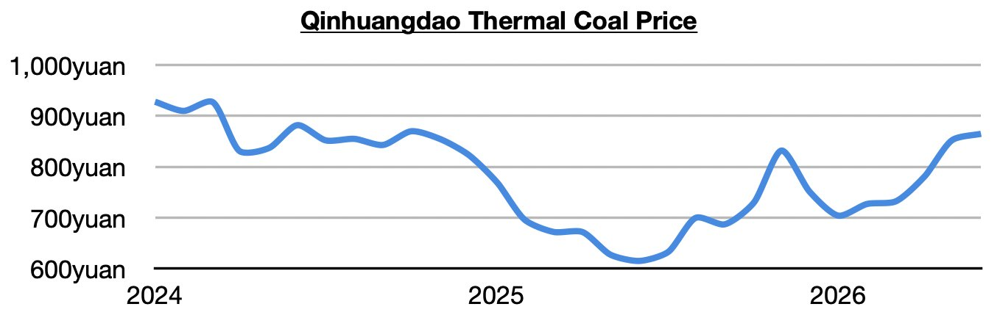
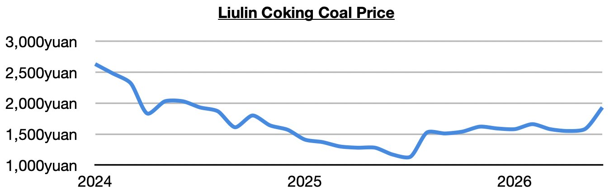
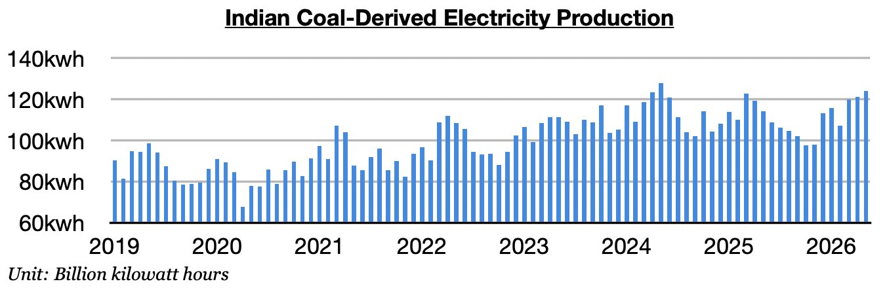

# Dry Bulk and Thermal Coal Demand Prospects Remain Bullish

**Date:** June 12, 2026  
**Publisher:** Breakwave Advisors | **Category:** Market Insights  
**Original URL:** [https://www.breakwaveadvisors.com/insights/2026/6/12/dry-bulk-and-thermal-coal-demand-prospects-remain-bullish](https://www.breakwaveadvisors.com/insights/2026/6/12/dry-bulk-and-thermal-coal-demand-prospects-remain-bullish)  

---

*By*[*Jeffrey Landsberg*](https://www.linkedin.com/in/jeffrey-landsberg-70ab957/)

As we discussed in Commodore Research's most recent Weekly Executive Report, dry bulk rates were mixed last week, with capesize and panamax rates falling while supramax and handysize rates increased. Capesize rates fell by the largest amount, and in particular had likely been set to take a breath considering how wide the capesize panamax ratio had recently climbed. In the coal market, of note is that thermal coal prices set yet another 2026 record.

> **Figure 1: Chart 1**  
> [Local Asset](file:///C:/Users/Dell/Github/Shipping/corpus/03-breakwave/insights/2026/assets/2026-06-12_dry-bulk-and-thermal-coal-demand-prospects-remain-bullish_img_chart1_60b981555a51.jpg)

Coking coal prices also set another 2026 record.

> **Figure 2: Chart 2**  
> [Local Asset](file:///C:/Users/Dell/Github/Shipping/corpus/03-breakwave/insights/2026/assets/2026-06-12_dry-bulk-and-thermal-coal-demand-prospects-remain-bullish_img_chart2_6e43fde103fa.jpg)

The catastrophic coal mine accident in Shanxi (and the government’s response) remains very supportive for Chinese coal import demand prospects. Separately, India’s own coal import demand prospects have also become much stronger. India’s coal-derived electricity generation grew year-on-year last month by the largest amount since June 2024.

> **Figure 3: Chart 3**  
> [Local Asset](file:///C:/Users/Dell/Github/Shipping/corpus/03-breakwave/insights/2026/assets/2026-06-12_dry-bulk-and-thermal-coal-demand-prospects-remain-bullish_img_chart3_5a16595b21f0.jpg)

---

**Tags:** Coal, Shipping, Drybulk  
