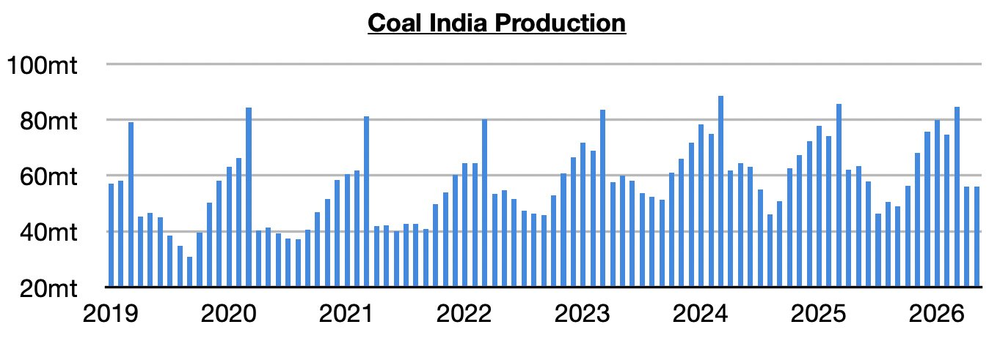
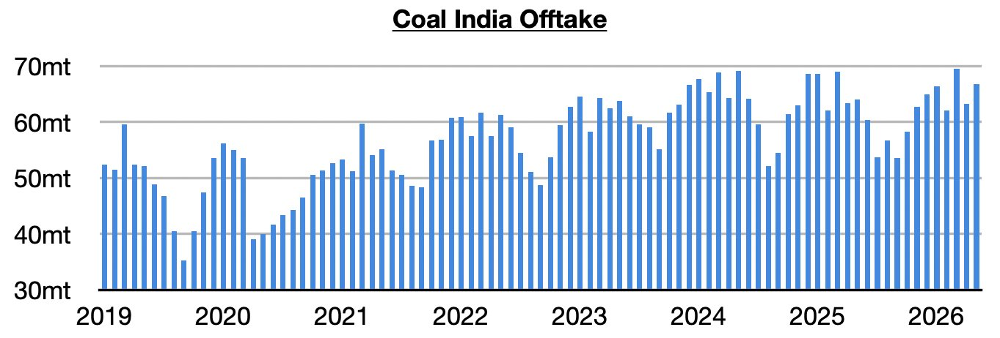
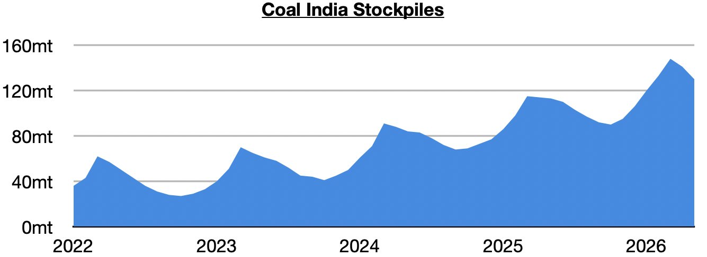

# Large Contraction in Coal India's Production

**Date:** June 15, 2026  
**Publisher:** Breakwave Advisors | **Category:** Market Insights  
**Original URL:** [https://www.breakwaveadvisors.com/insights/2026/6/15/large-contraction-in-coal-indias-production](https://www.breakwaveadvisors.com/insights/2026/6/15/large-contraction-in-coal-indias-production)  

---

*By*[*Jeffrey Landsberg*](https://www.linkedin.com/in/jeffrey-landsberg-70ab957/)

As we discussed in Commodore Research's most recent Weekly Executive Report, Coal India (which is responsible for over 75% of India’s coal output) produced 56.1 million tons of coal last month. This is unchanged from April and is down year-on-year by 7.4 million tons (-12%). Coal India’s production has now contracted on a year-on-year basis for three straight months. Previously, Coal India’s production had grown on a year-on-year basis for four straight months. Last month’s 12% year-on-year contraction has again marked the largest seen since July.

> **Figure 1: Chart 1**  
> [Local Asset](file:///C:/Users/Dell/Github/Shipping/corpus/03-breakwave/insights/2026/assets/2026-06-15_large-contraction-in-coal-indias-production_img_chart1_c253be084d4f.jpg)

Offtake (the amount sent to customers) totaled 66.7 million tons. This is up month-on-month by 3.5 million tons (6%) and is up year-on-year by 2.7 million tons (4%). Previously, offtake had contracted on a year-on-year basis in seven of the prior eight months.

> **Figure 2: Chart 2**  
> [Local Asset](file:///C:/Users/Dell/Github/Shipping/corpus/03-breakwave/insights/2026/assets/2026-06-15_large-contraction-in-coal-indias-production_img_chart2_572db46cbcc1.jpg)

With offtake again coming in above output, India’s stockpiles have fallen further. They now stand at approximately 130 million tons. This is down month-on-month by 11 million tons (-8%) but up year-on-year by 17 million tons (15%). Prior to the last two months, stockpiles had increased for five straight months.

> **Figure 3: Chart 3**  
> [Local Asset](file:///C:/Users/Dell/Github/Shipping/corpus/03-breakwave/insights/2026/assets/2026-06-15_large-contraction-in-coal-indias-production_img_chart3_7e53e091cdc1.jpg)

---

**Tags:** Coal, Shipping, Markets  
