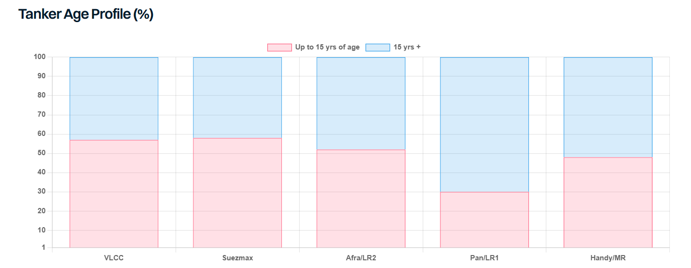

# Too Much of a Good Thing

**Date:** June 15, 2026  
**Publisher:** Breakwave Advisors | **Category:** Market Insights  
**Original URL:** [https://www.breakwaveadvisors.com/insights/2026/6/15/too-much-of-a-good-thing](https://www.breakwaveadvisors.com/insights/2026/6/15/too-much-of-a-good-thing)  

---

> **Figure 1: Tanker**  
> **Interactive Data & Source:** [Gibsons Co](https://www.gibsons.co.uk/market-reports) | [Local Asset](file:///C:/Users/Dell/Github/Shipping/corpus/03-breakwave/insights/2026/assets/2026-06-15_too-much-of-a-good-thing_img_tanker_e5832ce07803.jpg)

The Strait of Hormuz has been largely blocked since late February but despite an unprecedented energy crisis, tanker ordering activity for large carriers has intensified notably this year, especially for VLCCs, the segment that is arguably the most exposed to the extended Hormuz closure. Over 120 VLCCs have been ordered this year, with this number already exceeding the highest annual VLCC order total on record. This adds to already strong investment over the previous two years, taking the VLCC orderbook from around 5% of the existing fleet in early 2024 to 35% today. This ratio is significantly higher when only mainstream vessels are considered, given that one-fifth of the VLCC fleet is already dark/sanctioned.

The Suezmax segment has also attracted significant new investment, albeit at a more measured pace than VLCCs. Over 60 tankers have been ordered for the year to date, the second highest since 2015. As with VLCCs, robust investment in Suezmaxes has also been observed in recent years, meaning that this size group has the second highest orderbook, at 30% of the total existing fleet, and much higher if dark/sanctioned ships are excluded from these calculations.

Investment in other size groups is lower in comparison to larger sizes; yet again orders for the year to date are also fairly close to total investment seen last year. The orderbook looks much healthier but this is in part a function of a healthy stream of deliveries in 2025 and so far in 2026. At present, MR orders account for 20% of the existing fleet, whilst the Aframax/LR2 orderbook stands at 18%. The Handy and LR1/Panamax orderbook is notably lower but so has been investment in these segments for the past decade (with a few exceptions during the 2023-25 period).

There are unquestionably a few solid fundamental reasons for the overall increases in new investment levels, not least the ballooning size of the dark/sanctioned fleet and a rapidly ageing fleet profile, with over 21% of the fleet over 25,000 dwt already at 20 years of age or older and another 28% in the 15 to 19 year bracket. A further driver has been the substantial premiums commanded by modern secondhand tonnage, making newbuildings a more attractive long-term investment. On the demand side, Venezuela’s reset shifted demand into mainstream tonnage overnight, and a US-Iran deal could deliver a similar shift for Iranian crude. Ownership concentration in the VLCC segment has also reached unprecedented levels, which in a tight market has shown the benefits of tactically holding tonnage back. The tanker market’s own strength has also played a role.

Yet we have been here before and the question is how much is too much? The answer will evolve over time depending on geopolitical events, the evolution of tanker trade and the pace of removal of ageing and/or dark/sanctioned vessels from trading. High earnings leave little incentive to scrap, but sooner or later that will change: either as chartering restrictions shut older ships out of trading, or as the weight of new deliveries bears down on the market. When that moment comes, demolition capacity could face a serious test given the sheer volume of ageing tonnage.

> **Figure 2: Στιγμιότυπο Οθόνης 2026 06 15 100439**  
> **Interactive Data & Source:** [Gibsons Co](https://www.gibsons.co.uk/market-reports) | [Local Asset](file:///C:/Users/Dell/Github/Shipping/corpus/03-breakwave/insights/2026/assets/2026-06-15_too-much-of-a-good-thing_img_cea3cf84ceb9ceb3cebcceb9cf8ccf84cf85_765a2779dcb8.png)

Data source:[Gibson Shipbrokers](https://www.gibsons.co.uk/market-reports)

---

**Tags:** Tankers, Crude, Shipping  
