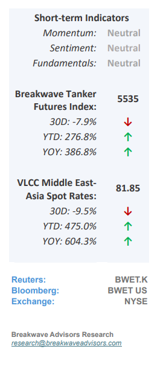
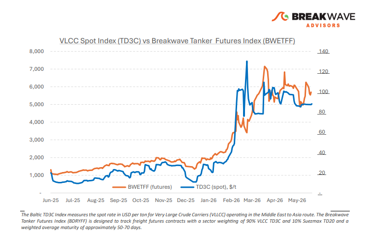
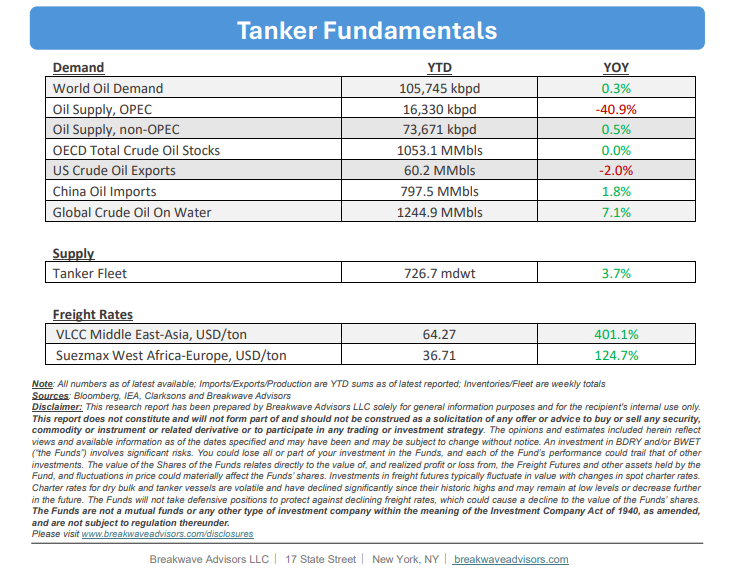

# Breakwave Bi-Weekly Tanker Report - June 16, 2026

**Date:** June 16, 2026  
**Publisher:** Breakwave Advisors | **Category:** Market Insights  
**Original URL:** [https://www.breakwaveadvisors.com/insights/6162026wetreportkjujun202698](https://www.breakwaveadvisors.com/insights/6162026wetreportkjujun202698)  

---

•**VLCC ex-Gulf Continues to Soften as Balance Tilts**– The VLCC market is increasingly transitioning from a disruption-driven environment toward one dictated by underlying supply-demand fundamentals**. Freight rates have softened across major long-haul routes, especially West of Suez,**reflecting the gradual erosion of the geopolitical premium that supported earnings during the Middle East disruption. Recent progress toward a U.S.-Iran agreement and expectations for a reopening of the Strait of Hormuz have reinforced this normalization trend. Brent crude has fallen sharply as markets anticipate a recovery in Gulf export flows and lower disruption risks. Against this backdrop, VLCC fleet growth remains the key medium-term concern.**Newbuilding activity continues**at an exceptional pace, driven by attractive economics relative to secondhand values and the need to renew an aging fleet. The**VLCC orderbook has expanded from nonexistent to roughly 35%**of the existing fleet, raising the risk that vessel supply growth outpaces cargo demand growth over the next several years. While freight markets remain elevated by historical standards, earnings**outside the Arabian Gulf have already retreated**below the highs seen during the disruption period. Assuming no renewed regional escalation, the**second half**of the year is likely to be characterized by further**normalization**, with freight increasingly exposed to rising fleet capacity and more modest oil demand growth.

> **Figure 1: Cea3cf84ceb9ceb3cebcceb9cf8ccf84cf85**  
> [Local Asset](file:///C:/Users/Dell/Github/Shipping/corpus/03-breakwave/insights/2026/assets/2026-06-16_6162026wetreportkjujun202698_img_cea3cf84ceb9ceb3cebcceb9cf8ccf84cf85_1bff84a41d53.png)

•**Oil Prices Drop to 2-month Lows as Piece Deal Emerges**– The recent initial agreement between the United States and Iran has pushed oil prices down to their lowest levels since the conflict's onset, as**markets price in expected normalizations in crude flows**. While global oil inventories face significant nearterm declines due to the long lead times required to reopen the Strait of Hormuz, the market anticipates that increased supply will ultimately improve. However, this assumption relies heavily on unresolved variables; therefore, we**maintain our outlook**that strong economic demand will keep**oil prices between $80 and $90 per barrel**for the remainder of the year assuming there is a smooth development in the current agreement framework. This sustained price level is further supported by projected global inventory drawdowns approaching 2 billion barrels, which will reduce reserves to multi-decade lows.

•**Our Long-term View**– The tanker market has been recovering from a long period of staggered rates as the growth in new vessel supply shrunk while oil demand remained elevated in line with the global economy. The recent rapid increase in freight rates has led to significant new vessel ordering, with the orderbook now standing at above average levels, and although in the near term such a supply/demand misbalance is small, we expect a meaningful negative balance to develop longer term leading to a potential downcycle.

> **Figure 2: Στιγμιότυπο Οθόνης 2026 06 15 202355**  
> [Local Asset](file:///C:/Users/Dell/Github/Shipping/corpus/03-breakwave/insights/2026/assets/2026-06-16_6162026wetreportkjujun202698_img_cea3cf84ceb9ceb3cebcceb9cf8ccf84cf85_59cb31321189.png)

> **Figure 3: Στιγμιότυπο Οθόνης 2026 06 15 202411**  
> [Local Asset](file:///C:/Users/Dell/Github/Shipping/corpus/03-breakwave/insights/2026/assets/2026-06-16_6162026wetreportkjujun202698_img_cea3cf84ceb9ceb3cebcceb9cf8ccf84cf85_aed6699fcf45.png)

### Subscribe:
