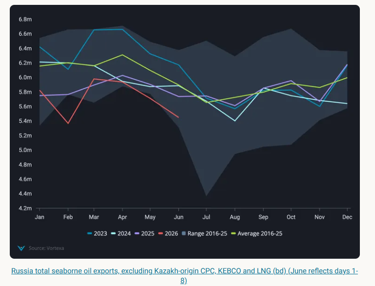
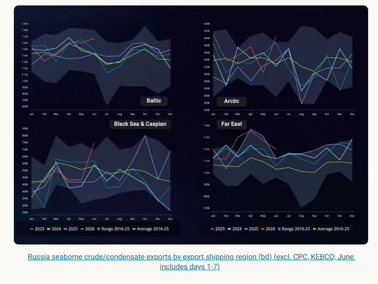
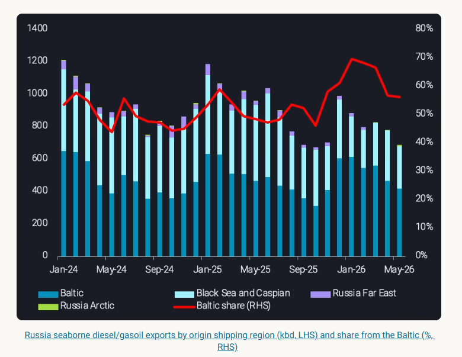

# Russian seaborne crude exports show little signs of slowing

**Date:** June 17, 2026  
**Publisher:** Breakwave Advisors | **Category:** Market Insights  
**Original URL:** [https://www.breakwaveadvisors.com/insights/2026/6/17/russian-seaborne-crude-exports-show-little-signs-of-slowing](https://www.breakwaveadvisors.com/insights/2026/6/17/russian-seaborne-crude-exports-show-little-signs-of-slowing)  

---

Here, we review key markers affecting Russian seaborne crude and clean refined product supplies for the near future

*By*[*Anna Zhminko*](https://www.linkedin.com/in/anna-zhminko/)

Russia’s total seaborne oil exports set another seasonal minimum in May, arriving at 5.74mbd, 160kbd lower than a year ago.

Looking beneath the headline figure, we review key markers affecting Russian seaborne crude and clean refined product supplies and what the outlook holds for the near future.

> **Figure 1: Στιγμιότυπο Οθόνης 2026 06 17 110057**  
> **Interactive Data & Source:** [Analytics Vortexa](https://analytics.vortexa.com/Flows?dateRange=2023-01-01T00%3A00%3A00.000Z__2026-06-07T23%3A59%3A59.999Z&filtersEnabled=%5B%22p%22%2C%22o%22%2C%22d%22%2C%22d_r%22%2C%22v%22%2C%22intra_d%22%2C%22sts_o%22%2C%22c_o%22%2C%22hd%22%2C%22v_o%22%5D&from=%5B%22b996521be9c996db3560ca234a56286ac38f798d34be229437555fab4f12a6a5%22%5D&geoBreakdownDestinationGlobal=region&metric=bpd&page=Flows&productsExcluded=%5B%229b0f7f5de0b111910f9f8a71b4008d4e0fd7542c55750f21dc905cda5f76bc08%22%2C%22578b0722570521d64e6a1527e1fb88ddb1a064cc15afe1d6023d2a0b6d66be6b%22%2C%22bb70cf56200f5b72ba69a90bda2c6b47ba29da23945c6f1994cfd4c2ef2fe0ff%22%5D&productsXFilter=%5B%2254af755a090118dcf9b0724c9a4e9f14745c26165385ffa7f1445bc768f06f11%22%5D&tabId=bf004a73-66d4-4ed1-b14a-cb9e37a7c119&timeSeriesChartView=seasonal&timeSeriesProperty=product_group_product&tsSeasonalMovingAvgWindow=28d&v=3) | [Local Asset](file:///C:/Users/Dell/Github/Shipping/corpus/03-breakwave/insights/2026/assets/2026-06-17_russian-seaborne-crude-exports-show-little-signs-of-slowing_img_cea3cf84ceb9ceb3cebcceb9cf8ccf84cf85_2faac0764f8b.png)

## Distant Export Hubs Expand Their Share in Crude Supply

Starting from October 2025 and until now, Russian[seaborne crude exports](https://analytics.vortexa.com/Flows?dateRange=2023-01-01T00%3A00%3A00.000Z__2026-06-07T23%3A59%3A59.999Z&filtersEnabled=%5B%22p%22%2C%22o%22%2C%22d%22%2C%22d_r%22%2C%22v%22%2C%22intra_d%22%2C%22sts_o%22%2C%22c_o%22%2C%22hd%22%2C%22v_o%22%5D&from=%5B%22b996521be9c996db3560ca234a56286ac38f798d34be229437555fab4f12a6a5%22%5D&geoBreakdownDestinationGlobal=region&metric=bpd&page=Flows&productsExcluded=%5B%229b0f7f5de0b111910f9f8a71b4008d4e0fd7542c55750f21dc905cda5f76bc08%22%2C%22578b0722570521d64e6a1527e1fb88ddb1a064cc15afe1d6023d2a0b6d66be6b%22%2C%22bb70cf56200f5b72ba69a90bda2c6b47ba29da23945c6f1994cfd4c2ef2fe0ff%22%5D&productsXFilter=%5B%2254af755a090118dcf9b0724c9a4e9f14745c26165385ffa7f1445bc768f06f11%22%5D&tabId=bf004a73-66d4-4ed1-b14a-cb9e37a7c119&timeSeriesChartView=seasonal&timeSeriesProperty=product_group_product&tsSeasonalMovingAvgWindow=28d&v=3)have been comparatively robust with exports averaging[305kbd higher each month](https://analytics.vortexa.com/Flows?dateRange=2023-01-01T00%3A00%3A00.000Z__2026-06-08T23%3A59%3A59.999Z&filtersEnabled=%5B%22p%22%2C%22o%22%2C%22d%22%2C%22d_r%22%2C%22v%22%2C%22intra_d%22%2C%22sts_o%22%2C%22c_o%22%2C%22hd%22%2C%22v_o%22%5D&from=%5B%22b996521be9c996db3560ca234a56286ac38f798d34be229437555fab4f12a6a5%22%5D&geoBreakdownDestinationGlobal=region&geoBreakdownOriginGlobal=shipping_region_v2&metric=bpd&page=Flows&productsExcluded=%5B%229b0f7f5de0b111910f9f8a71b4008d4e0fd7542c55750f21dc905cda5f76bc08%22%2C%22578b0722570521d64e6a1527e1fb88ddb1a064cc15afe1d6023d2a0b6d66be6b%22%2C%22bb70cf56200f5b72ba69a90bda2c6b47ba29da23945c6f1994cfd4c2ef2fe0ff%22%5D&productsXFilter=%5B%2254af755a090118dcf9b0724c9a4e9f14745c26165385ffa7f1445bc768f06f11%22%5D&tabId=bf004a73-66d4-4ed1-b14a-cb9e37a7c119&timeSeriesChartView=yearOverYear&tsSeasonalMovingAvgWindow=28d&v=3)against year-ago levels.

Despite repeating cases of infrastructure damage to Russian export terminals (i.e. at Primorsk, Ust-Luga in March 2026),[total seaborne exports of Russian crude](https://analytics.vortexa.com/Flows?dateRange=2023-01-01T00%3A00%3A00.000Z__2026-06-08T23%3A59%3A59.999Z&filtersEnabled=%5B%22p%22%2C%22o%22%2C%22d%22%2C%22d_r%22%2C%22v%22%2C%22intra_d%22%2C%22sts_o%22%2C%22c_o%22%2C%22hd%22%2C%22v_o%22%5D&from=%5B%22b996521be9c996db3560ca234a56286ac38f798d34be229437555fab4f12a6a5%22%5D&geoBreakdownDestinationGlobal=region&geoBreakdownOriginGlobal=shipping_region_v2&metric=bpd&page=Flows&productsExcluded=%5B%229b0f7f5de0b111910f9f8a71b4008d4e0fd7542c55750f21dc905cda5f76bc08%22%2C%22578b0722570521d64e6a1527e1fb88ddb1a064cc15afe1d6023d2a0b6d66be6b%22%2C%22bb70cf56200f5b72ba69a90bda2c6b47ba29da23945c6f1994cfd4c2ef2fe0ff%22%5D&productsXFilter=%5B%2254af755a090118dcf9b0724c9a4e9f14745c26165385ffa7f1445bc768f06f11%22%5D&tabId=bf004a73-66d4-4ed1-b14a-cb9e37a7c119&timeSeriesChartView=seasonal&timeSeriesProperty=product_category&tsSeasonalMovingAvgWindow=28d&v=3)have largely stayed above the 3-year seasonal level since March this year.

The Arctic and Far East regions played a significant role in maintaining this increase, driven in part by sites situated at greater distances from the strike reach. Exports from Russia Baltic have shown a slightly slower upside compared to 3-year seasonal levels, albeit being higher year-on-year, while the Black Sea continued to trail year-ago levels.

> **Figure 2: Στιγμιότυπο Οθόνης 2026 06 17 110148**  
> **Interactive Data & Source:** [Analytics Vortexa](https://analytics.vortexa.com/Flows?dateRange=last-24-months&filtersEnabled=%5B%22p%22%2C%22o%22%2C%22d%22%2C%22d_r%22%2C%22v%22%2C%22intra_d%22%2C%22sts_o%22%2C%22c_o%22%2C%22w%22%2C%22sts%22%2C%22v_t%22%2C%22c%22%2C%22v_o%22%2C%22sh%22%2C%22co%22%5D&from=%5B%22b996521be9c996db3560ca234a56286ac38f798d34be229437555fab4f12a6a5%22%5D&geoBreakdownDestinationGlobal=region&geoBreakdownOriginGlobal=shipping_region_v2&metric=bpd&page=Flows&products=%5B%2254af755a090118dcf9b0724c9a4e9f14745c26165385ffa7f1445bc768f06f11%22%5D&productsBreakdown=grade&productsExcluded=%5B%22bb70cf56200f5b72ba69a90bda2c6b47ba29da23945c6f1994cfd4c2ef2fe0ff%22%2C%22578b0722570521d64e6a1527e1fb88ddb1a064cc15afe1d6023d2a0b6d66be6b%22%5D&productsXFilter=%5B%2204c4ea46fc6fccfe8388717f399b40e5e348f9a98c451d99e7366caa998191a7%22%5D&sortDirection=asc&sortField=unloading_start&tabId=d8180133-fa1c-4341-aeb4-622067f2084f&timeSeriesPercentageEnabled=1&timeSeriesProperty=product_grade&tsSeasonalMovingAvg=1&tsSeasonalMovingAvgWindow=28d&v=3) | [Local Asset](file:///C:/Users/Dell/Github/Shipping/corpus/03-breakwave/insights/2026/assets/2026-06-17_russian-seaborne-crude-exports-show-little-signs-of-slowing_img_cea3cf84ceb9ceb3cebcceb9cf8ccf84cf85_c54c94cf5197.png)

Such regional divergence also underpins longer-term capacity dynamics in both the Far East and the Arctic:

- Far East ESPO Blend exports from Russia’s Kozmino have yet to expand to the 50mt/y (1mbd-1.1mbd) terminal capacity, where[47.2mt (1mbd) was lifted in 2025](https://analytics.vortexa.com/Flows?dateRange=last-24-months&filtersEnabled=%5B%22p%22%2C%22o%22%2C%22d%22%2C%22d_r%22%2C%22v%22%2C%22intra_d%22%2C%22sts_o%22%2C%22c_o%22%2C%22w%22%2C%22sts%22%2C%22v_t%22%2C%22c%22%2C%22v_o%22%2C%22sh%22%2C%22co%22%5D&from=%5B%22b996521be9c996db3560ca234a56286ac38f798d34be229437555fab4f12a6a5%22%5D&geoBreakdownDestinationGlobal=region&geoBreakdownOriginGlobal=shipping_region_v2&metric=bpd&page=Flows&products=%5B%2254af755a090118dcf9b0724c9a4e9f14745c26165385ffa7f1445bc768f06f11%22%5D&productsBreakdown=grade&productsExcluded=%5B%22bb70cf56200f5b72ba69a90bda2c6b47ba29da23945c6f1994cfd4c2ef2fe0ff%22%2C%22578b0722570521d64e6a1527e1fb88ddb1a064cc15afe1d6023d2a0b6d66be6b%22%5D&productsXFilter=%5B%2204c4ea46fc6fccfe8388717f399b40e5e348f9a98c451d99e7366caa998191a7%22%5D&sortDirection=asc&sortField=unloading_start&tabId=d8180133-fa1c-4341-aeb4-622067f2084f&timeSeriesPercentageEnabled=1&timeSeriesProperty=product_grade&tsSeasonalMovingAvg=1&tsSeasonalMovingAvgWindow=28d&v=3)(Argus)
- In the Arctic, Vostok Oil phase-1 is expected to come online by end-2026, bringing up to 600kbd of additional crude export capacity upon full exploitation (Argus). Despite multiple delays and limited timeline transparency, this start-up could allow Russia to insulate some seaborne crude exports from infrastructure disruption due to strike exposure

While these remain longer-term developments, the current export robustness from both the[Far East and Arctic regions,](https://analytics.vortexa.com/Flows?dateRange=2023-01-01T00%3A00%3A00.000Z__2026-06-07T23%3A59%3A59.999Z&filtersEnabled=%5B%22p%22%2C%22o%22%2C%22d%22%2C%22d_r%22%2C%22v%22%2C%22intra_d%22%2C%22sts_o%22%2C%22c_o%22%2C%22hd%22%2C%22v_o%22%5D&from=%5B%22b996521be9c996db3560ca234a56286ac38f798d34be229437555fab4f12a6a5%22%5D&geoBreakdownDestinationGlobal=region&geoBreakdownOriginGlobal=shipping_region_v2&metric=bpd&originGlobalXFilter=%5B%2223d89c430d1f8ee5ccfd78a82243d3e17199d520898d3463cc99ddd2f97eb971%22%2C%221cb30f0019d0b954851a40c489059017e12bf742c4ff533e3c3a47fdce9aa942%22%5D&page=Flows&productsExcluded=%5B%229b0f7f5de0b111910f9f8a71b4008d4e0fd7542c55750f21dc905cda5f76bc08%22%2C%22578b0722570521d64e6a1527e1fb88ddb1a064cc15afe1d6023d2a0b6d66be6b%22%2C%22bb70cf56200f5b72ba69a90bda2c6b47ba29da23945c6f1994cfd4c2ef2fe0ff%22%5D&productsXFilter=%5B%2254af755a090118dcf9b0724c9a4e9f14745c26165385ffa7f1445bc768f06f11%22%5D&tabId=bf004a73-66d4-4ed1-b14a-cb9e37a7c119&timeSeriesChartView=seasonal&tsSeasonalMovingAvgWindow=28d&v=3)combined with ongoing refinery outages, suggests Russian seaborne crude exports are likely to remain sustained over the coming month.

## Refinery Outages Continue to Weigh on Diesel

Amid[near-record refinery strikes](https://analytics.vortexa.com/InsightsHubPage?articleId=56wbQ92byUbTt8jFojvBa3&articleType=report&authorFilters=%5B%223NPZuX5Jnwcc1lTyR437H%22%5D&page=InsightsHubPage&searchTerm=&tabId=d1a66096-eec5-4661-ac35-6ebf7f9fe5aa)in May, with at least 14 recorded instances,[Russian seaborne diesel/gasoil exports](https://analytics.vortexa.com/Flows?dateRange=2023-01-01T00%3A00%3A00.000Z__2026-06-07T23%3A59%3A59.999Z&filtersEnabled=%5B%22p%22%2C%22o%22%2C%22d%22%2C%22d_r%22%2C%22v%22%2C%22intra_d%22%2C%22sts_o%22%2C%22c_o%22%2C%22hd%22%2C%22v_o%22%5D&from=%5B%22b996521be9c996db3560ca234a56286ac38f798d34be229437555fab4f12a6a5%22%5D&geoBreakdownDestinationGlobal=region&geoBreakdownOriginGlobal=shipping_region_v2&metric=bpd&page=Flows&productsBreakdown=group_product&productsExcluded=%5B%229b0f7f5de0b111910f9f8a71b4008d4e0fd7542c55750f21dc905cda5f76bc08%22%2C%22578b0722570521d64e6a1527e1fb88ddb1a064cc15afe1d6023d2a0b6d66be6b%22%2C%22bb70cf56200f5b72ba69a90bda2c6b47ba29da23945c6f1994cfd4c2ef2fe0ff%22%5D&productsXFilter=%5B%22deda35eb9ca56b54e74f0ff370423f9a8c61cf6a3796fcb18eaeeb32a8c290bb%22%5D&tabId=bf004a73-66d4-4ed1-b14a-cb9e37a7c119&timeSeriesChartView=seasonal&tsSeasonalMovingAvgWindow=28d&v=3)fell to a seasonal minimum at 740kbd, 26% lower year-on-year.

Meanwhile,[Russian Baltic](https://analytics.vortexa.com/Flows?dateRange=2023-01-01T00%3A00%3A00.000Z__2026-06-07T23%3A59%3A59.999Z&filtersEnabled=%5B%22p%22%2C%22o%22%2C%22d%22%2C%22d_r%22%2C%22v%22%2C%22intra_d%22%2C%22sts_o%22%2C%22c_o%22%2C%22hd%22%2C%22v_o%22%5D&from=%5B%22b996521be9c996db3560ca234a56286ac38f798d34be229437555fab4f12a6a5%22%5D&geoBreakdownDestinationGlobal=region&geoBreakdownOriginGlobal=shipping_region_v2&metric=bpd&page=Flows&productsBreakdown=group_product&productsExcluded=%5B%229b0f7f5de0b111910f9f8a71b4008d4e0fd7542c55750f21dc905cda5f76bc08%22%2C%22578b0722570521d64e6a1527e1fb88ddb1a064cc15afe1d6023d2a0b6d66be6b%22%2C%22bb70cf56200f5b72ba69a90bda2c6b47ba29da23945c6f1994cfd4c2ef2fe0ff%22%5D&productsXFilter=%5B%22deda35eb9ca56b54e74f0ff370423f9a8c61cf6a3796fcb18eaeeb32a8c290bb%22%5D&tabId=bf004a73-66d4-4ed1-b14a-cb9e37a7c119&timeSeriesProperty=origin_shipping_region_v2&tsSeasonalMovingAvgWindow=28d&v=3)has continued to maintain the largest share of exports at 56% in May. This reflects a broader, ongoing shift away from the Black Sea since the Ukraine invasion, as declining refined fuel sendout from the region has been a persistent trend. Further pressure was added by strikes on the Tuapse refinery and terminal in April and May, with close to no[diesel/gasoil cargoes exported from Tuapse](https://analytics.vortexa.com/Flows?dateRange=2024-01-01T00%3A00%3A00.000Z__2026-05-31T23%3A59%3A59.999Z&filtersEnabled=%5B%22p%22%2C%22o%22%2C%22d%22%2C%22d_r%22%2C%22v%22%2C%22intra_d%22%2C%22sts_o%22%2C%22c_o%22%2C%22w%22%2C%22sts%22%2C%22v_o%22%5D&from=%5B%22b996521be9c996db3560ca234a56286ac38f798d34be229437555fab4f12a6a5%22%5D&geoBreakdownDestinationGlobal=shipping_region_v2&geoBreakdownOriginGlobal=port&metric=bpd&originGlobalXFilter=%5B%22865a4b54b27d7ebfb7147c077446baa1ae3b5be1bb9a6ef2ff07c9443e43fcfc%22%5D&page=Flows&products=%5B%22deda35eb9ca56b54e74f0ff370423f9a8c61cf6a3796fcb18eaeeb32a8c290bb%22%5D&tabId=ad323d12-d124-4404-8607-9ebb6fc38f82&timeSeriesPercentageEnabled=1&timeSeriesProperty=origin_port&tsSeasonalMovingAvg=1&tsSeasonalMovingAvgWindow=28d&v=3)in May. This reflects at least a 110kbd deficit compared to a year prior. That said, Russian diesel exports are likely to remain subdued through the summer months.

> **Figure 3: Στιγμιότυπο Οθόνης 2026 06 17 110241**  
> **Interactive Data & Source:** [Vortexa](https://www.vortexa.com//oil-gas-data-traders-analysts-data-scientists?gclid=Cj0KCQjw8_qRBhCXARIsAE2AtRZKOvMnbilZ_6_91d7huSFFy71pWLrnPwGwOHVzXsmsG-1a1mZnQw8aAt89EALw_wcB&hsa_acc=1782073842&hsa_ad=548425387665&hsa_cam=14746637662&hsa_grp=125038601902&hsa_kw=&hsa_mt=&hsa_net=adwords&hsa_src=g&hsa_tgt=dsa-1431852288425&hsa_ver=3&utm_campaign=%5BCD%5D%20-%20DSA%20-%20EMEA&utm_medium=cpc&utm_medium=ppc&utm_source=google&utm_source=adwords&utm_term=) | [Local Asset](file:///C:/Users/Dell/Github/Shipping/corpus/03-breakwave/insights/2026/assets/2026-06-17_russian-seaborne-crude-exports-show-little-signs-of-slowing_img_cea3cf84ceb9ceb3cebcceb9cf8ccf84cf85_03f2afa28b1f.png)

## Outlook

Ukrainian strikes on Russia’s refineries continue at pace, with at least five attacks so far in June. At the same time, frequency of reported outages has risen too. Six refineries attacked in May went into full outage (Reuters, other sources), reflecting a total of 1.5mbd of CDU capacity affected (Argus). This alone, represents nearly 21% of Russia’s total refining CDU capacity.

A multi-year sustained strike campaign over Russian refineries may also incrementally increase infrastructure vulnerability, even if the severity of attacks remains unchanged. As a result, we will likely continue to see exports of Russian refined products subdued.

For crude oil exports, this points to continued supply availability from Russia’s west-facing ports in the near term, particularly from the Russian Baltic. With Arctic and Far East volumes also holding firm, more barrels are likely to be pushed into export channels.

While it remains uncertain whether the United States extend the sanctions waiver for Russian oil after June 17, Russia's exports of predominantly medium-sour crude will likely remain robust, underpinned by the factors outlined above.

Data Source:[Vortexa](https://www.vortexa.com//oil-gas-data-traders-analysts-data-scientists?gclid=Cj0KCQjw8_qRBhCXARIsAE2AtRZKOvMnbilZ_6_91d7huSFFy71pWLrnPwGwOHVzXsmsG-1a1mZnQw8aAt89EALw_wcB&hsa_acc=1782073842&hsa_ad=548425387665&hsa_cam=14746637662&hsa_grp=125038601902&hsa_kw=&hsa_mt=&hsa_net=adwords&hsa_src=g&hsa_tgt=dsa-1431852288425&hsa_ver=3&utm_campaign=%5BCD%5D%20-%20DSA%20-%20EMEA&utm_medium=cpc&utm_medium=ppc&utm_source=google&utm_source=adwords&utm_term=)

---

**Tags:** Crude, Tankers, Markets  
