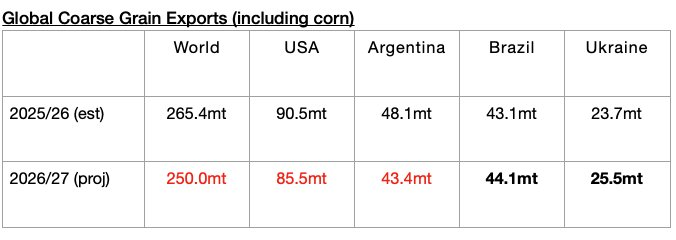

# Less Grain Exports Expected Next Season

**Date:** June 18, 2026  
**Publisher:** Breakwave Advisors | **Category:** Market Insights  
**Original URL:** [https://www.breakwaveadvisors.com/insights/2026/6/18/less-grain-exports-expected-next-season](https://www.breakwaveadvisors.com/insights/2026/6/18/less-grain-exports-expected-next-season)  

---

*By*[*Jeffrey Landsberg*](https://www.linkedin.com/in/jeffrey-landsberg-70ab957/)

As we discussed in Commodore Research's most recent Weekly Executive Report, The United States Department of Agriculture (USDA) now predicts that global coarse grain, wheat, soybean, and soymeal exports will total 739.3 million tons in the upcoming 2026/27 season. This is 23.2 million tons (-3%) less than expected for the current 2025/26 season. Overall, this is a firm amount (and the forecast, of course, remains preliminary and will change as the months progress). For the current 2025/26 grain season, 763.1 million tons is expected, which would mark a year-on-year increase of 58.1 million tons (8%). This season’s robust volume has continued to contribute to strength in dry bulk rates. Compared to the 705 million tons of grain that was shipped during the 2024/25 season, 739.3 million tons — if actually shipped in 2026/27 — would mark an increase of 34.3 million tons (5%).

The USDA forecasts that global coarse grain exports in 2026/27 will total 249 million tons. This would mark a year-on-year decrease of 15.4 million tons (-6%) from the 2025/26 season. Coarse grain exports will remain the global grain market’s largest cargo by volume. Moderate year-on-year declines in coarse grain exports are expected from the United States and Argentina. Small year-on-year increases in coarse grain exports are expected from Brazil and Ukraine.

> **Figure 1: Chart**  
> [Local Asset](file:///C:/Users/Dell/Github/Shipping/corpus/03-breakwave/insights/2026/assets/2026-06-18_less-grain-exports-expected-next-season_img_chart_f1983a69a6f4.jpg)

---

**Tags:** Commodities, Markets, Grains  
