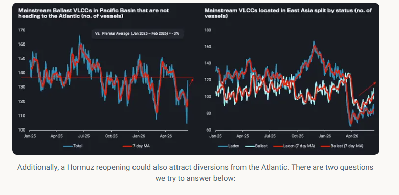
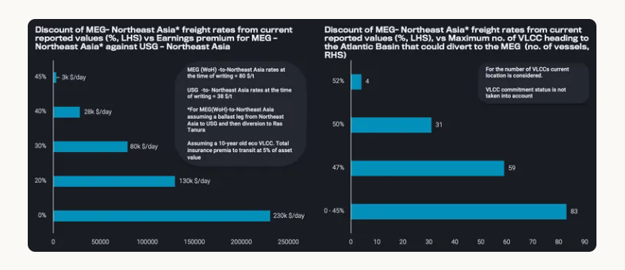

# The Tonnage Math Behind a Hormuz Reopening

**Date:** June 18, 2026  
**Publisher:** Breakwave Advisors | **Category:** Market Insights  
**Original URL:** [https://www.breakwaveadvisors.com/insights/2026/6/18/the-tonnage-math-behind-a-hormuz-reopening](https://www.breakwaveadvisors.com/insights/2026/6/18/the-tonnage-math-behind-a-hormuz-reopening)  

---

A reopening is unlikely to trigger a sudden tonnage squeeze, with vessels positioning to the MEG while Atlantic diversions could add to the tally.

*By*[*Ioannis Papadimitriou*](https://www.linkedin.com/in/ipapadimitriou/)

A Hormuz reopening is unlikely to trigger an immediate VLCC tonnage squeeze, as ample ballast capacity is already positioning towards the MEG, whereas diverting ballasters from the Atlantic could further add to the tally.

There has been a lot of discussion on whether a potential Strait of Hormuz reopening could provide a significant upside on freight rates, specifically for VLCCs. Even setting the current baseline to understand from which rates will increase or decline is challenging, as VLCC rates reported west of Hormuz aren't necessarily reliable given the illiquidity of deals.

This piece sets out our view on the tonnage and cargo dynamics behind that question, and quantifies the conditions under which Atlantic-bound VLCCs would find it worthwhile to divert back to the Middle East Gulf.

From a vessel demand perspective, regional infrastructure is expected to take several months to normalise, while[MEG crude inventories (excl. Iran)](https://analytics.vortexa.com/OnShoreCrudeInventories?dateRange=2022-01-01T00%3A00%3A00.000Z__2026-06-15T23%3A59%3A59.999Z&multiSelect=1&onshoreInventoriesLocations=%5B%22a50f4a476665d3d507f54398b1a1aed1746c5469619c83c3398716724f8dda27%22%2C%22934c47f36c16a58d68ef5e007e62a23f5f036ee3f3d1f5f85a48c572b90ad8b2%22%2C%22e9e556620469f46a4dc171aef71073f5286a288da35c5883cac760446b0ceb46%22%2C%2250182d9d05051a6c8d24f0514d4ee828da6eaa29eacbb11cfe368f51526328ce%22%2C%2243a70ba6b21894cd24165d9d7ee59b012e698cf97e22fd275ccdd05a556e7061%22%2C%22cde783a902c7837b814dfa5988ed74fb14841c2999d6984952c7cbfc543d5073%22%2C%2270425373a1836d6d0390dc6fef838a468717fba7776d66065a5043488f9f041b%22%2C%22f39d455f5d38907394d6da3a91da4e391f9a34bd6a17e826d6042761067e88f4%22%2C%229ab4381aab3268d41c92fe179c819cb9e01e5b4fc6c22b231124c2a83e59ff98%22%2C%228fe5aff59d1fb619c31ac78f63344d929e35d3941e85f654c6ae9d18fdb6cdb1%22%2C%22d308ddc557e774187ad6c7da81b39db990def9a39e6c88e79cb163b6bdd6e8e5%22%2C%226253047d839a51684f2ab6e3a4fa9956f582c73dfbbb276ebcd51ee01697b024%22%2C%22c1698979b983b265490545013156924518af07faf7f25905a78a1813054860d8%22%2C%223eac69e760d9ec571e57ed806a244168f12b4374af47f53d983d71ca6d01b61b%22%2C%222d92cc08f22524dba59f6a7e340f132a9da0ce9573cca968eb8e3752ef17a963%22%2C%22707da622480cd2158abeb3c2803f7f848d46fdc1357c2fdca974a56ed38d52a2%22%2C%22bcd7dddaf951959ebf6076a3a594b426a246d3bffe13339b10d04e45f222e011%22%2C%2280aa9e4f3014c3d96559c8e642157edbb2b684ea0144ed76cd20b3af75110877%22%2C%220427e0f9d52b38c1a98b68c59b8fd80cb1c508e44882e96611e48ef5b140d927%22%2C%22f2ac0b4ca7b0e481ec41197ddbd37f6c60251f369ed74872691988bed8a07e0a%22%2C%22e6ac4ef9f6171a6473679fda36014b1bdea85469c80c0250bf2dbe86ab4a5935%22%2C%2290f285f8fb15c8bc72a43d25cea803491cc0fd0e97567cff577a2cfa56cde6f8%22%5D&page=OnShoreCrudeInventories&selectedRegion=%5B%2290f285f8fb15c8bc72a43d25cea803491cc0fd0e97567cff577a2cfa56cde6f8%22%2C%22e6ac4ef9f6171a6473679fda36014b1bdea85469c80c0250bf2dbe86ab4a5935%22%2C%2243a70ba6b21894cd24165d9d7ee59b012e698cf97e22fd275ccdd05a556e7061%22%2C%22f2ac0b4ca7b0e481ec41197ddbd37f6c60251f369ed74872691988bed8a07e0a%22%2C%226253047d839a51684f2ab6e3a4fa9956f582c73dfbbb276ebcd51ee01697b024%22%5D&tabId=5b0c4b8e-c632-4711-ae45-bfc23ec86442&tankCrude=%5B%22confirmed%22%2C%22probable%22%5D&tsVisualType=seasonal)remain below 5-year seasonal ranges. Cargo enquiries however could carry a wider booking window than usual, which could provide employment support that propagates through to rate uplifts in other regions, such as the Atlantic Basin.

To better understand how the situation in the Gulf is likely to unfold, it helps to look at the tonnage picture. Any near-term spike in rates is unlikely to be driven by a shortage of tonnage, at least in the crude segment, and to the extent one occurs, it should be short-lived. Mainstream ballast VLCCs are rushing toward the MEG.[VLCCs in the Pacific not currently heading toward the Atlantic Basin are sitting at levels in line with pre-war averages](https://tinyurl.com/49jnhep4), while the[number of VLCCs located in East Asia](https://tinyurl.com/mw34zn4p), though still below 2-year averages, is rising — implying the pool available to load from the MEG should keep expanding over the next two weeks.

> **Figure 1: Στιγμιότυπο Οθόνης 2026 06 18 114544**  
> **Interactive Data & Source:** [Vortexa](https://www.vortexa.com//oil-gas-data-traders-analysts-data-scientists?gclid=Cj0KCQjw8_qRBhCXARIsAE2AtRZKOvMnbilZ_6_91d7huSFFy71pWLrnPwGwOHVzXsmsG-1a1mZnQw8aAt89EALw_wcB&hsa_acc=1782073842&hsa_ad=548425387665&hsa_cam=14746637662&hsa_grp=125038601902&hsa_kw=&hsa_mt=&hsa_net=adwords&hsa_src=g&hsa_tgt=dsa-1431852288425&hsa_ver=3&utm_campaign=%5BCD%5D%20-%20DSA%20-%20EMEA&utm_medium=cpc&utm_medium=ppc&utm_source=google&utm_source=adwords&utm_term=) | [Local Asset](file:///C:/Users/Dell/Github/Shipping/corpus/03-breakwave/insights/2026/assets/2026-06-18_the-tonnage-math-behind-a-hormuz-reopening_img_cea3cf84ceb9ceb3cebcceb9cf8ccf84cf85_98c8c3f31e73.png)

- What is the minimum level of freight that can be offered to attract VLCC operators that have reached the Gulf of Mexico to divert back to Ras Tanura?

- Based on vessel location, what is the maximum number of VLCCs in or heading to the Atlantic that could divert to the Middle East Gulf at different freight price points?

In practice, this calculation differs for every operator, depending on factors such as vessel age and fuel efficiency, whether the vessel has been drifting or idle for an extended period, the price at which bunkers were procured, and the insurance premium available to the operator for transiting the Strait. For this exercise, we focus on the repositioning economics of a 10-year-old eco VLCC, comparing the benefit of diverting to the Middle East Gulf (west of Hormuz) against the alternative of a Gulf of Mexico-to-Northeast Asia voyage.

On the first question, our analysis suggests that even at a 45% discount to current West of Hormuz rates (around $45/t), diverting from the US Gulf back to the Atlantic would still make financial sense for vessels, further inflating tonnage availability. While a 45% discount may sound severe, it remains $15/t above currently quoted rates for East of Hormuz cargoes. At this discount level, an additional 83 VLCCs currently ballasting toward the Atlantic could reposition back to the Middle East, provided they are not already committed.

> **Figure 2: Στιγμιότυπο Οθόνης 2026 06 18 114639**  
> **Interactive Data & Source:** [Vortexa](https://www.vortexa.com//oil-gas-data-traders-analysts-data-scientists?gclid=Cj0KCQjw8_qRBhCXARIsAE2AtRZKOvMnbilZ_6_91d7huSFFy71pWLrnPwGwOHVzXsmsG-1a1mZnQw8aAt89EALw_wcB&hsa_acc=1782073842&hsa_ad=548425387665&hsa_cam=14746637662&hsa_grp=125038601902&hsa_kw=&hsa_mt=&hsa_net=adwords&hsa_src=g&hsa_tgt=dsa-1431852288425&hsa_ver=3&utm_campaign=%5BCD%5D%20-%20DSA%20-%20EMEA&utm_medium=cpc&utm_medium=ppc&utm_source=google&utm_source=adwords&utm_term=) | [Local Asset](file:///C:/Users/Dell/Github/Shipping/corpus/03-breakwave/insights/2026/assets/2026-06-18_the-tonnage-math-behind-a-hormuz-reopening_img_cea3cf84ceb9ceb3cebcceb9cf8ccf84cf85_a1276efe06f6.png)

For deeper discounts, the diversion economics tighten quickly, and the pool of vessels willing to divert narrows sharply. At a $42/t freight rate (a 47% discount to current levels), 59 VLCCs could theoretically still make the diversion economical. At $38/t, however, only four VLCCs, currently positioned around East Africa and the West Indian coast and already heading towards the Atlantic, would find it financially worthwhile to divert and pick up cargo west of Hormuz.

Data Source:[Vortexa](https://www.vortexa.com//oil-gas-data-traders-analysts-data-scientists?gclid=Cj0KCQjw8_qRBhCXARIsAE2AtRZKOvMnbilZ_6_91d7huSFFy71pWLrnPwGwOHVzXsmsG-1a1mZnQw8aAt89EALw_wcB&hsa_acc=1782073842&hsa_ad=548425387665&hsa_cam=14746637662&hsa_grp=125038601902&hsa_kw=&hsa_mt=&hsa_net=adwords&hsa_src=g&hsa_tgt=dsa-1431852288425&hsa_ver=3&utm_campaign=%5BCD%5D%20-%20DSA%20-%20EMEA&utm_medium=cpc&utm_medium=ppc&utm_source=google&utm_source=adwords&utm_term=)

---

**Tags:** Crude, Markets, Tankers  
