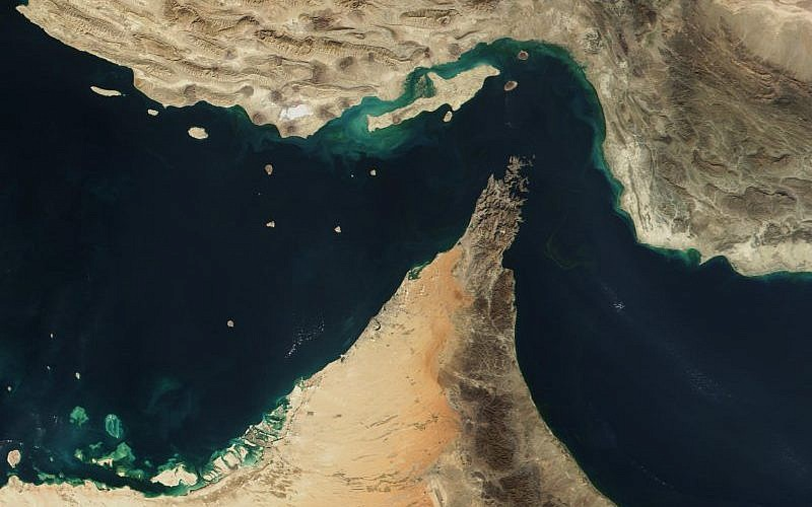
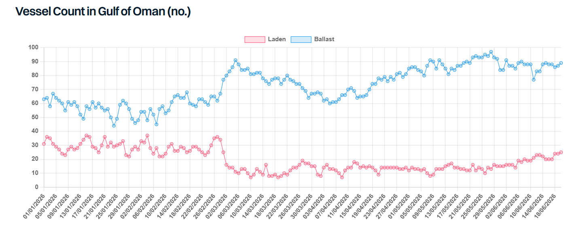

# Fourteen Points

**Date:** June 22, 2026  
**Publisher:** Breakwave Advisors | **Category:** Market Insights  
**Original URL:** [https://www.breakwaveadvisors.com/insights/2026/6/22/fourteen-points](https://www.breakwaveadvisors.com/insights/2026/6/22/fourteen-points)  

---

> **Figure 1: Hormuz**  
> **Interactive Data & Source:** [Gibsons Co](https://www.gibsons.co.uk/market-reports) | [Local Asset](file:///C:/Users/Dell/Github/Shipping/corpus/03-breakwave/insights/2026/assets/2026-06-22_fourteen-points_img_hormuz_e7d7a49f81b1.png)

After more than three months of disruption, the prospect of the Iran conflict drawing to a close appears higher than ever. The memorandum of understanding (MOU) between Iran and the US, signed twice over the past week, sets out fourteen points charting a path towards normalisation.

In brief, the MOU stipulates an end to hostilities between all parties, including Israel and Lebanon, alongside the lifting of both the US and Iranian blockades, the latter taking into account the removal of technical obstacles and mines. Iran is to receive its frozen funds together with substantial financing and sanctions relief and will in turn refrain from pursuing a nuclear weapon. A comprehensive agreement is to be negotiated within 60 days, a period which is extendable, with the final deal enshrined through a binding resolution of the UN Security Council.

The early signs suggest both sides are honouring the terms. We have seen several Iranian VLCCs and Suezmaxes cross the US blockade this week with their AIS switched on, indicating Washington is holding up its end of the bargain. Similarly, transits through the Strait of Hormuz are increasing, though a return to pre-war volumes within 30 days may prove difficult to achieve. However, cargo availability currently exceeds the willingness of owners to cross the SOH, indicating that for now concerns about transits remain in place.

Transits into Hormuz are expected to build gradually, subject to the security situation continuing to improve, and insurance premiums should ease in line with this. Freight premiums for transits into the Middle East Gulf (MEG), however, are likely to remain volatile. We have observed vessels increasingly positioning nearer to the MEG in recent weeks, particularly VLCCs and LR2s, the segments most dependent on MEG volumes, though it may take two to three months before vessel supply fully normalises.

On the oil supply side, the IEA is optimistic that Middle East crude production can recover swiftly as security normalises. Saudi Arabia and the UAE hold significant spare capacity and could lift output to offset slower recoveries in the likes of Iraq and Kuwait. With the UAE now free from OPEC quotas, the country may look to expand exports rapidly, while Saudi Arabia may continue to lean on Yanbu to limit any bottlenecks at its Gulf loading terminals. The OPEC+ quota policy remains uncertain, yet the group has already lifted quotas by nearly 800kbd between April and July.

The recovery in products will lag behind. Damage to Middle East refineries means runs are unlikely to return to pre-war levels until 2027 at the earliest, while Asian refinery runs will only recover once feedstock supplies have substantially improved, likely in Q4 2026. Refiners may also find themselves competing with government stock building, and refinery exports may be constrained as operators seek to rebuild CPP inventories to normal levels or divert supplies into government storage. Seaborne CPP volumes are therefore unlikely to recover fully until later in 2027, lagging crude volumes considerably.

The US Treasury has reportedly already issued a waiver for exports of Iranian oil and products, valid until all sanctions facing Iran are lifted, yet no official confirmation has been published. It remains unclear, however, whether sanctions relief will be broad enough to allow mainstream buyers back into Iranian oil. Should sanctions be fully lifted, and the EU and UK follow suit, mainstream VLCCs and Suezmaxes in particular stand to benefit. With around 28% of the dark fleet currently engaged in Iranian trade, the prospects for those vessels would be further diminished, and asset prices for older tankers could come under pressure as revenue-generating opportunities narrow.

Overall, the deal appears fragile, and a return to hostilities cannot be ruled out. Israel has continued military operations in Lebanon, with Iran accusing it of violating the MOU terms 84 times since signing. Time will tell whether this marks the genuine beginning of the end, or merely another pause.

> **Figure 2: Στιγμιότυπο Οθόνης 2026 06 22 102844**  
> **Interactive Data & Source:** [Gibsons Co](https://www.gibsons.co.uk/market-reports) | [Local Asset](file:///C:/Users/Dell/Github/Shipping/corpus/03-breakwave/insights/2026/assets/2026-06-22_fourteen-points_img_cea3cf84ceb9ceb3cebcceb9cf8ccf84cf85_0975834db7aa.png)

Data source:[Gibson Shipbrokers](https://www.gibsons.co.uk/market-reports)

---

**Tags:** Tankers, Crude, Shipping  
