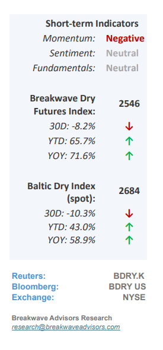
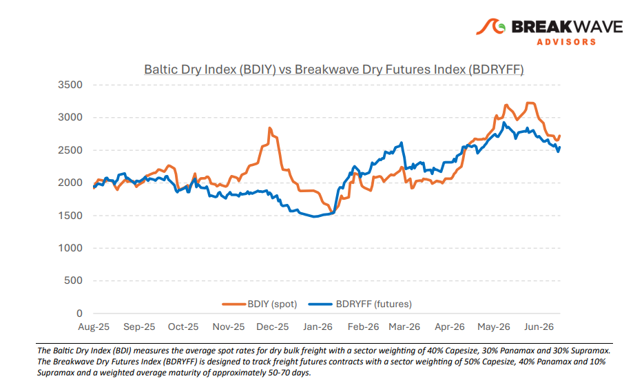
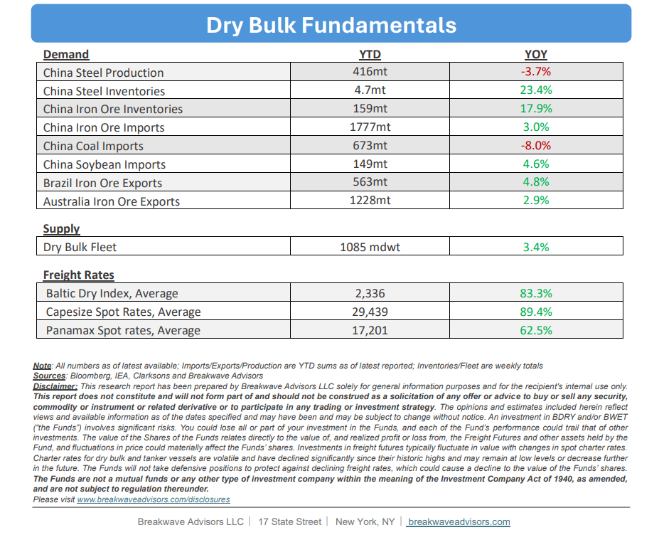

# Breakwave Bi-Weekly Dry Bulk Report - June 23, 2026

**Date:** June 23, 2026  
**Publisher:** Breakwave Advisors | **Category:** Market Insights  
**Original URL:** [https://www.breakwaveadvisors.com/insights/6232026db-report2026drykk47](https://www.breakwaveadvisors.com/insights/6232026db-report2026drykk47)  

---

•**Capesize Rates Remain Seasonally Strong Despite Recent Drop**– The dry bulk market continues to demonstrate seasonal resilience, characterized by highly profitable freight rates and a positive outlook equally supported by a strong freight futures curve. While the**Pacific basin has experienced some anticipated softening**identified in our previous report, robust Atlantic fixtures remain the cornerstone of the current market upcycle, with steady fixing activity projected to continue. On the commodity front,**iron ore volumes continue to outperform****expectations**, and West African**bauxite exports have achieved double-digit year-over-year growth;**conversely, coal volumes represent a localized weakness due to declining Chinese imports. This overall bullish trajectory is expected to persist through the second half of the year. Although potential risks exist, such as rumored government interventions in bauxite exports affecting Atlantic vessel supply, or high iron ore inventories amid a soft steel market eventually dampening import demand, there is currently**no definitive evidence that these bearish scenarios will materialize**. Consequently, near-term market expectations remain highly optimistic, corroborated by a firm freight futures curve and a robust secondhand vessel market across all asset classes.

> **Figure 1: Cea3cf84ceb9ceb3cebcceb9cf8ccf84cf85**  
> [Local Asset](file:///C:/Users/Dell/Github/Shipping/corpus/03-breakwave/insights/2026/assets/2026-06-23_6232026db-report2026drykk47_img_cea3cf84ceb9ceb3cebcceb9cf8ccf84cf85_4c6ee517ed28.png)

•**Some Ugly Economic Numbers out of China**– While global attention naturally remains fixed on Middle East tensions, China’s latest economic data underscores a prolonged,**sluggish recovery**as both retail sales and fixed-asset investments fell below expectations due to the persistent real estate slump. Although a 17% surge in May exports, driven largely by**electric vehicles and solar products,**continues to anchor the economy, this trade strength masks severe domestic weakness in the property market. Because the**real estate sector**is the primary catalyst for domestic steel demand, its ongoing contraction directly could affect iron ore imports, ultimately creating a challenging outlook for the dry bulk shipping sector in the coming years. Combined that with increasing use of scrap steel and electric furnace use, iron ore imports would**need a substantial revival**in residential property demand in the coming years to**maintain momentum.**

•**Our Long-term View**– The last few years have been characterized by increased geopolitical uncertainty. Going forward, we expect such events to continue to affect global trade and have a meaningful impact on effective vessel supply. Combined with the potential for a multi-year cyclical rebound in China’s economic activity following the recent economic turmoil, dry bulk shipping should experience higher volatility on top of a secular tightness driven by stable bulk commodity demand and rather steady fleet growth.

> **Figure 2: Στιγμιότυπο Οθόνης 2026 06 23 105436**  
> [Local Asset](file:///C:/Users/Dell/Github/Shipping/corpus/03-breakwave/insights/2026/assets/2026-06-23_6232026db-report2026drykk47_img_cea3cf84ceb9ceb3cebcceb9cf8ccf84cf85_6cb9bdca92e7.png)

> **Figure 3: Στιγμιότυπο Οθόνης 2026 06 23 105447**  
> [Local Asset](file:///C:/Users/Dell/Github/Shipping/corpus/03-breakwave/insights/2026/assets/2026-06-23_6232026db-report2026drykk47_img_cea3cf84ceb9ceb3cebcceb9cf8ccf84cf85_d4f61f1eb546.png)

### Subscribe:
