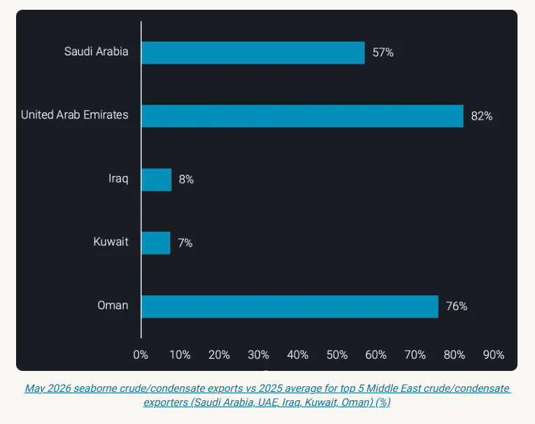
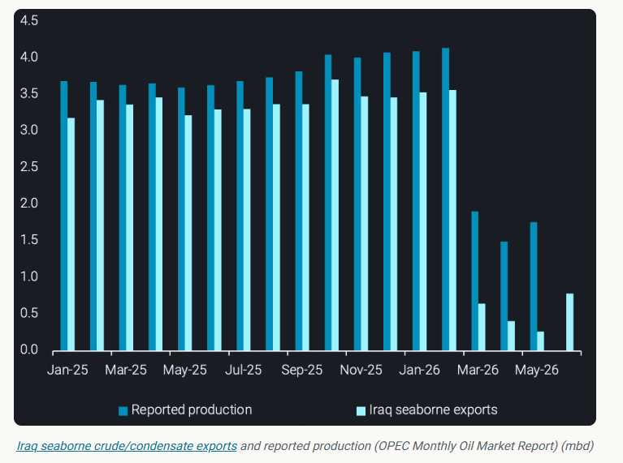
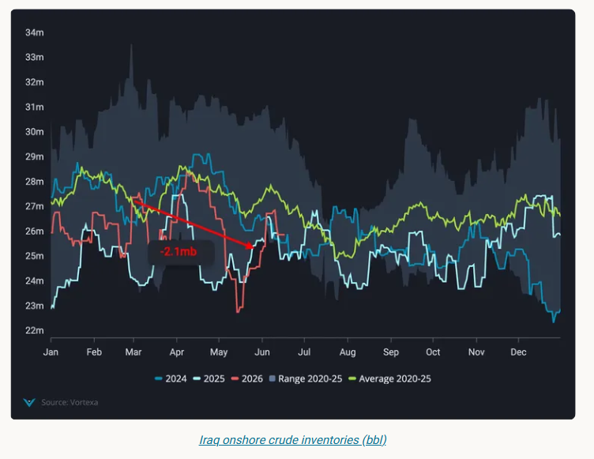
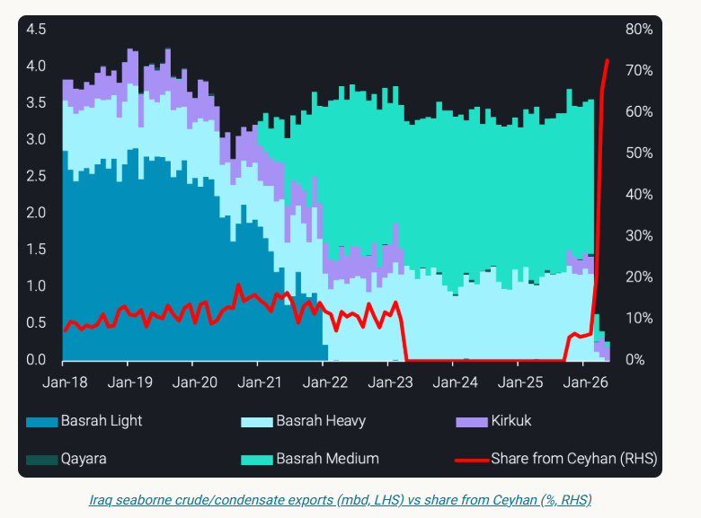
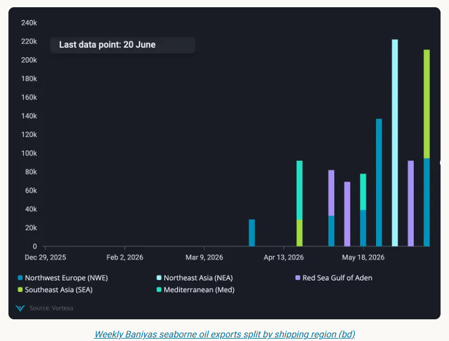
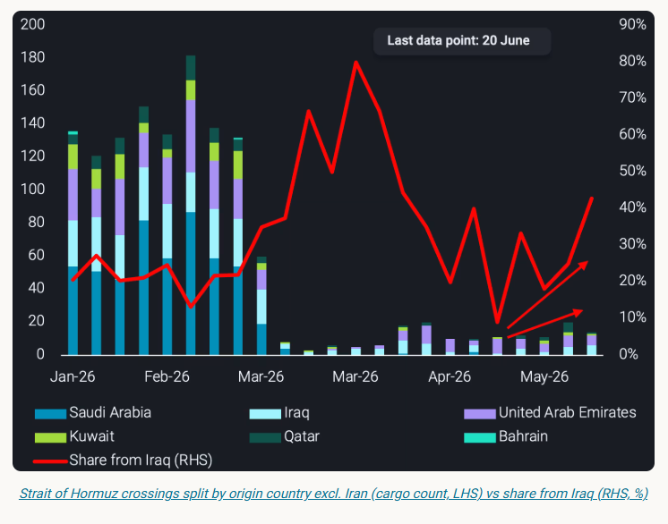

# Iraq's export crisis: Hormuz and pipeline uncertainty

**Date:** June 23, 2026  
**Publisher:** Breakwave Advisors | **Category:** Market Insights  
**Original URL:** [https://www.breakwaveadvisors.com/insights/2026/6/23/iraqs-export-crisis-hormuz-and-pipeline-uncertainty](https://www.breakwaveadvisors.com/insights/2026/6/23/iraqs-export-crisis-hormuz-and-pipeline-uncertainty)  

---

Iraq's oil exports are severely strained by the Hormuz closure and threatened by expiring northern pipeline deal, pushing production to decade lows

*By*[*George Morris*](https://www.linkedin.com/in/george-d-morris/)

Iraq currently faces multiple simultaneous oil export challenges: seaborne exports are constrained by the Strait of Hormuz closure and its northern pipeline corridor is nearing a contractual deadline. The result is a severely strained crude balance, with production at a decade low and recovery dependent on two separate geopolitical negotiations.

## Southern Exports: Collateral Damage From Hormuz

Iraq has been amid the most affected Middle Eastern exporters as a result of the effective closure of the Strait of Hormuz in March.[Iraq seaborne crude/condensate exports](https://analytics.vortexa.com/Flows?dateRange=2016-01-01T00%3A00%3A00.000Z__2026-05-31T23%3A59%3A59.999Z&from=%5B%229fa4354c24b3c7a2b0d40f870a1f57da4907bd816f130033f994ee9dcfdf08d1%22%5D&metric=bpd&page=Flows&products=%5B%2254af755a090118dcf9b0724c9a4e9f14745c26165385ffa7f1445bc768f06f11%22%5D&tabId=01780461-c486-41ac-9a83-48c665803dd0&timeSeriesPercentageEnabled=1&timeSeriesProperty=product_grade&v=3)fell to a dataset low of 260kbd in May - just 8% of the 2025 average and 145kbd lower m-o-m from the prior dataset low observed in April. The contrast with regional peers is stark: Saudi Arabia maintained 57% of its 2025 average export rate in May, and the UAE 82%, as both countries rerouted volumes via pipeline, and the UAE furthermore introduced a shuttle service to move barrels out for STSes offshore Oman or in the vicinity. Iraq's dependence on the Strait as its outlet for Basrah crude exports from the southern ports left it uniquely exposed.

> **Figure 1: Στιγμιότυπο Οθόνης 2026 06 23 074933**  
> **Interactive Data & Source:** [Analytics Vortexa](https://analytics.vortexa.com/Flows?dateRange=2025-01-01T00%3A00%3A00.000Z__2026-06-16T23%3A59%3A59.999Z&maxEventFilter=1767225599999&metric=bpd&minEventFilter=1735689600000&movementEvent=unloading_start&page=Flows&products=%5B%22b68cbb746f8b9098c50e2ba36bcad83001a53bd362e9031fb49085d02c36659c%22%2C%225de0b00094e0fd7542c10f9f8a71b4008d55750f21dc905cda9b0f7f5f76bc08%22%5D&tabId=596eef05-6c7d-45aa-9914-37b6a881ec3b&to=%5B%229fa4354c24b3c7a2b0d40f870a1f57da4907bd816f130033f994ee9dcfdf08d1%22%5D&v=3) | [Local Asset](file:///C:/Users/Dell/Github/Shipping/corpus/03-breakwave/insights/2026/assets/2026-06-23_iraqs-export-crisis-hormuz-and-pipeline-uncertainty_img_cea3cf84ceb9ceb3cebcceb9cf8ccf84cf85_d9d55a0aecc5.png)

Iraq's crude oil production fell to a 10-year low of 1.5mbd in April (OPEC), down over 60% from the pre-conflict January-February average of 4.1mbd. May production recovered approximately 20% m-o-m to 1.8mbd, signalling some ramping of oilfields following the shut-ins - though volumes remain far below quota levels.

The divergence between production and seaborne exports has widened dramatically. In 2025, exports averaged 380kbd below production, primarily feeding domestic refinery demand. Between March and May 2026, that gap has more than tripled to 1.3mbd - a figure that certainly raises question marks. There are three options to close the gap: 1) higher domestic demand (refining and direct burn), higher exports via other routes (e.g. trucking to Syria) and stockbuilds. We will show in the following that these options - neither individually nor in combination - are unlikely to explain the jump in the gap between production and exports, raising the option that the output loss is even bigger.

In February, Iraq's National Oil Company announced several new refineries had reached 100% of production capacity. The Karbala refinery reached maximum capacity, while advanced FCC units were introduced at Basra and gasoline hydrogenation units commissioned at Kirkuk (NOC). The refineries were intended to reduce Iraq's dependence on[refined product imports](https://analytics.vortexa.com/Flows?dateRange=2025-01-01T00%3A00%3A00.000Z__2026-06-16T23%3A59%3A59.999Z&maxEventFilter=1767225599999&metric=bpd&minEventFilter=1735689600000&movementEvent=unloading_start&page=Flows&products=%5B%22b68cbb746f8b9098c50e2ba36bcad83001a53bd362e9031fb49085d02c36659c%22%2C%225de0b00094e0fd7542c10f9f8a71b4008d55750f21dc905cda9b0f7f5f76bc08%22%5D&tabId=596eef05-6c7d-45aa-9914-37b6a881ec3b&to=%5B%229fa4354c24b3c7a2b0d40f870a1f57da4907bd816f130033f994ee9dcfdf08d1%22%5D&v=3), which stood at 72kbd in 2025. These expanded domestic processing volumes add another minor mitigation to the loss of crude exports observed from March onwards, with volumes staying domestically rather than being exported to global seaborne markets. The gap between reported production and exports has increased ~700kbd March through May compared to Jan/Feb levels, resulting in an expected inventory build of ~500-600kbd (46-55mb) March through May, assuming higher refinery runs account for an additional 100-200kbd of domestic consumption. In reality, the data shows Iraq’s limited[onshore crude inventories](https://analytics.vortexa.com/OnShoreCrudeInventories?dateRange=2024-01-01T00%3A00%3A00.000Z__2026-06-17T09%3A53%3A31.459Z&frequency=day&hiddenSeries=%5B%224bd22474bec28e0d2576ff0ad204966df7f082d85af4f062763c49c4b1cac65d%22%2C%223663536da3c85053556bc0d1a803481aa137a854da8bc835f614e84e810b1bb7%22%2C%226034694c5c614aecd76df3e55851fdbe17f05a2b3e3d55a4630ee5c030dc9e95%22%2C%227a8292b7fbc1786ffa991850919e22ea4bc7a84382075453768367386576b0b7%22%2C%229601c1f3570258ff1b61537034a11570bda4001b4b75df5d99697ce5d5ac00de%22%2C%225190e0bccad9bf9e0ab42bfbf078d5a6151c0862a5c65d073944d38bdcfbf4d8%22%2C%22f77b3f9efb465601faafacfa2f847a997af32aa9d2a2849720b86a9ef60e937b%22%2C%22898667e32a8ddfc0f123347154d4fc6e4a8396f789709e2988dc4defd557479d%22%5D&onshoreInventoriesLocations=%5B%222e8e30bdad2704a6d888a689d9e40d08f2d397ae19d54c29191838da4abaa2b9%22%2C%227ad15d106a9cc7c49cec8f2d5731a208c1aa1ec0d29ef8bbd9d1b18264e23e0a%22%2C%229fa4354c24b3c7a2b0d40f870a1f57da4907bd816f130033f994ee9dcfdf08d1%22%5D&page=OnShoreCrudeInventories&selectedRegion=%5B%229fa4354c24b3c7a2b0d40f870a1f57da4907bd816f130033f994ee9dcfdf08d1%22%5D&tabId=24ec91fb-9ced-42fd-a166-648d669367ab&tankCrude=%5B%22probable%22%2C%22confirmed%22%5D&tsVisualType=seasonal)have fallen 2.1mb in this time. The combination of low seaborne loadings and a counter-seasonal inventory draw points to a substantial volume of production being shut-in but also may point toward greater crude burn for power generation heading into summer.

> **Figure 2: Στιγμιότυπο Οθόνης 2026 06 23 074943**  
> **Interactive Data & Source:** [Analytics Vortexa](https://analytics.vortexa.com/Flows?dateRange=2023-01-01T00%3A00%3A00.000Z__2026-06-16T23%3A59%3A59.999Z&from=%5B%229fa4354c24b3c7a2b0d40f870a1f57da4907bd816f130033f994ee9dcfdf08d1%22%5D&metric=bpd&page=Flows&products=%5B%22f95529fb0524a95783a8f3a2dad1463bfcc610b789bffd91ed16b233b77bf86c%22%5D&tabId=596eef05-6c7d-45aa-9914-37b6a881ec3b&v=3) | [Local Asset](file:///C:/Users/Dell/Github/Shipping/corpus/03-breakwave/insights/2026/assets/2026-06-23_iraqs-export-crisis-hormuz-and-pipeline-uncertainty_img_cea3cf84ceb9ceb3cebcceb9cf8ccf84cf85_626353a62dbd.png)

> **Figure 3: Στιγμιότυπο Οθόνης 2026 06 23 074951**  
> **Interactive Data & Source:** [Analytics Vortexa](https://analytics.vortexa.com/Flows?dateRange=2023-01-01T00%3A00%3A00.000Z__2026-06-16T23%3A59%3A59.999Z&from=%5B%229fa4354c24b3c7a2b0d40f870a1f57da4907bd816f130033f994ee9dcfdf08d1%22%5D&metric=bpd&page=Flows&products=%5B%22f95529fb0524a95783a8f3a2dad1463bfcc610b789bffd91ed16b233b77bf86c%22%5D&tabId=596eef05-6c7d-45aa-9914-37b6a881ec3b&v=3) | [Local Asset](file:///C:/Users/Dell/Github/Shipping/corpus/03-breakwave/insights/2026/assets/2026-06-23_iraqs-export-crisis-hormuz-and-pipeline-uncertainty_img_cea3cf84ceb9ceb3cebcceb9cf8ccf84cf85_5d7fec3e0ec1.png)

## Northern Exports: Kirkuk Volumes at Risk

Iraq's southern export disruption is compounded by uncertainty over its northern pipeline exports. The Kirkuk-Ceyhan pipeline, initially commissioned under a 1973 Iraq-Turkey agreement and today rated at a nameplate capacity of 1.6mbd (Argus), has had a turbulent operational history.

[Iraq seaborne Kirkuk exports](https://analytics.vortexa.com/Flows?dateRange=2023-01-01T00%3A00%3A00.000Z__2026-06-16T23%3A59%3A59.999Z&from=%5B%229fa4354c24b3c7a2b0d40f870a1f57da4907bd816f130033f994ee9dcfdf08d1%22%5D&metric=bpd&page=Flows&products=%5B%22f95529fb0524a95783a8f3a2dad1463bfcc610b789bffd91ed16b233b77bf86c%22%5D&tabId=596eef05-6c7d-45aa-9914-37b6a881ec3b&v=3)stopped in April 2023, down from 350kbd in March, after Turkish pumps ceased pulling Kirkuk crude following an international arbitration ruling in Iraq's favour against Ankara over unauthorised Kurdish Regional Government (KRG) exports (Argus). The decision resulted in a $1.47bn arbitration fine for Turkey. Seaborne exports of Kirkuk via Ceyhan restarted in October 2023 following an agreement between Iraq's federal government, the KRG, and international oil companies operating in the semi-autonomous Kurdish region.[Seaborne Kirkuk exports](https://analytics.vortexa.com/Flows?dateRange=2023-01-01T00%3A00%3A00.000Z__2026-06-16T23%3A59%3A59.999Z&from=%5B%229fa4354c24b3c7a2b0d40f870a1f57da4907bd816f130033f994ee9dcfdf08d1%22%5D&maxEventFilter=1772323199999&metric=bpd&minEventFilter=1759276800000&page=Flows&products=%5B%22f95529fb0524a95783a8f3a2dad1463bfcc610b789bffd91ed16b233b77bf86c%22%5D&tabId=596eef05-6c7d-45aa-9914-37b6a881ec3b&v=3)subsequently averaged 220kbd from October 2025 through February 2026.

The pipeline agreement formally expires on 27 July following Ankara's issuance of a termination notice in July 2025. Turkey is now seeking a broader framework covering multiple energy products - oil, gas, petrochemicals, and electricity - and is also pushing for a settlement offset against the arbitration fine it incurred. The expiration of the agreement poses a substantial risk to Baghdad's export revenues.

> **Figure 4: Στιγμιότυπο Οθόνης 2026 06 23 074959**  
> **Interactive Data & Source:** [Analytics Vortexa](https://analytics.vortexa.com/InsightsHubPage?articleId=6utChDynvUMFMrZdjoS5Ty&articleType=highlight&page=InsightsHubPage&searchTerm=&tabId=ecc93418-36e2-437e-b372-21e07db74316) | [Local Asset](file:///C:/Users/Dell/Github/Shipping/corpus/03-breakwave/insights/2026/assets/2026-06-23_iraqs-export-crisis-hormuz-and-pipeline-uncertainty_img_cea3cf84ceb9ceb3cebcceb9cf8ccf84cf85_c63858d0166c.png)

## Alternate Export Routes

Iraq's export crisis has exposed the country's lack of alternative routes - and accelerated efforts to build them.

### Cross-Border Trucking Via Syria

In April, SOMO signed an agreement with Syria for cross-border truck haulage of crude, with a separate arrangement to export 650kt of fuel oil per month. Iraqinews reports 500-700 tanker trucks were conducting daily overland border crossings into Syria as of early June. Seaborne oil exports from Baniyas show these volumes hitting the water in late April and averaging 130kbd for the four weeks to 14 June.

> **Figure 5: Στιγμιότυπο Οθόνης 2026 06 23 075010**  
> **Interactive Data & Source:** [Analytics Vortexa](https://analytics.vortexa.com/InsightsHubPage?articleId=6utChDynvUMFMrZdjoS5Ty&articleType=highlight&page=InsightsHubPage&searchTerm=&tabId=ecc93418-36e2-437e-b372-21e07db74316) | [Local Asset](file:///C:/Users/Dell/Github/Shipping/corpus/03-breakwave/insights/2026/assets/2026-06-23_iraqs-export-crisis-hormuz-and-pipeline-uncertainty_img_cea3cf84ceb9ceb3cebcceb9cf8ccf84cf85_7ac8444c757c.png)

### Basra-Haditha Pipeline

The longer-term structural response is the Basra-Haditha pipeline, approved in 2024, designed to provide an alternative to both the Kirkuk-Ceyhan corridor and Gulf exports through Hormuz. The planned pipeline is 2.5mbd in capacity and 700km in length (Argus), connecting Basrah fields in the south to three seaborne loading points: Ceyhan (Turkey, Mediterranean), Baniyas (Syria, Mediterranean), and Aqaba (Jordan, Red Sea). The pipeline is also expected to supply domestic refineries along its route.

## Signs of Recovery at Hormuz

[Total Strait of Hormuz crossings](https://analytics.vortexa.com/InsightsHubPage?articleId=6utChDynvUMFMrZdjoS5Ty&articleType=highlight&page=InsightsHubPage&searchTerm=&tabId=ecc93418-36e2-437e-b372-21e07db74316)for laden crude tankers have increased in recent weeks, signalling a loosening of the US blockade and easing Iranian restrictions on transits. Iraq has been a key beneficiary: Iraq-origin crossings were up over 20% for the four weeks ending 14 June versus the prior four-week period. Iraq's share of total crossings rose to 40% in the week commencing June 8 - recovering from a post-closure low of 9% in the week commencing 11 May.

> **Figure 6: Στιγμιότυπο Οθόνης 2026 06 23 075019**  
> **Interactive Data & Source:** [Vortexa](https://www.vortexa.com//oil-gas-data-traders-analysts-data-scientists?gclid=Cj0KCQjw8_qRBhCXARIsAE2AtRZKOvMnbilZ_6_91d7huSFFy71pWLrnPwGwOHVzXsmsG-1a1mZnQw8aAt89EALw_wcB&hsa_acc=1782073842&hsa_ad=548425387665&hsa_cam=14746637662&hsa_grp=125038601902&hsa_kw=&hsa_mt=&hsa_net=adwords&hsa_src=g&hsa_tgt=dsa-1431852288425&hsa_ver=3&utm_campaign=%5BCD%5D%20-%20DSA%20-%20EMEA&utm_medium=cpc&utm_medium=ppc&utm_source=google&utm_source=adwords&utm_term=) | [Local Asset](file:///C:/Users/Dell/Github/Shipping/corpus/03-breakwave/insights/2026/assets/2026-06-23_iraqs-export-crisis-hormuz-and-pipeline-uncertainty_img_cea3cf84ceb9ceb3cebcceb9cf8ccf84cf85_c809cd1a4333.png)

## Forward View

At Hormuz, the directional data is encouraging: crossings are rising, and Iraq is capturing an increasing share. The caveat is that a sustained shut-in of large volumes may well see a slower ramp back up to normal production levels than other exporting counterparts, although the recent increase in exports is a bullish indicator.

At Ceyhan, the window is narrow. The July 27 expiry date is a hard constraint without a renewed deal, and Turkey's demand for a multi-commodity framework adds significant complexity to any rapid resolution. Failure to agree terms would cease 220kbd of northern exports at a time in which Iraq is facing substantial losses on southern exports.

The cross-border trucking route through Syria may elapse at the end of June. Domestic power generation requirements could weigh on trucked fuel oil exports, though surplus domestic crude may be substituted for the typical fuel oil feedstock.

Looking ahead, near-term export volumes in June and July will be dictated primarily by the status of Hormuz transits. A failure to renew the Kirkuk-Ceyhan agreement by July 27 would compound southern losses with the elimination of one of two remaining export routes - a scenario that would likely accelerate both overland trucking through Syria and political pressure to fast-track construction of the Basra-Haditha pipeline.

Data Source:[Vortexa](https://www.vortexa.com//oil-gas-data-traders-analysts-data-scientists?gclid=Cj0KCQjw8_qRBhCXARIsAE2AtRZKOvMnbilZ_6_91d7huSFFy71pWLrnPwGwOHVzXsmsG-1a1mZnQw8aAt89EALw_wcB&hsa_acc=1782073842&hsa_ad=548425387665&hsa_cam=14746637662&hsa_grp=125038601902&hsa_kw=&hsa_mt=&hsa_net=adwords&hsa_src=g&hsa_tgt=dsa-1431852288425&hsa_ver=3&utm_campaign=%5BCD%5D%20-%20DSA%20-%20EMEA&utm_medium=cpc&utm_medium=ppc&utm_source=google&utm_source=adwords&utm_term=)

---

**Tags:** Crude, Markets, Tankers  
