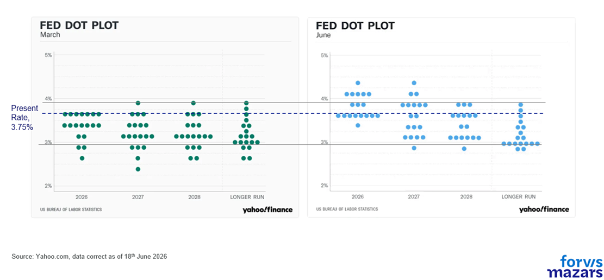
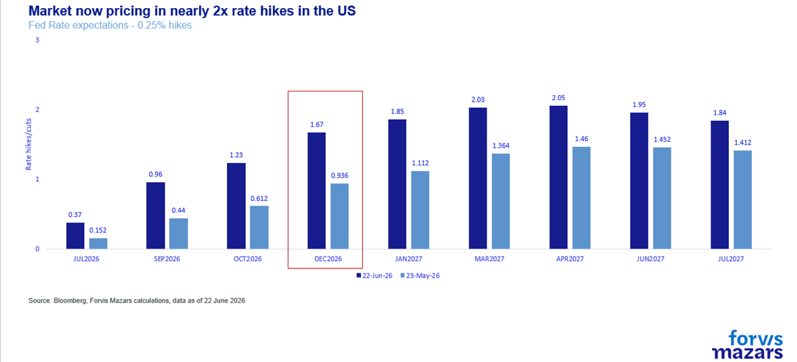
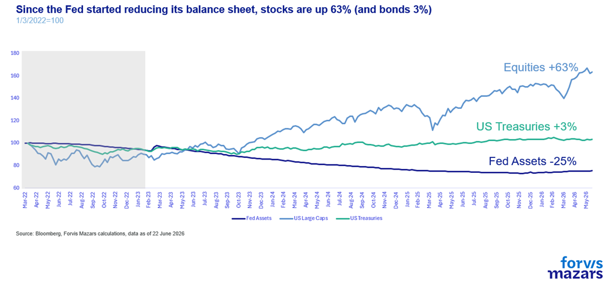

# Did the Fed drive the tech selloff?

**Date:** June 24, 2026  
**Publisher:** Breakwave Advisors | **Category:** Market Insights  
**Original URL:** [https://www.breakwaveadvisors.com/insights/2026/6/24/did-the-fed-drive-the-tech-selloff](https://www.breakwaveadvisors.com/insights/2026/6/24/did-the-fed-drive-the-tech-selloff)  

---

**The three things investors should know this week.**

1. **A slightly more hawkish-than-anticipated first appearance of the new Fed Chair, Kevin Warsh, has investors worried that the world’s most important central bank will increase rates and reduce the size of its balance sheet.**
2. **Mr Warsh’s comments were followed by an intensifying selloff, focused on AI-related stocks.**
3. **Some unexpected Fed hawkishness could raise tactical risks, but market performance over the past three years suggests that the Fed is not “the only game in town” for financial assets and businesses.**

*By*[*George Lagarias*](https://www.linkedin.com/in/george-lagarias-mba-3baa769/)

-----------------------------

*Summary*

*A slightly more hawkish-than-anticipated first appearance by the new Fed Chair, Kevin Warsh, has raised concerns that the world’s most important central bank will increase rates and reduce its balance sheet. His comments were followed by a tech-driven selloff, focused on AI-related stocks. Projections for rate hikes shifted upward, while forward guidance was dropped. However, market performance over the past three years suggests the Fed is not the only game in town. Corporate America remains resilient, leverage is contained, and the economy continues to grow. A more hawkish Fed may raise tactical risks, but is unlikely to trigger bear markets or economic contraction.*

-------------------------------

From the treaty between Iran and the US to a new Prime Minister in the UK, the geopolitical front is once again loaded with important news. To be sure, markets are watching. Movement in the Strait of Hormuz (unfettered or not, is less important right now) and the intentions of the seventh British PM in a decade will be closely watched by investors and businesses.

However, the most important news for global investors, businesses and consumers came from the inaugural meeting of the new Fed Chair, Kevin Warsh, who adopted a slightly more hawkish tone than previously expected. Projections for a rate hike in the US shifted materially upward. Nine of the eighteen Fed members who voted, project at least one rate hike in 2026 with markets now pricing in virtually two.

> **Figure 1: Market Chart 1**  
> [Local Asset](file:///C:/Users/Dell/Github/Shipping/corpus/03-breakwave/insights/2026/assets/2026-06-24_did-the-fed-drive-the-tech-selloff_img_image006_ddc7d193fdae.png)

> **Figure 2: However**  
> *However, when it comes down to it, the hawkish shift is not yet too material. Ancient Spartans often said that “being laconic” is philosophy («τὸ λακωνίζειν πολὺ μᾶλλόν ἐστιν φιλοσοφεῖν»). They felt that using no more words than absolutely necessary to express their full intent was an art and, importantly, left little room for misinterpretation. Similarly, the Fed being more laconic is not necessarily a sign of tighter lending conditions. “Forward guidance” and extensive interviews were a product of the Global Financial Crisis, when markets needed to feel that the Fed would suppress risks, so they could more safely deploy their investments. It has since been associated with the “Fed Put”, even though the Fed’s promise to intervene in times of stress predates it by more than a decade. Removal of excess explaining does not mean removal of the Fed Put itself. It simply moves it from the realm of the “explicit” to the realm of the “slightly more implicit”, leaving the central bank more room to make decisions without markets panicking every time it doesn’t come to the rescue.*  
> [Local Asset](file:///C:/Users/Dell/Github/Shipping/corpus/03-breakwave/insights/2026/assets/2026-06-24_did-the-fed-drive-the-tech-selloff_img_image007_f68516d069e6.png)

PCE inflation projections were revised sharply higher to 3.6%, while GDP growth was trimmed to 2.2%. Forward guidance, a tool to soothe markets since 2008, was dropped entirely from a significantly shortened policy statement.

Despite an initial positive reaction, the week opened with a negative tone, as US large caps shed 2% of their value, and the tech-heavy NASDAQ lost 3.3%. Has Mr Warsh made a mistake?

While the market reaction after Governor Warsh’s first meeting could be interpreted as foreshadowing an unfamiliar period for investors that must now survive without the protection of a benign Federal Reserve, we don’t see any evidence of this just yet; corporate America is in a relatively strong position, and Federal Reserve support peaked during the Covid-19 pandemic and has been broadly retreating since then.

### Hawkish Evidence

The rhetoric, to be sure, was not accommodating. For a chairman who had spent the past year arguing for lower rates, the talk of "unambiguous and unanimous" resolve on inflation was surprisingly hawkish. Mr Warsh identified the tolerance of above-2% inflation as a "fatal policy error," signalling a shift from previous Fed frameworks.

One of his most hawkish tells is his long-standing idea that the Fed should reduce its $6.5 tn balance sheet, which translates into removing liquidity from markets. To this end, he launched a task force to review the Fed’s balance sheet. He also launched task forces to revise the Fed’s communication strategy, with the intent to reduce it, data sourcing, the effect of AI on productivity and jobs, and inflation drivers.

### A Second Reading

As for the balance sheet of the Fed, the reality is that this has been underway for some time. Since 2022, the Fed’s balance sheet has shrunk by a third. Nevertheless, equities are up 63%. Treasuries, however, have only gained 3%, but this is mostly a result of the sharp rate hikes in 2022 rather than Fed assets. And the real economy has grown at a satisfactory pace, an average of 2.6% per annum since 2022.

> **Figure 3: Simply Put**  
> *Simply put, the Fed is not the only game in town anymore.*  
> [Local Asset](file:///C:/Users/Dell/Github/Shipping/corpus/03-breakwave/insights/2026/assets/2026-06-24_did-the-fed-drive-the-tech-selloff_img_image008_1fc415233af2.png)

Also, importantly, the economy is not too leveraged, so it doesn’t completely depend on credit availability.

At the issuer level, debt is about 14% to 16% of the corporate capital structure at market value (roughly 47% of GDP). In new buyouts, debt funds roughly half the purchase price, down from about two-thirds in 2019 and 70% to 90% pre-GFC.

Direct margin borrowing is under 2% of market cap but still it is at a record relative to GDP (4.1%); the genuinely fragile leverage is the concentrated 18 to 20x in Treasury basis books, small in headcount, systemic in consequence.

This means that in case the Fed would withdraw liquidity abruptly (it has shown no indication of doing so), the effect will be negative, but it may not be immensely dramatic for the real economy.

It is thus evident that equities have learned to live without the Fed. Bonds have had a rough three-year period, but now promise higher returns for investors. And the real US economy is growing at a pace above 2.5%.

A marginally more hawkish Fed can challenge the AI be-all-and-end-all narrative, which keeps ignoring the micro and macroeconomic realities, to be sure. It can even lead to a correction in asset prices. But we don’t see how it can fundamentally cause bear markets or economic contraction. Markets have learned to live without it. So it should not be inconceivable for the world’s de facto central bank to think long and hard about the size of its mandate. Some schools of thought suggest that asset volatility may be a small price to pay for return to more market-centric asset pricing.

### What Does This All Mean for Investors?

While the fundamental case for being invested remains intact, a slightly more hawkish Fed marginally raises tactical risks. A runaway AI-driven market is already seeing some doubts after last week’s meeting. However, broadly we remain in “wait-and-see” mode. Interest rates are less important for markets than the Fed’s provision of a safety net in times of stress. Mr Warsh is still fairly new, and the “Warsh Put” hasn’t been tested. Being more laconic and seeking to “stay in its lane” doesn’t necessarily foreshadow abandoning the Fed’s implicit promise to intervene when risks rise exponentially.

### What Does All This Mean for Businesses?

The Fed’s focus on inflation fighting might be challenging over the short-term, but ultimately it’s good news for businesses. High inflation is a challenge to profit margins and erodes consumer confidence, especially at times when growth is challenging. There is not much evidence to suggest that corporations are highly leveraged, which means that persistently high interest rates until inflation comes down could stress income statements and balance sheets, but it should not break them. If inflation, however, does come down, this is overall good for businesses.

### The Policy Error Risk

However, as investors should not overestimate the Fed’s impact on markets, the Fed should not overestimate its powers over inflation, or risk a policy error. If prices remain persistently high due to exogenous factors, such as the trade war or geopolitical disturbance, then tightening monetary conditions could end up choking growth without bringing inflation down to more manageable levels.

*Laconia is the area around Sparta.

---

**Tags:** Macro, Economy, Markets  
