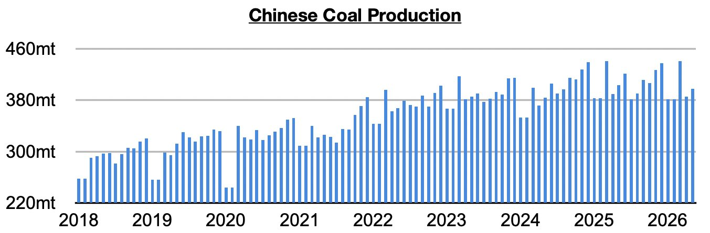
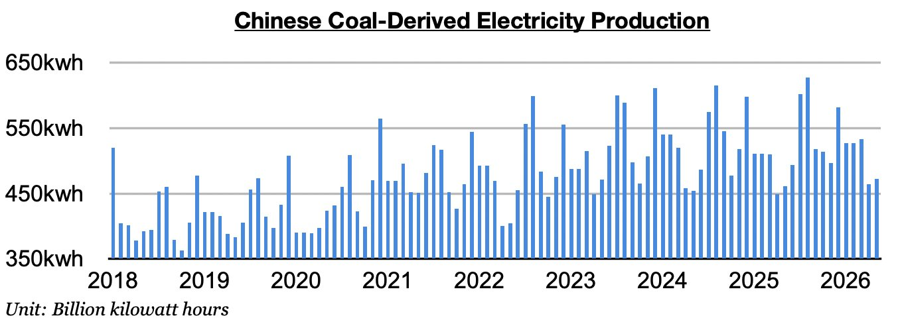
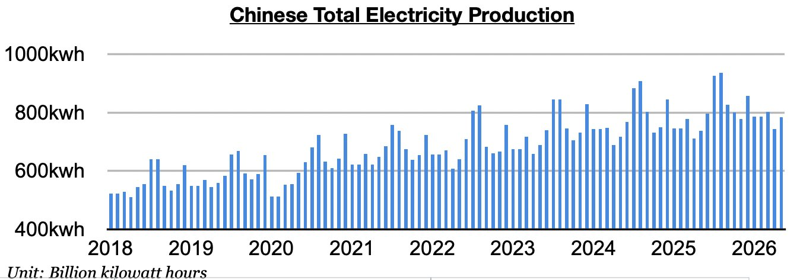

# Strong Electricity Production in China

**Date:** June 26, 2026  
**Publisher:** Breakwave Advisors | **Category:** Market Insights  
**Original URL:** [https://www.breakwaveadvisors.com/insights/2026/6/26/strong-electricity-production-in-china](https://www.breakwaveadvisors.com/insights/2026/6/26/strong-electricity-production-in-china)  

---

*By*[*Jeffrey Landsberg*](https://www.linkedin.com/in/jeffrey-landsberg-70ab957/)

As we discussed in Commodore Research's most recent Weekly Executive Report, China’s coal production totaled 397.2 million tons in May. This is up month-on-month by 11.6 million tons (3%) but is down year-on-year by 6.1 million tons (-2%). Remaining very significant is that the last time there was any year-on-year growth was in June. Before this stretch, China’s coal production had grown on a year-on-year basis for thirteen straight months.

> **Figure 1: Chart 1**  
> [Local Asset](file:///C:/Users/Dell/Github/Shipping/corpus/03-breakwave/insights/2026/assets/2026-06-26_strong-electricity-production-in-china_img_chart1_05421dae6581.jpg)

Coal-derived electricity generation totaled 472.6 billion kilowatt hours. This is up month-on-month by 8.8 billion kilowatt hours (2%) and is up year-on-year by 11.1 billion kilowatt hours (2%).**Very helpful for coal import demand and the dry bulk market is that China's coal-derived electricity generation has now fared better than coal production for five straight months**. Before these last five months, China's coal-derived electricity generation had fared worse than domestic coal production in three of the prior four months.

> **Figure 2: Chart 2**  
> [Local Asset](file:///C:/Users/Dell/Github/Shipping/corpus/03-breakwave/insights/2026/assets/2026-06-26_strong-electricity-production-in-china_img_chart2_5158f8aa6d81.jpg)

Total electricity production reached 784.3 billion kilowatt hours. This is up month-on-month by 40.3 billion kilowatt hours (5%) and is up year-on-year by 46.5 billion kilowatt hours (6%). This has marked the strongest year-on-year growth since October.

> **Figure 3: Chart 3**  
> [Local Asset](file:///C:/Users/Dell/Github/Shipping/corpus/03-breakwave/insights/2026/assets/2026-06-26_strong-electricity-production-in-china_img_chart3_3c05a035ef9f.jpg)

---

**Tags:** Coal, China, Drybulk  
