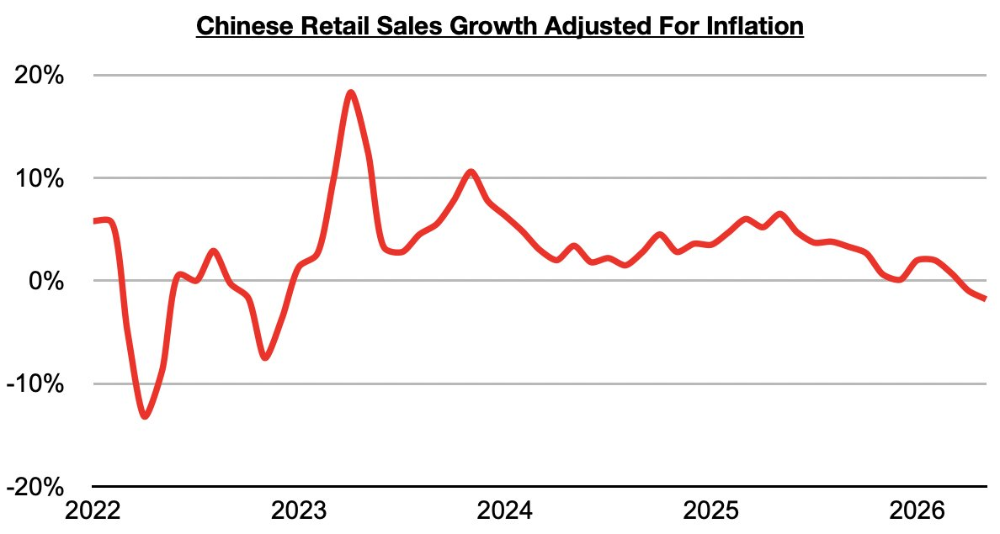
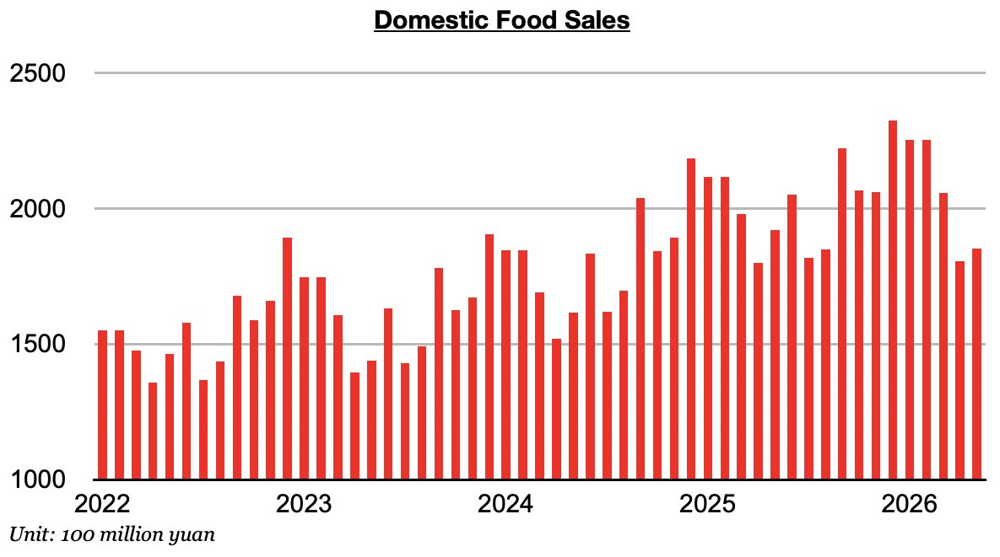

# China's Consumer Sector Has Become Even Weaker

**Date:** June 29, 2026  
**Publisher:** Breakwave Advisors | **Category:** Market Insights  
**Original URL:** [https://www.breakwaveadvisors.com/insights/2026/6/29/chinas-consumer-sector-has-become-even-weaker](https://www.breakwaveadvisors.com/insights/2026/6/29/chinas-consumer-sector-has-become-even-weaker)  

---

*By*[*Jeffrey Landsberg*](https://www.linkedin.com/in/jeffrey-landsberg-70ab957/)

As we discussed in Commodore Research's most recent Weekly China Report, China’s retail sales in May contracted year-on-year by 0.6%. This has marked the first contraction since December 2022. Taking May’s 1.2% inflation into account, retail sales adjusted for inflation contracted year-on-year by 1.8%.

> **Figure 1: Chart 1**  
> [Local Asset](file:///C:/Users/Dell/Github/Shipping/corpus/03-breakwave/insights/2026/assets/2026-06-29_chinas-consumer-sector-has-become-even-weaker_img_chart1_6d7c03d7cba8.jpg)

Last month has marked the second straight month that inflation in China exceeded retail sales growth. This is a troubling sign of contraction/recession as consumers in China are buying less actual goods than they did during the previous year. Of note on the consumer side is that sales of household appliances and electronics, furniture, food, automobiles, petroleum, and daily necessities all contracted on a year-on-year basis. The contraction in food sales is particularly worrisome. Food sales in China contracted year-on-year by 3%. Previously food sales had grown on a year-on-year basis for thirty-five straight months.

> **Figure 2: Chart 2**  
> [Local Asset](file:///C:/Users/Dell/Github/Shipping/corpus/03-breakwave/insights/2026/assets/2026-06-29_chinas-consumer-sector-has-become-even-weaker_img_chart2_63d534b5cb14.jpg)

---

**Tags:** China, Markets, Economy  
