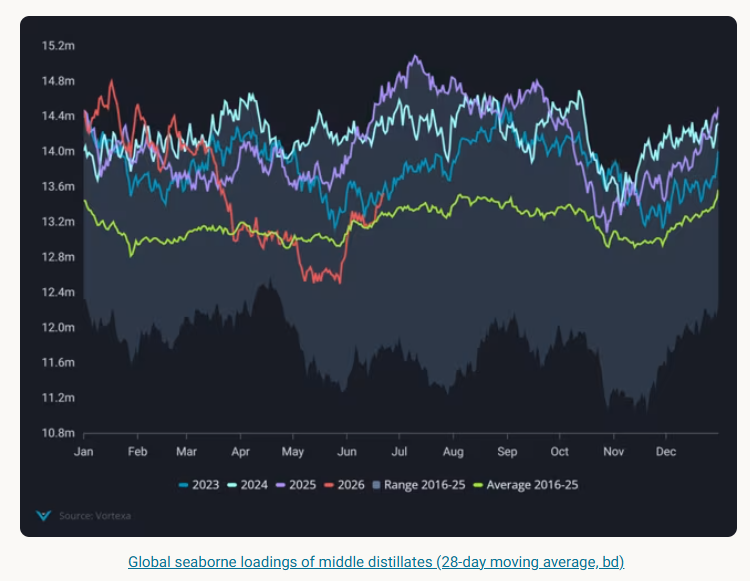
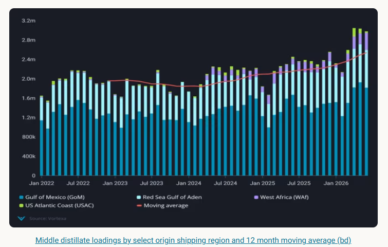
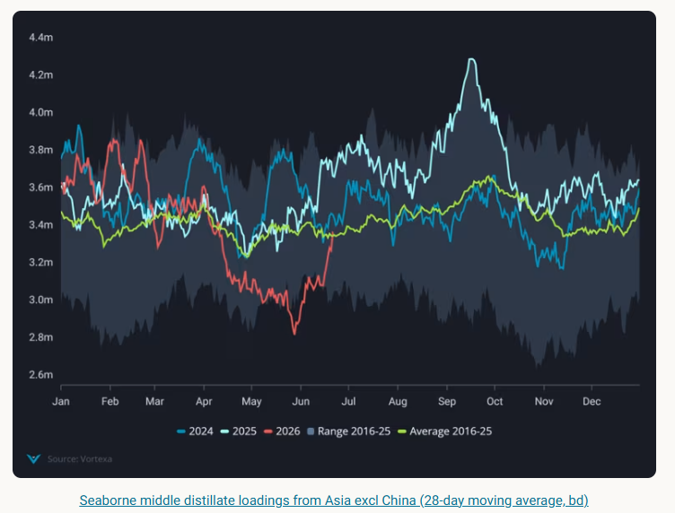

# Middle Distillates in Recovery: Supplies Rise, Prices Fall, Risks Remain

**Date:** June 29, 2026  
**Publisher:** Breakwave Advisors | **Category:** Market Insights  
**Original URL:** [https://www.breakwaveadvisors.com/insights/2026/6/29/middle-distillates-in-recovery-supplies-rise-prices-fall-risks-remain](https://www.breakwaveadvisors.com/insights/2026/6/29/middle-distillates-in-recovery-supplies-rise-prices-fall-risks-remain)  

---

Global middle distillate seaborne supplies have moved above the seasonal average for June and are expected to rise further as the strait of Hormuz opens up.

*By*[*Pamela Munger*](https://www.linkedin.com/in/pamela-munger-a7849a5/)

Global middle distillate loadings (jet/diesel) have moved well above the seasonal average for June on a 28 day moving average (red line) and are expected to rise further as the strait of Hormuz opens up, freeing up barrels from those exporters not restricted by Middle East Gulf damaged refining capacity (~1.3mbpd).

Outright prices have fallen significantly for diesel and jet with diesel pricing over jet since June 19 (Argus). Ice gasoil forward curve backwardation fell as of June 22 (Argus), a reflection of a stark decline in front month absolute prices and a signal that supply fears have eased significantly in the European markets.

> **Figure 1: Στιγμιότυπο Οθόνης 2026 06 29 112346**  
> **Interactive Data & Source:** [Analytics Vortexa](https://analytics.vortexa.com/Flows?dateRange=2016-01-01T00%3A00%3A00.000Z__2026-06-22T23%3A59%3A59.999Z&filtersEnabled=%5B%22p%22%2C%22o%22%2C%22d%22%2C%22d_r%22%2C%22v%22%2C%22intra_d%22%2C%22sts_o%22%2C%22c_o%22%2C%22w%22%2C%22sts%22%5D&from=%5B%22e07017b246e0d7295d0cc88ea378f6724d482a6646c52bafe90dd3fa17e1a182%22%2C%22c5460c5a4ece7b64ffc0cc280aeade60d364423e8e062ef4a11494352fe6fdbb%22%5D&geoBreakdownDestinationGlobal=shipping_region_v2&geoBreakdownOriginGlobal=shipping_region_v2&intraMovementDropdown=all&metric=bpd&originGlobalXFilter=%5B%22e07017b246e0d7295d0cc88ea378f6724d482a6646c52bafe90dd3fa17e1a182%22%5D&page=Flows&products=%5B%22b68cbb746f8b9098c50e2ba36bcad83001a53bd362e9031fb49085d02c36659c%22%5D&productsExcluded=%5B%229256907ba7e4ed11ff03aa297a7e62e14484ce5a85c8118c7495b9120ad0e268%22%2C%22364ccbb996c944055b479810a8e74863267885dc1b01407cb0f00ab26dafe1e1%22%2C%223e4db72ef7027de928ce55703a213a546fd86d2debe6f2e9c85f3a5f9d53e8dd%22%2C%22cbb5acffa542aad31d26712a8cdfd9884301aa7658ac95c40f86ddb31bc29d9b%22%2C%22a75fcc09bfc7d16496de3336551bc52b5891838bb7c22356d2cb65451587d1e5%22%5D&sortDirection=asc&tabId=40322de3-dc79-4526-9094-13fadfe91c02&timeSeriesProperty=origin_country×eriesMovingAvg=12m&tsSeasonalMovingAvg=1&tsSeasonalMovingAvgWindow=28d&v=3) | [Local Asset](file:///C:/Users/Dell/Github/Shipping/corpus/03-breakwave/insights/2026/assets/2026-06-29_middle-distillates-in-recovery-supplies-rise-prices-fall-risks-remain_img_cea3cf84ceb9ceb3cebcceb9cf8ccf84cf85_a473451e3bb2.png)

Meanwhile, resupply regions (Red Sea, USGC, Nigeria) continue to push out historically high volumes of middle distillates (~30% increase in Mar-June 2026 vs Mar-June 2025) with 60% of the total volume coming from USGC. Refineries in PADD 3 have been running at historically high rates since January, while the Red Sea export volumes have shot up 20% y-o-y compared to Mar-June 2026.

> **Figure 2: Στιγμιότυπο Οθόνης 2026 06 29 112354**  
> **Interactive Data & Source:** [Analytics Vortexa](https://analytics.vortexa.com/Flows?dateRange=2016-01-01T00%3A00%3A00.000Z__2026-06-22T23%3A59%3A59.999Z&filtersEnabled=%5B%22p%22%2C%22o%22%2C%22d%22%2C%22d_r%22%2C%22v%22%2C%22intra_d%22%2C%22sts_o%22%2C%22c_o%22%2C%22w%22%2C%22sts%22%5D&from=%5B%22e07017b246e0d7295d0cc88ea378f6724d482a6646c52bafe90dd3fa17e1a182%22%2C%22c5460c5a4ece7b64ffc0cc280aeade60d364423e8e062ef4a11494352fe6fdbb%22%5D&geoBreakdownDestinationGlobal=shipping_region_v2&geoBreakdownOriginGlobal=shipping_region_v2&intraMovementDropdown=all&metric=bpd&originGlobalXFilter=%5B%22e07017b246e0d7295d0cc88ea378f6724d482a6646c52bafe90dd3fa17e1a182%22%5D&page=Flows&products=%5B%22b68cbb746f8b9098c50e2ba36bcad83001a53bd362e9031fb49085d02c36659c%22%5D&productsExcluded=%5B%229256907ba7e4ed11ff03aa297a7e62e14484ce5a85c8118c7495b9120ad0e268%22%2C%22364ccbb996c944055b479810a8e74863267885dc1b01407cb0f00ab26dafe1e1%22%2C%223e4db72ef7027de928ce55703a213a546fd86d2debe6f2e9c85f3a5f9d53e8dd%22%2C%22cbb5acffa542aad31d26712a8cdfd9884301aa7658ac95c40f86ddb31bc29d9b%22%2C%22a75fcc09bfc7d16496de3336551bc52b5891838bb7c22356d2cb65451587d1e5%22%5D&sortDirection=asc&tabId=40322de3-dc79-4526-9094-13fadfe91c02&timeSeriesProperty=origin_country×eriesMovingAvg=12m&tsSeasonalMovingAvg=1&tsSeasonalMovingAvgWindow=28d&v=3) | [Local Asset](file:///C:/Users/Dell/Github/Shipping/corpus/03-breakwave/insights/2026/assets/2026-06-29_middle-distillates-in-recovery-supplies-rise-prices-fall-risks-remain_img_cea3cf84ceb9ceb3cebcceb9cf8ccf84cf85_1707659b4078.png)

Meanwhile as growing levels of MEG seaborne crude exports (from National Oil Companies and Iran) open up more economic buying options to Asia, we are likely to see a pick up in refinery runs which have been suppressed since the beginning of March due to curtailments in domestic consumption and policy-driven demand control initiatives.

Middle distillate seaborne loadings from Asia excluding China have risen sharply in June after falling to lows in May and have even crossed the seasonal average on a 28 day moving average.

> **Figure 3: Στιγμιότυπο Οθόνης 2026 06 29 112402**  
> **Interactive Data & Source:** [Analytics Vortexa](https://analytics.vortexa.com/Flows?dateRange=2016-01-01T00%3A00%3A00.000Z__2026-06-22T23%3A59%3A59.999Z&filtersEnabled=%5B%22p%22%2C%22o%22%2C%22d%22%2C%22d_r%22%2C%22v%22%2C%22intra_d%22%2C%22sts_o%22%2C%22c_o%22%2C%22w%22%2C%22sts%22%5D&from=%5B%22e07017b246e0d7295d0cc88ea378f6724d482a6646c52bafe90dd3fa17e1a182%22%2C%22c5460c5a4ece7b64ffc0cc280aeade60d364423e8e062ef4a11494352fe6fdbb%22%5D&geoBreakdownDestinationGlobal=shipping_region_v2&geoBreakdownOriginGlobal=shipping_region_v2&intraMovementDropdown=all&metric=bpd&originGlobalXFilter=%5B%22e07017b246e0d7295d0cc88ea378f6724d482a6646c52bafe90dd3fa17e1a182%22%5D&page=Flows&products=%5B%22b68cbb746f8b9098c50e2ba36bcad83001a53bd362e9031fb49085d02c36659c%22%5D&productsExcluded=%5B%229256907ba7e4ed11ff03aa297a7e62e14484ce5a85c8118c7495b9120ad0e268%22%2C%22364ccbb996c944055b479810a8e74863267885dc1b01407cb0f00ab26dafe1e1%22%2C%223e4db72ef7027de928ce55703a213a546fd86d2debe6f2e9c85f3a5f9d53e8dd%22%2C%22cbb5acffa542aad31d26712a8cdfd9884301aa7658ac95c40f86ddb31bc29d9b%22%2C%22a75fcc09bfc7d16496de3336551bc52b5891838bb7c22356d2cb65451587d1e5%22%5D&sortDirection=asc&tabId=40322de3-dc79-4526-9094-13fadfe91c02&timeSeriesProperty=origin_country×eriesMovingAvg=12m&tsSeasonalMovingAvg=1&tsSeasonalMovingAvgWindow=28d&v=3) | [Local Asset](file:///C:/Users/Dell/Github/Shipping/corpus/03-breakwave/insights/2026/assets/2026-06-29_middle-distillates-in-recovery-supplies-rise-prices-fall-risks-remain_img_cea3cf84ceb9ceb3cebcceb9cf8ccf84cf85_221696423cdb.png)

While most of these recovering middle distillate supplies from Asia head to Oceania or stay within the region, it will likely mean Atlantic Basin supplies pause their long haul crossings and seek outlets within the Atlantic Basin. Another crucial indicator to watch for will be the reveral of policies by various Asia governments to curb demand, a reveral of these policies maybe later than expected.

While the Strait of Hormuz gradually opens up, most transits have been by laden crude vessels which could limit middle distillate supply coming out of the Strait.

Looking forward, despite the current rapid recovery outlook for middle distillates, factors that could keep a floor to how far middle distillate prices drop include how Mediterranean refineries hold up in the heat (only Lavera 210kbd reported out as of June 2026 vs ~390kbd of refining capacity offline in H1 2025 (Argus)).

August 2025 was a multiyear low for[middle distillate loadings from the Med](https://analytics.vortexa.com/Flows?dateRange=2016-01-01T00%3A00%3A00.000Z__2026-06-22T23%3A59%3A59.999Z&filtersEnabled=%5B%22p%22%2C%22o%22%2C%22d%22%2C%22d_r%22%2C%22v%22%2C%22intra_d%22%2C%22sts_o%22%2C%22c_o%22%2C%22w%22%2C%22sts%22%5D&from=%5B%22e07017b246e0d7295d0cc88ea378f6724d482a6646c52bafe90dd3fa17e1a182%22%2C%22c5460c5a4ece7b64ffc0cc280aeade60d364423e8e062ef4a11494352fe6fdbb%22%5D&geoBreakdownDestinationGlobal=shipping_region_v2&geoBreakdownOriginGlobal=shipping_region_v2&intraMovementDropdown=all&metric=bpd&originGlobalXFilter=%5B%22e07017b246e0d7295d0cc88ea378f6724d482a6646c52bafe90dd3fa17e1a182%22%5D&page=Flows&products=%5B%22b68cbb746f8b9098c50e2ba36bcad83001a53bd362e9031fb49085d02c36659c%22%5D&productsExcluded=%5B%229256907ba7e4ed11ff03aa297a7e62e14484ce5a85c8118c7495b9120ad0e268%22%2C%22364ccbb996c944055b479810a8e74863267885dc1b01407cb0f00ab26dafe1e1%22%2C%223e4db72ef7027de928ce55703a213a546fd86d2debe6f2e9c85f3a5f9d53e8dd%22%2C%22cbb5acffa542aad31d26712a8cdfd9884301aa7658ac95c40f86ddb31bc29d9b%22%2C%22a75fcc09bfc7d16496de3336551bc52b5891838bb7c22356d2cb65451587d1e5%22%5D&sortDirection=asc&tabId=40322de3-dc79-4526-9094-13fadfe91c02&timeSeriesProperty=origin_country×eriesMovingAvg=12m&tsSeasonalMovingAvg=1&tsSeasonalMovingAvgWindow=28d&v=3)which ran ~120kbd below previous year volumes due to a prolonged and unplanned refinery outage.

Another important and variable factor will be the repair and restart of Middle East Gulf refineries damaged by drone attacks. The damaged refineries are currently running at reduced rates limiting supplies between 800-900 kbd (~1.3mbpd) (Satorp, Sitra, Ruwais) (Argus).

And finally Russia refinery damages limiting seaborne exports alongside reports of a potential diesel ban which have pushed[seaborne export volumes down to the lowest levels](https://analytics.vortexa.com/Flows?dateRange=all-available&filtersEnabled=%5B%22p%22%2C%22o%22%2C%22d%22%2C%22d_r%22%2C%22v%22%2C%22intra_d%22%2C%22sts_o%22%2C%22c_o%22%2C%22w%22%2C%22sts%22%2C%22v_t%22%2C%22c%22%2C%22v_o%22%5D&from=%5B%22b996521be9c996db3560ca234a56286ac38f798d34be229437555fab4f12a6a5%22%5D&geoBreakdownOriginGlobal=port&metric=bpd&page=Flows&products=%5B%22deda35eb9ca56b54e74f0ff370423f9a8c61cf6a3796fcb18eaeeb32a8c290bb%22%5D&sortField=unloading_start&tabId=dc7a2c89-620f-4093-b33f-728bfa56dfb8&timeSeriesProperty=origin_port&v=3)since 2016 (below 600kbd June 1-22).

Data Source:[Vortexa](https://www.vortexa.com//oil-gas-data-traders-analysts-data-scientists?gclid=Cj0KCQjw8_qRBhCXARIsAE2AtRZKOvMnbilZ_6_91d7huSFFy71pWLrnPwGwOHVzXsmsG-1a1mZnQw8aAt89EALw_wcB&hsa_acc=1782073842&hsa_ad=548425387665&hsa_cam=14746637662&hsa_grp=125038601902&hsa_kw=&hsa_mt=&hsa_net=adwords&hsa_src=g&hsa_tgt=dsa-1431852288425&hsa_ver=3&utm_campaign=%5BCD%5D%20-%20DSA%20-%20EMEA&utm_medium=cpc&utm_medium=ppc&utm_source=google&utm_source=adwords&utm_term=)

---

**Tags:** Crude, Markets, Tankers  
