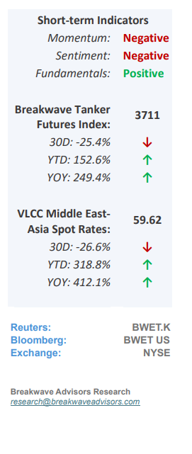
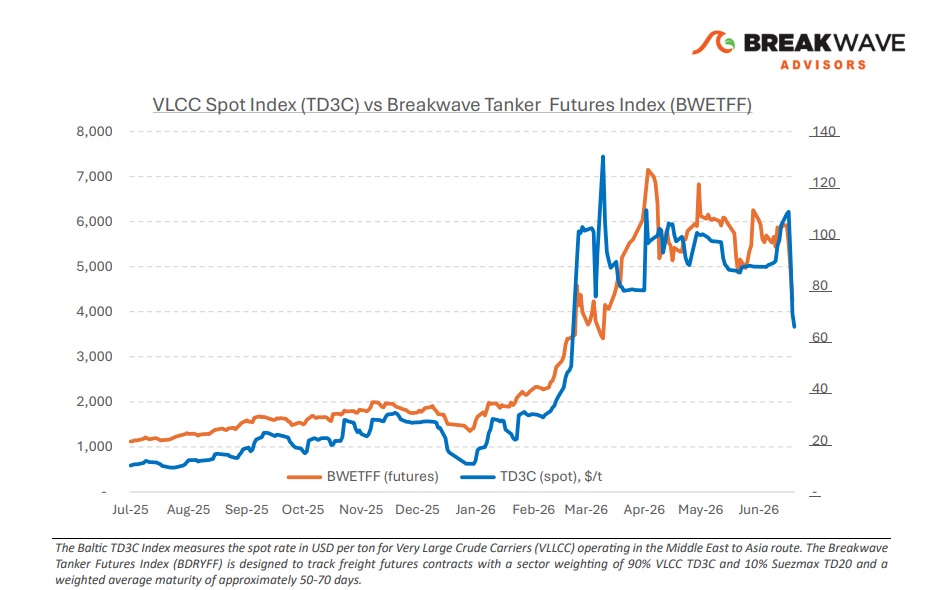
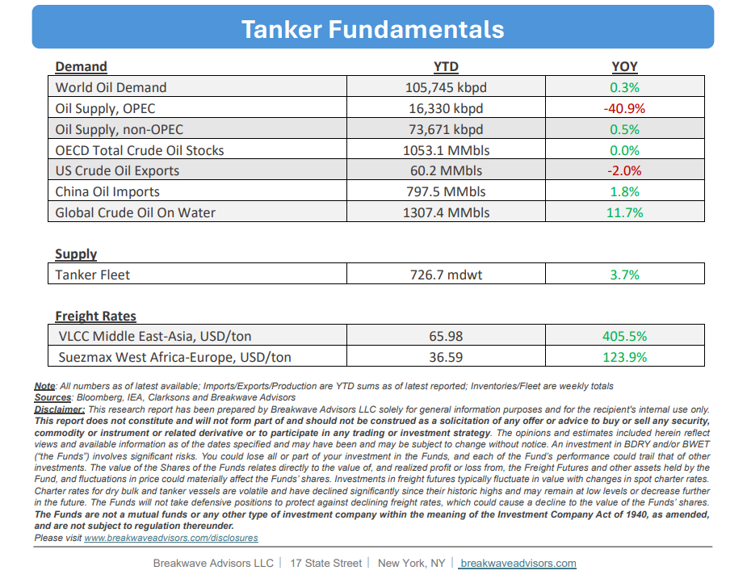

# Breakwave Bi-Weekly Tanker Report - June 30, 2026

**Date:** June 30, 2026  
**Publisher:** Breakwave Advisors | **Category:** Market Insights  
**Original URL:** [https://www.breakwaveadvisors.com/insights/3062026wetreportkjujun459](https://www.breakwaveadvisors.com/insights/3062026wetreportkjujun459)  

---

•**VLCC Spot Drops from Crisis Highs, but Volatility Remains**– The Very Large Crude Carrier (VLCC) Arabian Gulf (AG) market experienced extreme volatility during the past week, with spot rates fluctuating sharply due to dynamic geopolitical risks in the Strait of Hormuz. While shipowners continually evaluate risk-versusreward profiles for regional transits, sentiment is supported by a tangible recovery in Middle Eastern supply, driven by Saudi Arabia resuming loadings at Ras Tanura alongside expanded export programs from ADNOC, Qatar, Iraq, Kuwait, and Iran. Conversely, weakening Chinese demand presents a significant headwind; preliminary data indicates June imports have fallen to approximately 6.4 million barrels per day (bpd), an 8% decline from May’s average of 7.82 million bpd and the lowest volume since October 2016. Moving forward, near-term market direction will depend on whether lower crude pricing can stimulate Asian refinery buying, though freight rates, and as a result freight futures, are expected to remain highly volatile and sensitive to headline risks.

> **Figure 1: Cea3cf84ceb9ceb3cebcceb9cf8ccf84cf85**  
> [Local Asset](file:///C:/Users/Dell/Github/Shipping/corpus/03-breakwave/insights/2026/assets/2026-06-30_3062026wetreportkjujun459_img_cea3cf84ceb9ceb3cebcceb9cf8ccf84cf85_c554c9d1b4f9.png)

•**Oil Prices Drop to pre-war Levels as Oversupply becomes the Narrative**– A rapid shift in oil market sentiment from supply anxiety to an oversupply narrative has driven crude prices back to pre-war levels, despite little change in structural reality. While global inventories continue a rapid drawdown and uncertainty persists over the pace of Arabian Gulf (AG) export recovery, a steep decline in Chinese spot market purchasing has put severe downward pressure on global pricing. The primary driver of this deflation is not necessarily the volume of barrels transiting the Hormuz straits (which is admittedly high in such a short period of time), but rather the notable lack of appetite from Chinese refiners to accumulate stockpiles at preconflict rates. Whether this pullback represents a structural shift in Chinese demand (economy) or a temporary buying pause remains to be seen; however, the immediate seaborne market is left fundamentally imbalanced with a surplus of prompt spot oil supply.

•**Our Long-term View**– The tanker market has been recovering from a long period of staggered rates as the growth in new vessel supply shrunk while oil demand remained elevated in line with the global economy. The recent rapid increase in freight rates has led to significant new vessel ordering, with the orderbook now standing at above average levels, and although in the near term such a supply/demand misbalance is small, we expect a meaningful negative balance to develop longer term leading to a potential downcycle.

> **Figure 2: Στιγμιότυπο Οθόνης 2026 06 29 230342**  
> [Local Asset](file:///C:/Users/Dell/Github/Shipping/corpus/03-breakwave/insights/2026/assets/2026-06-30_3062026wetreportkjujun459_img_cea3cf84ceb9ceb3cebcceb9cf8ccf84cf85_d7626209e5f5.png)

> **Figure 3: Στιγμιότυπο Οθόνης 2026 06 29 230351**  
> [Local Asset](file:///C:/Users/Dell/Github/Shipping/corpus/03-breakwave/insights/2026/assets/2026-06-30_3062026wetreportkjujun459_img_cea3cf84ceb9ceb3cebcceb9cf8ccf84cf85_9be0fbf70b67.png)

### Subscribe:
