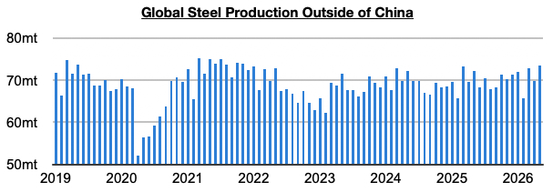
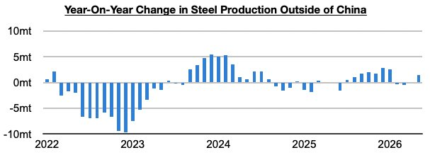
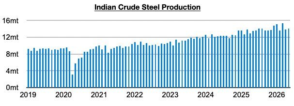

# Stronger Growth in Steel Production Outside of China

**Date:** July 02, 2026  
**Publisher:** Breakwave Advisors | **Category:** Market Insights  
**Original URL:** [https://www.breakwaveadvisors.com/insights/2026/7/2/stronger-growth-in-steel-production-outside-of-china](https://www.breakwaveadvisors.com/insights/2026/7/2/stronger-growth-in-steel-production-outside-of-china)  

---

*By*[*Jeffrey Landsberg*](https://www.linkedin.com/in/jeffrey-landsberg-70ab957/)

As we discussed in Commodore Research's most recent Weekly Executive Report, global steel production totaled approximately 157.9 million tons in March. This is up month-on-month by 4.5 million tons (3%) but is down year-on-year by 900,000 tons (-1%). Steel production outside of China totaled approximately 73.5 million tons. This is up month-on-month by 3.7 million tons (5%) and is up year-on-year by 1.4 million tons (2%).

> **Figure 1: 241**  
> [Local Asset](file:///C:/Users/Dell/Github/Shipping/corpus/03-breakwave/insights/2026/assets/2026-07-02_stronger-growth-in-steel-production-outside-of-china_img_241_da84c691b343.png)

Steel production ex-China has now increased on a year-on-year basis for two straight months. Previously, it had contracted on a year-on-year basis for two straight months.

> **Figure 2: 242**  
> [Local Asset](file:///C:/Users/Dell/Github/Shipping/corpus/03-breakwave/insights/2026/assets/2026-07-02_stronger-growth-in-steel-production-outside-of-china_img_242_4fb167fd8f84.jpg)

Taking India out of the equation, production grew year-on-year by 800,000 tons (1%). Previously, production ex-China/India had contracted on a year-on-year basis for three straight months.

India's own steel production totaled 14.1 million tons last month. This is up month-on-month by 300,000 tons (2%) and is up year-on-year by 600,000 tons (4%). Production has now grown on a year-on-year basis for thirty-nine straight months.

> **Figure 3: 243**  
> [Local Asset](file:///C:/Users/Dell/Github/Shipping/corpus/03-breakwave/insights/2026/assets/2026-07-02_stronger-growth-in-steel-production-outside-of-china_img_243_d010bd300e27.jpg)

---

**Tags:** Steel, Ironore, Drybulk  
