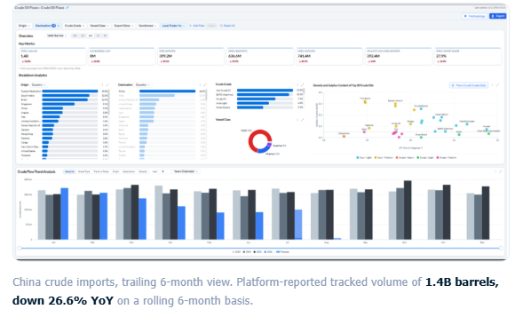
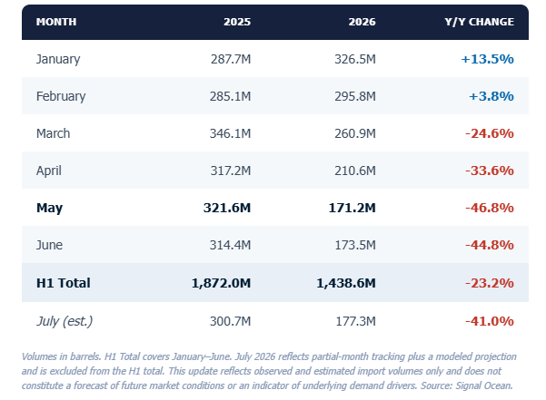
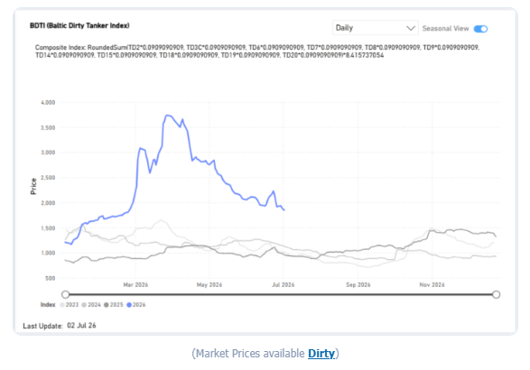
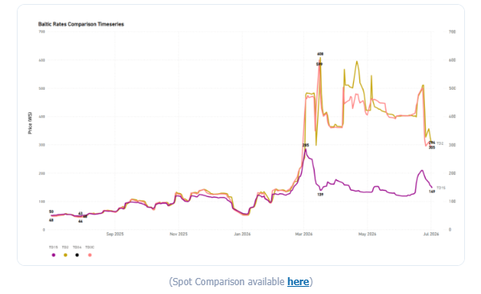
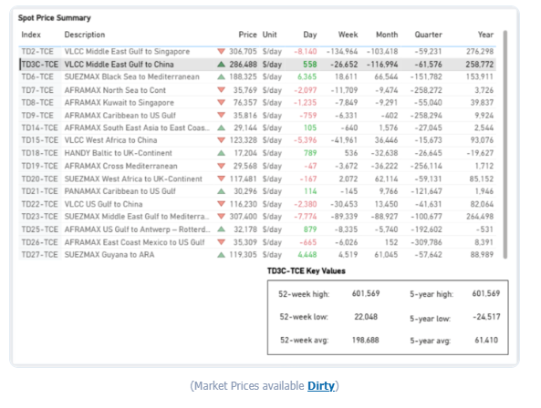
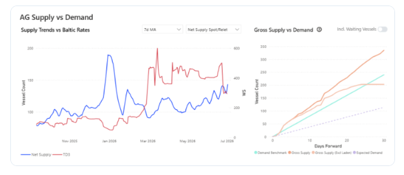
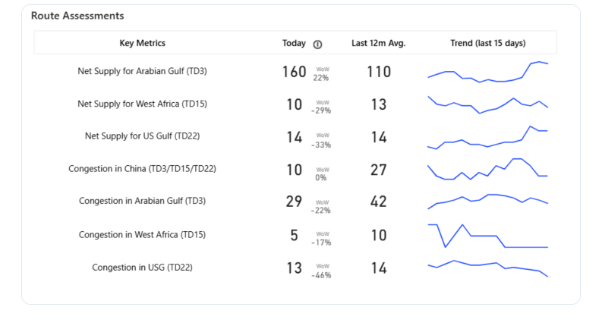
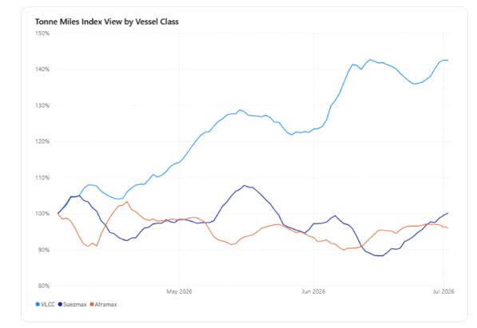

# China's H1 Crude Imports Post Sharpest Drop Since War Began

**Date:** July 06, 2026  
**Publisher:** Breakwave Advisors | **Category:** Market Insights  
**Original URL:** [https://www.breakwaveadvisors.com/insights/2026/7/6/chinas-h1-crude-imports-post-sharpest-drop-since-war-began](https://www.breakwaveadvisors.com/insights/2026/7/6/chinas-h1-crude-imports-post-sharpest-drop-since-war-began)  

---

### Executive Snapshot

• China's crude imports fell ~23% year-on-year in H1 2026, with May marking the low point at nearly 48% below prior-year levels; July data points to stabilization rather than recovery, still tracking ~41% below 2025.

• Freight markets spiked then corrected in tandem with the Strait of Hormuz disruption, with the BDTI easing to 1,850 (‑49% year-to-date), and AG–China VLCC earnings (TD3C-TCE) retreating ~29% month-on-month to ~$286,500/day, though both remain well above pre-crisis norms.

• US–Iran negotiations are easing the disruption but remain unresolved, with the June 17 Islamabad Memorandum and continued Doha talks driving a partial recovery in Hormuz transit.

• The incomplete normalization explains why freight rates have fallen from wartime peaks yet stay elevated, and why Chinese import volumes have yet to rebound.

## Spotlight of the Week |Chinese Crude Oil Flows

### China Crude Oil Imports Fall 23% in First Half of 2026

*May marks the low point of the period as vessel-tracking data shows a sharp Q2 decline, followed by signs of stabilization in July*

Chinese seaborne crude oil imports fell approximately 23% year-on-year in the first half of 2026, according to Signal Ocean vessel-tracking data, declining from roughly 1.87 billion barrels in H1 2025 to an estimated 1.44 billion barrels in H1 2026.

Imports opened the year above 2025 levels in January and February before turning sharply lower from March onward. May 2026 marked the low point of the period, with tracked imports down approximately 47% year-on-year, the steepest single-month decline observed in the dataset this year. June volumes remained at similarly depressed levels.

Preliminary tracking for July 2026, combined with a modeled month-end estimate, indicates imports of approximately 177 million barrels, a modest increase of around 2% versus June, but still roughly 41% below the same month in 2025. The data suggests the sharp sequential declines seen from March through June have begun to stabilize, though volumes remain well below prior-year levels.

### Signal Ocean Crude Oil Flows — China, 6-Month View

> **Figure 1: Στιγμιότυπο Οθόνης 2026 07 06 110643**  
> **Interactive Data & Source:** [Signal Ocean Platform](https://go.signalocean.com/e/983831/2026-07-03/2s8lt1/625244241/h/NKebvtXkKIg0QHLqG1n3oNmvpsbvAAuk5gLa1TGbfcY) | [Local Asset](file:///C:/Users/Dell/Github/Shipping/corpus/03-breakwave/insights/2026/assets/2026-07-06_chinas-h1-crude-imports-post-sharpest-drop-since-war-began_img_cea3cf84ceb9ceb3cebcceb9cf8ccf84cf85_272c294a565f.png)

### Key Year-on-Year Moves: Jan +13.5% · May -46.8% · July -41.0% (Est.)

### Monthly Import Volumes — China (year-on-Year)

> **Figure 2: Στιγμιότυπο Οθόνης 2026 07 06 110744**  
> **Interactive Data & Source:** [Signal Ocean Platform](https://go.signalocean.com/e/983831/2026-07-03/2s8lt1/625244241/h/NKebvtXkKIg0QHLqG1n3oNmvpsbvAAuk5gLa1TGbfcY) | [Local Asset](file:///C:/Users/Dell/Github/Shipping/corpus/03-breakwave/insights/2026/assets/2026-07-06_chinas-h1-crude-imports-post-sharpest-drop-since-war-began_img_cea3cf84ceb9ceb3cebcceb9cf8ccf84cf85_ab44dd465f83.png)

## Freight Market Overview - Dirty

As of early July 2026, the Baltic Dirty Tanker Index had eased sharply to 1,850 points, down 49.2% year-to-date and roughly 50% from its peak, as tanker traffic through Hormuz began to normalize, though it remained approximately 92.5% above year-ago levels. Middle East Gulf-to-China rates (TD3C) had similarly retreated to 293.89 Worldscale points, down 27% monthly.

### Bdti (Baltic Dirty Tanker Index)

> **Figure 3: Στιγμιότυπο Οθόνης 2026 07 06 110830**  
> **Interactive Data & Source:** [Signal Ocean Platform](https://go.signalocean.com/e/983831/2026-07-03/2s8lt1/625244241/h/NKebvtXkKIg0QHLqG1n3oNmvpsbvAAuk5gLa1TGbfcY) | [Local Asset](file:///C:/Users/Dell/Github/Shipping/corpus/03-breakwave/insights/2026/assets/2026-07-06_chinas-h1-crude-imports-post-sharpest-drop-since-war-began_img_cea3cf84ceb9ceb3cebcceb9cf8ccf84cf85_f06c4768af59.png)

## Dirty VLCC

**VLCC |****TD2**Middle East Gulf to Singapore |**TD3C**Middle East Gulf to China |**TD15**West African to China |**TD34**Gulf of Oman to China

### Baltic Rates Comparison Timeseries

> **Figure 4: Στιγμιότυπο Οθόνης 2026 07 06 110910**  
> **Interactive Data & Source:** [Signal Ocean Platform](https://go.signalocean.com/e/983831/2026-07-03/2s8lt1/625244241/h/NKebvtXkKIg0QHLqG1n3oNmvpsbvAAuk5gLa1TGbfcY) | [Local Asset](file:///C:/Users/Dell/Github/Shipping/corpus/03-breakwave/insights/2026/assets/2026-07-06_chinas-h1-crude-imports-post-sharpest-drop-since-war-began_img_cea3cf84ceb9ceb3cebcceb9cf8ccf84cf85_a60e7e07a90f.png)

### Time-Charter-Equivalent Earnings: The Ag–china Route Correction

The correction was especially pronounced on time-charter-equivalent (TCE) earnings for the Middle East Gulf-to-China VLCC route (TD3C-TCE), the benchmark most directly tied to Chinese crude buying. As of July 2, 2026, daily earnings on the route stood at approximately $286,500 per day, still elevated at roughly 44% above the 52-week average, but down about $117,000 (‑29%) over the past month and more than 52% below the 52-week high of $601,569 recorded at the height of the crisis. On a year-on-year basis, earnings remained sharply higher (+$258,772), reflecting how depressed the pre-conflict starting point had been.

The retreat in freight earnings tracks the broader trajectory of US–Iran negotiations over the Strait of Hormuz. Following more than three months of conflict that severely disrupted a waterway through which around 20% of global oil trade normally passes, the United States and Iran reached an interim agreement in mid-June 2026 aimed at ending the conflict and reopening the strait, formalized through the Islamabad Memorandum signed on June 17, 2026. As transit conditions gradually improved, freight risk premiums eased, pulling TCE earnings back from their wartime extremes.

The latest round of indirect US–Iran talks in Doha on July 1 underscored that normalization remains incomplete. Mediators reported positive progress on issues linked to the memorandum, and both sides agreed to continue discussions. However, the technical negotiations concluded without resolving the main outstanding issues, with transit arrangements through the Strait of Hormuz remaining the principal point of disagreement. Shipping traffic has recovered only partially and remains well below pre-war levels, helping explain why TD3C earnings, despite retreating sharply from wartime highs, continue to trade well above pre-conflict norms.

### Spot Price Summary

> **Figure 5: Στιγμιότυπο Οθόνης 2026 07 06 110957**  
> **Interactive Data & Source:** [Signal Ocean Platform](https://go.signalocean.com/e/983831/2026-07-03/2s8lt1/625244241/h/NKebvtXkKIg0QHLqG1n3oNmvpsbvAAuk5gLa1TGbfcY) | [Local Asset](file:///C:/Users/Dell/Github/Shipping/corpus/03-breakwave/insights/2026/assets/2026-07-06_chinas-h1-crude-imports-post-sharpest-drop-since-war-began_img_cea3cf84ceb9ceb3cebcceb9cf8ccf84cf85_b5716ea70fb1.png)

## Supply Market Trends

This week, the VLCC AG market takes centre stage, where signals of an oversupplied picture have started to reflect in the freight market sentiment.

### VLCC | AG Supply Trends

**•**VLCC Insights from the[**Signal Ocean Platform**](https://go.signalocean.com/e/983831/2026-07-03/2s8lt1/625244241/h/NKebvtXkKIg0QHLqG1n3oNmvpsbvAAuk5gLa1TGbfcY)indicate that the TD3C route has shifted into an oversupplied state starting in early July.

### AG Supply vs Demand

> **Figure 6: Στιγμιότυπο Οθόνης 2026 07 06 111041**  
> **Interactive Data & Source:** [Signal Ocean Platform](https://www.thesignalgroup.com/signal-ocean-platform) | [Local Asset](file:///C:/Users/Dell/Github/Shipping/corpus/03-breakwave/insights/2026/assets/2026-07-06_chinas-h1-crude-imports-post-sharpest-drop-since-war-began_img_cea3cf84ceb9ceb3cebcceb9cf8ccf84cf85_7484421ef01b.png)

The latest indicators point to an upward trend in the net supply for the Arabian Gulf during the last 15 days, with the latest estimate at 160, up 22% W-o-W.

### Route Assessments

> **Figure 7: Στιγμιότυπο Οθόνης 2026 07 06 111119**  
> **Interactive Data & Source:** [Signal Ocean Platform](https://www.thesignalgroup.com/signal-ocean-platform) | [Local Asset](file:///C:/Users/Dell/Github/Shipping/corpus/03-breakwave/insights/2026/assets/2026-07-06_chinas-h1-crude-imports-post-sharpest-drop-since-war-began_img_cea3cf84ceb9ceb3cebcceb9cf8ccf84cf85_9cd42ed8ef0b.png)

## Dirty Demand (Tonne Miles) | 7d Ma - Index View

### Vlcc↑4.5% Wow|suezmax↑4.8% Wow|aframax↓ 0.6% Wow

### Tonne Miles Index View by Vessel Class

> **Figure 8: Metrics Description: Index View (Base 100) by Total Tonne Miles**  
> *Metrics Description: Index View (Base 100) by total Tonne Miles over the selected period. This facilitates relative performance comparisons between segments of different sizes (e.g., comparing the growth rate of VLCC vs Suezmax)*  
> **Interactive Data & Source:** [Signal Ocean Platform](https://www.thesignalgroup.com/signal-ocean-platform) | [Local Asset](file:///C:/Users/Dell/Github/Shipping/corpus/03-breakwave/insights/2026/assets/2026-07-06_chinas-h1-crude-imports-post-sharpest-drop-since-war-began_img_cea3cf84ceb9ceb3cebcceb9cf8ccf84cf85_1db9a16b5d28.png)

VLCC tonne-mile demand extended its outperformance, rising 6.1 ppts WoW to 142.4% and remaining above historical norms. Suezmaxes recorded a further improvement of 4.6 ppts WoW to 100.1%, returning above the 100% parity threshold. By contrast, Aframax tonne-mile demand softened only marginally, declining 0.6 ppts WoW to 96.1%, indicating almost stable underlying demand.

Data Source:[Signal Ocean Platform](https://www.thesignalgroup.com/signal-ocean-platform)

---

**Tags:** Crude, Markets, Tankers  
