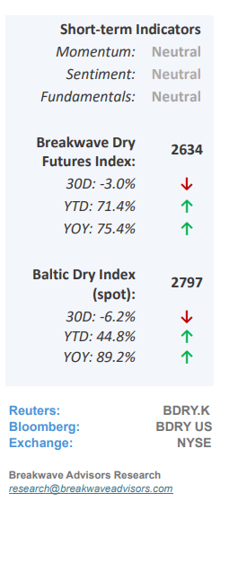
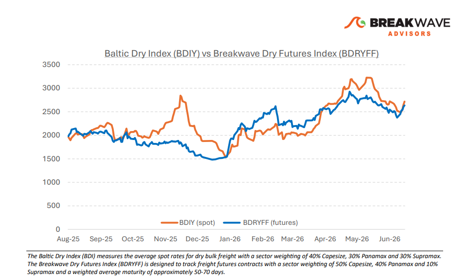
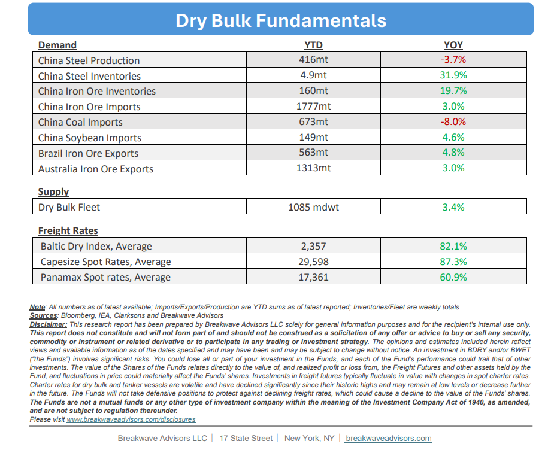

# Breakwave Bi-Weekly Dry Bulk Report - July 7, 2026

**Date:** July 07, 2026  
**Publisher:** Breakwave Advisors | **Category:** Market Insights  
**Original URL:** [https://www.breakwaveadvisors.com/insights/772026db-report2026dryreportjj47](https://www.breakwaveadvisors.com/insights/772026db-report2026dryreportjj47)  

---

•**A Solid First Half for Dry Bulk Shipping**– Notwithstanding prevailing market uncertainty, the**dry bulk shipping sector achieved an exceptionally strong performance**in the first half of the year, characterized by**tight**global vessel**supply**that drove average earnings across all asset classes well above historical benchmarks. Operational inefficiencies, extended voyage lengths, and bunker fueling dislocations stemming from disruptions in the Strait of Hormuz oil flow further constrained market capacity, a trend compounded by a**heavy drydocking schedule**for aging vessels built during the 2009–2011 vessel construction boom. This reduced effective supply, paired with healthy iron ore demand, sustained Capesize earnings at highly profitable levels exceeding $30,000 per day. While the second half of the year is projected to introduce**heightened volatility**as these operational tailwinds gradually unwind, fleet deliveries approach a 4% run-rate, and Chinese steel demand weakens, positive market sentiment is expected to temporarily mitigate these emerging fundamental headwinds.

> **Figure 1: Cea3cf84ceb9ceb3cebcceb9cf8ccf84cf85**  
> [Local Asset](file:///C:/Users/Dell/Github/Shipping/corpus/03-breakwave/insights/2026/assets/2026-07-07_772026db-report2026dryreportjj47_img_cea3cf84ceb9ceb3cebcceb9cf8ccf84cf85_db586f8a9f5c.png)

•**Oil Imports into China Collapse**– The**severe contraction**in**China's June oil****imports**to approximately 6 million barrels per day represents a critical convergence of acute geopolitical disruption and likely structural domestic economic weakness. While the recent U.S.-Iran conflict and Strait of Hormuz closure**severely distorted near-term trade data**and triggered price volatility, the decline might not be attributed solely to supply-side shocks; rather, it could underscore weak domestic demand within China's industrial and real estate sectors. This macroeconomic deceleration is further compounded by**a permanent structural shift**, as rapid electric vehicle adoption and alternative energy integration continue to erode the country's baseline transportation fuel requirements. Consequently, despite a recent peace breakthrough easing global supply constraints, China’s underlying domestic consumption remains**structurally impaired**, leaving its broader economic growth increasingly dependent on the export market to sustain current production targets.

•**Our Long-term View**– The last few years have been characterized by increased geopolitical uncertainty. Going forward, we expect such events to continue to affect global trade and have a meaningful impact on effective vessel supply. Combined with the potential for a multi-year cyclical rebound in China’s economic activity following the recent economic turmoil, dry bulk shipping should experience higher volatility on top of a secular tightness driven by stable bulk commodity demand and rather steady fleet growth.

> **Figure 2: Στιγμιότυπο Οθόνης 2026 07 06 221634**  
> [Local Asset](file:///C:/Users/Dell/Github/Shipping/corpus/03-breakwave/insights/2026/assets/2026-07-07_772026db-report2026dryreportjj47_img_cea3cf84ceb9ceb3cebcceb9cf8ccf84cf85_0a96ab8af11c.png)

> **Figure 3: Στιγμιότυπο Οθόνης 2026 07 06 221647**  
> [Local Asset](file:///C:/Users/Dell/Github/Shipping/corpus/03-breakwave/insights/2026/assets/2026-07-07_772026db-report2026dryreportjj47_img_cea3cf84ceb9ceb3cebcceb9cf8ccf84cf85_3c59e22df200.png)

### Subscribe:
