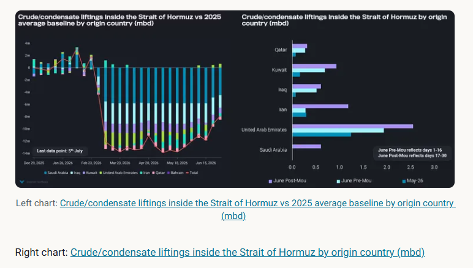
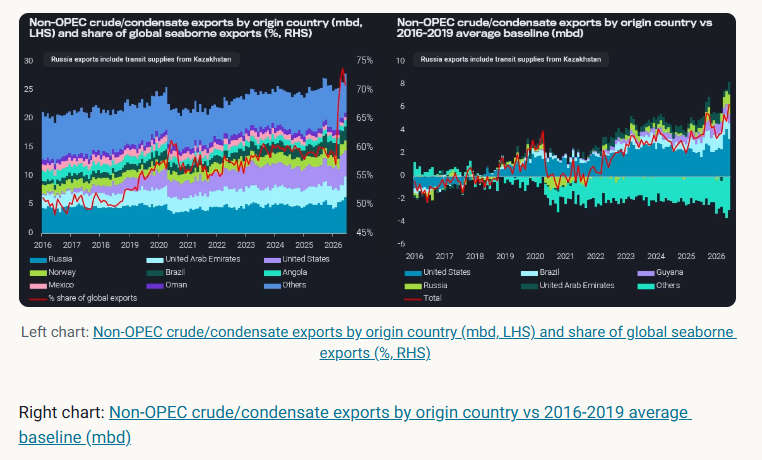
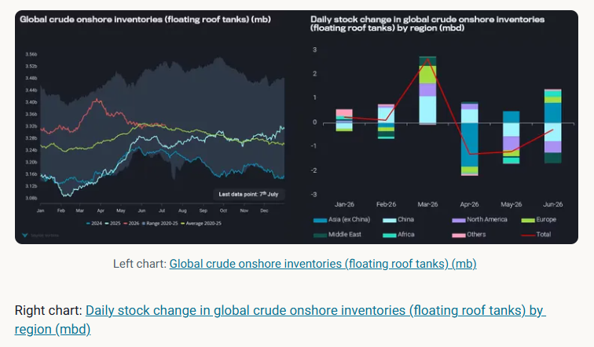

# Global oil oversupply looming

**Date:** July 08, 2026  
**Publisher:** Breakwave Advisors | **Category:** Market Insights  
**Original URL:** [https://www.breakwaveadvisors.com/insights/2026/7/8/global-oil-oversupply-looming](https://www.breakwaveadvisors.com/insights/2026/7/8/global-oil-oversupply-looming)  

---

With OPEC oil flows via the Strait of Hormuz gradually picking up and record-high non-OPEC exports, a global oil oversupply is looming.

*By*[*Xavier Tang*](https://www.linkedin.com/in/xavier-tang/)

Oil prices have recently fallen sharply, with the front-month ICE Brent and NYMEX WTI contracts trading at $71/bl and $69/bl as of 3rd July. The weakness in oil prices began as soon as US announced that a peace deal was imminent, prompting a sell-off in oil futures. Naturally, physical traders and speculators unwound their long positions as expectations of a resumption of oil flows through the Strait of Hormuz grew.

Seaborne crude/condensate liftings inside the Strait of Hormuz increased for the 2nd consecutive week (for the week ending 5th July), though growth in crude liftings began as early as the end of May.[The crude supply deficit caused by the closure of the Strait of Hormuz hovered between –12 mbd and –14 mbd](https://analytics.vortexa.com/Flows?dateRange=2026-01-01T00%3A00%3A00.000Z__2026-07-05T23%3A59%3A59.999Z&filtersEnabled=%5B%22p%22%2C%22o%22%2C%22d%22%2C%22d_r%22%2C%22v%22%2C%22intra_d%22%2C%22sts_o%22%2C%22c_o%22%2C%22w%22%5D&frequency=week&from=%5B%220cbe50bd8391492dbd1c968b9badf1d48b0492df670e4807965668f08cc68b8d%22%5D&intraMovementDropdown=all&metric=bpd&page=Flows&products=%5B%2254af755a090118dcf9b0724c9a4e9f14745c26165385ffa7f1445bc768f06f11%22%5D&productsExcluded=%5B%22f95529fb0524a95783a8f3a2dad1463bfcc610b789bffd91ed16b233b77bf86c%22%5D&tabId=61cafa26-5e5c-4635-ad46-7a7aed607d01&timeSeriesBaselineEnabled=1&timeSeriesBaselineEnd=2025-12-31T23%3A59%3A59.999Z&timeSeriesBaselineStart=2025-01-01T00%3A00%3A00.000Z&timeSeriesProperty=origin_country&tsAnalysisTotalToggle=1&v=3)across the March–May period when compared to the 2025 average baseline. Iran was exporting at normal levels in March until the US blockade was imposed on 13th April, restricting both inbound and outbound vessels involved in Iranian oil trade and adding to the crude supply deficit. The signing of the MOU has prompted other Middle Eastern countries to ramp up crude liftings, with significant increases seen in the UAE and Saudi Arabia over the past two weeks, aided by the involvement of shuttle tankers, state-owned vessels and major trading firms.

Among the mainstream crude producers,[UAE was the first country to ramp up its crude liftings back to pre-war levels since early June](https://analytics.vortexa.com/Flows?dateRange=2024-01-01T00%3A00%3A00.000Z__2026-06-30T23%3A59%3A59.999Z&filtersEnabled=%5B%22p%22%2C%22o%22%2C%22d%22%2C%22d_r%22%2C%22v%22%2C%22intra_d%22%2C%22sts_o%22%2C%22c_o%22%2C%22w%22%5D&frequency=day&from=%5B%22f2ac0b4ca7b0e481ec41197ddbd37f6c60251f369ed74872691988bed8a07e0a%22%5D&intraMovementDropdown=all&metric=bpd&page=Flows&products=%5B%2254af755a090118dcf9b0724c9a4e9f14745c26165385ffa7f1445bc768f06f11%22%5D&tabId=61cafa26-5e5c-4635-ad46-7a7aed607d01&timeSeriesBaselineEnd=2025-12-31T23%3A59%3A59.999Z&timeSeriesBaselineStart=2025-01-01T00%3A00%3A00.000Z&timeSeriesChartView=seasonal&tsAnalysisTotalToggle=1&tsSeasonalMovingAvg=1&tsSeasonalMovingAvgWindow=28d&v=3)as the country utilised its ADCOP pipeline to transport crude from its Habshan oil fields in Abu Dhabi to Fujairah and directed most of the crude supplies that had initially been fed to its refineries towards the market. Its success was also attributed to the use of ship-to-ship (STS) transfers to move oil from within the Strait of Hormuz to vessels outside it, at STS zones such as Sohar and Fujairah, allowing buyers to secure much-needed supplies in a safer area.

> **Figure 1: Στιγμιότυπο Οθόνης 2026 07 08 113606**  
> **Interactive Data & Source:** [Analytics Vortexa](https://analytics.vortexa.com/Flows?dateRange=2024-01-01T00%3A00%3A00.000Z__2026-07-03T23%3A59%3A59.999Z&filtersEnabled=%5B%22p%22%2C%22o%22%2C%22d%22%2C%22d_r%22%2C%22v%22%2C%22intra_d%22%2C%22sts_o%22%2C%22c_o%22%2C%22w%22%5D&frequency=day&metric=bpd&page=Flows&products=%5B%2254af755a090118dcf9b0724c9a4e9f14745c26165385ffa7f1445bc768f06f11%22%5D&tabId=61cafa26-5e5c-4635-ad46-7a7aed607d01&timeSeriesBaselineEnd=2024-12-31T23%3A59%3A59.999Z&timeSeriesBaselineStart=2024-01-01T00%3A00%3A00.000Z&timeSeriesChartView=seasonal&to=%5B%22934c47f36c16a58d68ef5e007e62a23f5f036ee3f3d1f5f85a48c572b90ad8b2%22%5D&tsAnalysisTotalToggle=1&tsSeasonalMovingAvg=1&tsSeasonalMovingAvgWindow=28d&v=3) | [Local Asset](file:///C:/Users/Dell/Github/Shipping/corpus/03-breakwave/insights/2026/assets/2026-07-08_global-oil-oversupply-looming_img_cea3cf84ceb9ceb3cebcceb9cf8ccf84cf85_e2c2bf5ed79b.png)

## Non-OPEC Exports Hit Record Highs

Facilitated by the US/Israel-Iran conflict, non-OPEC producers have ramped up their crude/condensate exports over the past four months, hitting a record high of 28.5 mbd in June, 6.2 mbd above the pre-COVID average (2016-2019). This surge in exports was driven by record US SPR releases (amounting to 133mb across April and June) and Brazilian oil production, as well as increased exports from Guyana, Russia, Kazakhstan, UAE, Canada and Norway. The recent growth in Russian crude exports was driven by lower refinery utilisation due to drone attacks, thereby freeing up supplies for the export market, while Kazakhstan's exports increased due to the resumption of output at the Tengiz field. Export growth from many non-OPEC producers began in 2025 as illustrated by the Sep/Oct 2025 flood, though minor additions have also been seen lately.

Although non-OPEC crude/condensate exports increased by “only” 10% (2.7 mbd) between February and June, their market share of seaborne exports rose from 57% to 72% as OPEC supplies were largely curtailed by disruptions to oil flows in the Strait of Hormuz.

With the gradual reopening of the Strait of Hormuz in place, OPEC producers would likely maximise their output within their quota restrictions, as long as ballast vessels can enter the waterway to load crude from their ports, especially those that have lost revenue due to the disruption in the Strait of Hormuz. The concern over an oversupply situation is deepening, given that non-OPEC supply is now at record highs and incoming supply from OPEC producers will likely flood the market at a time when demand hasn’t fully recovered.

> **Figure 2: Στιγμιότυπο Οθόνης 2026 07 08 124400**  
> **Interactive Data & Source:** [Analytics Vortexa](https://analytics.vortexa.com/Flows?dateRange=2024-01-01T00%3A00%3A00.000Z__2026-07-03T23%3A59%3A59.999Z&filtersEnabled=%5B%22p%22%2C%22o%22%2C%22d%22%2C%22d_r%22%2C%22v%22%2C%22intra_d%22%2C%22sts_o%22%2C%22c_o%22%2C%22w%22%5D&frequency=day&metric=bpd&page=Flows&products=%5B%2254af755a090118dcf9b0724c9a4e9f14745c26165385ffa7f1445bc768f06f11%22%5D&tabId=61cafa26-5e5c-4635-ad46-7a7aed607d01&timeSeriesBaselineEnd=2024-12-31T23%3A59%3A59.999Z&timeSeriesBaselineStart=2024-01-01T00%3A00%3A00.000Z&timeSeriesChartView=seasonal&to=%5B%22934c47f36c16a58d68ef5e007e62a23f5f036ee3f3d1f5f85a48c572b90ad8b2%22%5D&tsAnalysisTotalToggle=1&tsSeasonalMovingAvg=1&tsSeasonalMovingAvgWindow=28d&v=3) | [Local Asset](file:///C:/Users/Dell/Github/Shipping/corpus/03-breakwave/insights/2026/assets/2026-07-08_global-oil-oversupply-looming_img_cea3cf84ceb9ceb3cebcceb9cf8ccf84cf85_71bfee973c92.png)

## Demand Recovery Is Highly Dependent on China

China has borne the brunt of the crude supply shortage over the past three months, with crude/condensate imports falling for the fourth consecutive month since March. In June, China's imports fell into a 4.4 mbd deficit relative to the 2024 average, a period when China's oil supply/demand balance was relatively stable and stockpiling was limited. Although there were high imports from shipping regions such as the Red Sea Gulf and South America East Coast over the past three months, these imports were still insufficient to offset the supply losses from the Middle East Gulf (see left chart below). China's crude purchases from Saudi Arabia have also fallen, as reflected by lower imports from the Red Sea Gulf, due to the high official selling prices announced over the past few months, though the situation could change in August as there was a sharp correction for Asian customers, falling from +9.5/b to -$1.5/b m-o-m for Arab Light.

That said, the same comparison made for crude/condensate imports in the rest of the world told a different story. Imports rebounded sharply in May and continue to grow (see the chart on the right below), reaching about 800 kbd below the 2024 average, indicating that markets outside China can now sustain refinery runs at relatively healthy utilisation rates. This was perhaps the largest contributor to the fact that oil prices did not spike significantly despite the record disruption in oil supplies.

With oil production ramping up in the Middle East and an oversupply situation looming, China will now be the key driver of global oil demand recovery.[Crude/condensate exports to China, on a 28-day moving average](https://analytics.vortexa.com/Flows?dateRange=2024-01-01T00%3A00%3A00.000Z__2026-07-03T23%3A59%3A59.999Z&filtersEnabled=%5B%22p%22%2C%22o%22%2C%22d%22%2C%22d_r%22%2C%22v%22%2C%22intra_d%22%2C%22sts_o%22%2C%22c_o%22%2C%22w%22%5D&frequency=day&metric=bpd&page=Flows&products=%5B%2254af755a090118dcf9b0724c9a4e9f14745c26165385ffa7f1445bc768f06f11%22%5D&tabId=61cafa26-5e5c-4635-ad46-7a7aed607d01&timeSeriesBaselineEnd=2024-12-31T23%3A59%3A59.999Z&timeSeriesBaselineStart=2024-01-01T00%3A00%3A00.000Z&timeSeriesChartView=seasonal&to=%5B%22934c47f36c16a58d68ef5e007e62a23f5f036ee3f3d1f5f85a48c572b90ad8b2%22%5D&tsAnalysisTotalToggle=1&tsSeasonalMovingAvg=1&tsSeasonalMovingAvgWindow=28d&v=3), are showing signs of recovery, rebounding from record lows of 5mbd to 7mbd in early July, though volumes remain around 3-4mbd below 2024 and 2025 figures.

> **Figure 3: Στιγμιότυπο Οθόνης 2026 07 08 124446**  
> **Interactive Data & Source:** [Analytics Vortexa](https://analytics.vortexa.com/Flows?dateRange=2024-01-01T00%3A00%3A00.000Z__2026-07-05T23%3A59%3A59.999Z&filtersEnabled=%5B%22p%22%2C%22o%22%2C%22d%22%2C%22d_r%22%2C%22v%22%2C%22intra_d%22%2C%22sts_o%22%2C%22c_o%22%2C%22w%22%5D&frequency=day&from=%5B%225057dafe08229da478858da705209d61d88db8dcaadf8376c266eeabdbe1f0ee%22%5D&metric=bpd&page=Flows&products=%5B%2254af755a090118dcf9b0724c9a4e9f14745c26165385ffa7f1445bc768f06f11%22%5D&tabId=61cafa26-5e5c-4635-ad46-7a7aed607d01&timeSeriesChartView=seasonal&tsSeasonalMovingAvg=1&tsSeasonalMovingAvgWindow=28d&v=3) | [Local Asset](file:///C:/Users/Dell/Github/Shipping/corpus/03-breakwave/insights/2026/assets/2026-07-08_global-oil-oversupply-looming_img_cea3cf84ceb9ceb3cebcceb9cf8ccf84cf85_6ab5f26c794e.png)

Looking ahead, global crude markets are increasingly turning bearish, with a wave of non-OPEC exports hitting the market in June, alongside[OPEC producers ramping up their exports](https://analytics.vortexa.com/Flows?dateRange=2024-01-01T00%3A00%3A00.000Z__2026-07-05T23%3A59%3A59.999Z&filtersEnabled=%5B%22p%22%2C%22o%22%2C%22d%22%2C%22d_r%22%2C%22v%22%2C%22intra_d%22%2C%22sts_o%22%2C%22c_o%22%2C%22w%22%5D&frequency=day&from=%5B%225057dafe08229da478858da705209d61d88db8dcaadf8376c266eeabdbe1f0ee%22%5D&metric=bpd&page=Flows&products=%5B%2254af755a090118dcf9b0724c9a4e9f14745c26165385ffa7f1445bc768f06f11%22%5D&tabId=61cafa26-5e5c-4635-ad46-7a7aed607d01&timeSeriesChartView=seasonal&tsSeasonalMovingAvg=1&tsSeasonalMovingAvgWindow=28d&v=3). The surplus in global seaborne crude supplies over 2025 averages could hit 3 mbd if non-OPEC exports remain at record highs seen in June and OPEC exports return to pre-conflict levels seen in January and February. Furthermore, crude oil import demand is much weaker currently than in 2025, driven by Chinese restraint. So Chinese crude procurement remains the single most important factor to look at for a reversal in recent price dynamics (aside from a collapse of the MEG peace efforts).

Meanwhile, stockbuilding on its own is unlikely to turn crude markets bullish. Although global inventories have declined by 90 mb over the past three months, traders who have borrowed SPR volumes may delay their crude purchases, as the timeline to return these volumes could range from a few months to two years (Argus Media). Even if governments across the world were to fill their onshore crude stocks back to the 6-year highs, that would only add around 230mb of demand, or about 1mbd, over the next eight months.

Data Source:[Vortexa](https://www.vortexa.com//oil-gas-data-traders-analysts-data-scientists?gclid=Cj0KCQjw8_qRBhCXARIsAE2AtRZKOvMnbilZ_6_91d7huSFFy71pWLrnPwGwOHVzXsmsG-1a1mZnQw8aAt89EALw_wcB&hsa_acc=1782073842&hsa_ad=548425387665&hsa_cam=14746637662&hsa_grp=125038601902&hsa_kw=&hsa_mt=&hsa_net=adwords&hsa_src=g&hsa_tgt=dsa-1431852288425&hsa_ver=3&utm_campaign=%5BCD%5D%20-%20DSA%20-%20EMEA&utm_medium=cpc&utm_medium=ppc&utm_source=google&utm_source=adwords&utm_term=)

---

**Tags:** Crude, Markets, Tankers  
