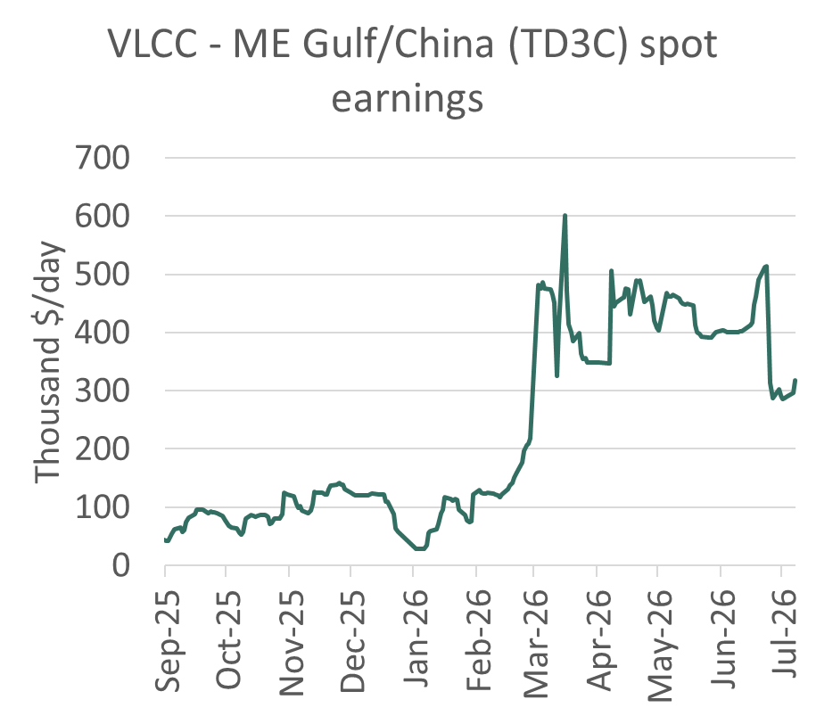
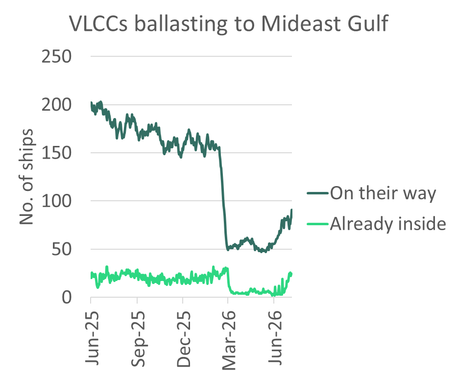

# Iran’s latest challenge to US-backed Hormuz corridor unlikely to change risk calculus

**Date:** July 08, 2026  
**Publisher:** Breakwave Advisors | **Category:** Market Insights  
**Original URL:** [https://www.breakwaveadvisors.com/insights/2026/7/8/irans-latest-challenge-to-us-backed-hormuz-corridor-unlikely-to-change-risk-calculus](https://www.breakwaveadvisors.com/insights/2026/7/8/irans-latest-challenge-to-us-backed-hormuz-corridor-unlikely-to-change-risk-calculus)  

---

Last night’s attacks on ships transiting the Strait of Hormuz appear to have done little to change the risk calculus for vessels fixing cargoes inside of Hormuz. Nor is Iran likely to succeed in forcing tankers to use its preferred routing close to the Iranian coast.

Iranian missiles hit a Qatari LNG carrier and a Bahri-controlled VLCC. This is the second time since Iran and the US signed an MoU on June 17th that a ship has been attacked. A container ship and a VLCC were hit on June 25th and June 27th, respectively. These attacks put paid to the IMO’s evacuation corridor, but otherwise left flows unaffected.

Iran is understood to be keen to control the passage of ships through the Strait of Hormuz with an eye to charging transit fees once the 60 days of the MoU expire.

The risk premium for Gulf loading VLCC routes has therefore settled over the past week at roughly $165k/day compared to a VLCC loading outside the Gulf in Oman, compared to around $370k/day at its peak in early May.

These attacks are not materially changing VLCC owners’ risk assessments. Our brokers report that owners that were signalling an interest in entering the Mideast Gulf are still willing to transit Hormuz. Nor is there any obvious sign they are refocusing on the lower paying Yanbu alternative, which would usually follow a hike in perceived risk of Gulf loading. The war risk premium has not risen, according to our contacts.

Mideast Gulf to China VLCC was assessed at $317k/day today, up $20k/day on yesterday. TD3C paper ticked up, with Balmo up $17k/day and Aug 2026 up $28k/day. The remaining contracts for 2026 also firmed.

> **Figure 1: Source: Baltic Exchange**  
> *Source: Baltic Exchange*  
> [Local Asset](file:///C:/Users/Dell/Github/Shipping/corpus/03-breakwave/insights/2026/assets/2026-07-08_irans-latest-challenge-to-us-backed-hormuz-corridor-unlikely-to-change-risk-calc_img_c6f4-image-0-1783447774287_b5ec58aabf8f.png)

### State of Play Before the Recent Attacks

Since May, the US has overseen transits via the southern corridor. This includes protection by US military aircraft, which is why it is the corridor of choice for Mideast national oil company cargoes and Greek-owned tankers, according to Windward. This includes most of the shuttle business – loaded from inside the Gulf and then STS-ing to ships in the Gulf of Oman near Fujairah. Kuwait, the UAE and Qatar have used shuttling to get roughly 80% of their June-loading cargoes loaded inside the Gulf out.

Crude exports from these three countries from inside the Mideast Gulf were 2.6mb/d in June, up from 1.3m b/d in May. Saudi cargoes from inside the Gulf have also reportedly followed the Omani route. The northern, Iranian-approved route through Hormuz is mostly the preserve of ships carrying Iranian cargoes.

VLCC transits in the Strait of Hormuz had been recovering following the signing of the US-Iran MoU on June 17th.

Transits averaged 9 VLCCs per day since 17 June, vs. 2-3/day in first half of June. In the past week over half of these transits were inbound, vs. just one-third in the first half of June.

Over the past week crude exports from the Middle East region (including Gulf of Oman and Yanbu) have reached 13.5m b/d, up from 7.8m b/d in May.

Exports from inside the Gulf have hit 6.7m b/d, up from 1.8m b/d in May. Shuttle runs moving Mideast Gulf (non-Iranian) crude outside Hormuz has increased STS liftings to 3mb/d in June, up from 1.5m b/d in May and an average of 0.5m b/d in 2025. Piped crude to Yanbu and Fujairah allowed exports to hit 4.1m b/d and 1.6m b/d, respectively in June.

A few key players were behind most of the recovery in crude liftings inside the Gulf. Our records suggest that Sinokor and Mideast national oil company-controlled ships have so far lifted 24 of the 32 VLCC non-Iranian cargoes loaded inside the Gulf since the MoU was signed. A further 9 Iranian cargoes were lifted by NITC or dark fleet tankers. The balance of 8 cargoes were mostly ships linked to Greek owners. In the last week, 67% of all empty VLCCs moving into the Mideast Gulf were Sinokor or Mideast national oil company-controlled ships. Of the 72 ballast inbound VLCC transits since the MoU was signed, 61% have been Sinokor or Mideast national oil company-controlled ships.

Ships operating in the Mideast Gulf could soon be joined by others. According to the predicted destinations produced by Vortexa, the number of empty VLCCs heading towards the Middle East Gulf has risen steeply since the start of June, from 60 to over 90 ships today, on top of the 24 empty VLCCs already in the Gulf. Around 70 of the tankers on their way to the Gulf are not controlled by Sinokor or a Mideast national oil company. However, these ships may be more likely to stay outside the Gulf near Fujairah and pick up shuttle cargoes given last night’s attacks.

> **Figure 2: E253 Image 1 1783447774289**  
> [Local Asset](file:///C:/Users/Dell/Github/Shipping/corpus/03-breakwave/insights/2026/assets/2026-07-08_irans-latest-challenge-to-us-backed-hormuz-corridor-unlikely-to-change-risk-calc_img_e253-image-1-1783447774289_6544d50d0a79.png)

*Source: Vortexa*

### Southern Passage Still Likely Choice for Most Non-Iranian Players for Remainder of Mou

During the remainder of the MoU period, VLCCs belonging to Mideast national oil companies, Sinokor and a handful of Greek owners that are currently lifting crude in the Mideast Gulf will be unlikely to take the northern passage approved by Iran. Owners making use of the southern corridor are enjoying the US-backed protections it provides, most of the time. The owners linked to the Middle East national oil companies are especially opposed to Iran exercising unilateral control over the Strait and therefore will be unwilling to submit to its authority today. Iran's previous attacks during the MoU period failed to materially alter tanker transit patterns. The northern route is therefore likely to remain primarily used by Iranian-linked cargoes.

But beyond the MoU’s expiry date on August 16th, owners will need to face the prospect that US protection may not continue indefinitely. And if it does continue, it’s unlikely to come free.

---

**Tags:** Tankers, Markets, Crude  
