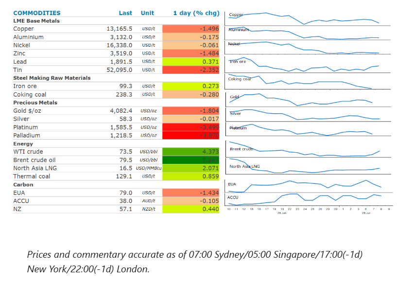
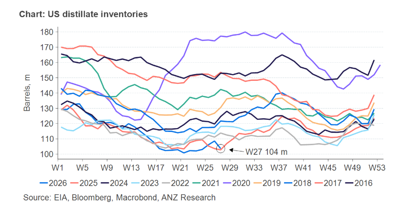

# Oil extends gains on renewed US and Iran attacks

**Date:** July 09, 2026  
**Publisher:** Breakwave Advisors | **Category:** Market Insights  
**Original URL:** [https://www.breakwaveadvisors.com/insights/2026/7/9/oil-extends-gains-on-renewed-us-and-iran-attacks](https://www.breakwaveadvisors.com/insights/2026/7/9/oil-extends-gains-on-renewed-us-and-iran-attacks)  

---

The energy sector rose as the US renewed attacks on Iran. Precious and industrial metals fell as risk appetite weakened.

*By*[*Daniel Hynes*](https://www.linkedin.com/in/dahynes/)

> **Figure 1: Στιγμιότυπο Οθόνης 2026 07 09 111410**  
> **Interactive Data & Source:** [Linkedin](https://www.linkedin.com/newsletters/commodities-wrap-6692196755876012032/?fbclid=IwAR3kiXJqZdxmp9ZcRwBNI7FsBySI-XSC0pfPur1qzjt7OZp7PTE59Tsl1QI) | [Local Asset](file:///C:/Users/Dell/Github/Shipping/corpus/03-breakwave/insights/2026/assets/2026-07-09_oil-extends-gains-on-renewed-us-and-iran-attacks_img_cea3cf84ceb9ceb3cebcceb9cf8ccf84cf85_7589b75dccde.png)

### Market Commentary

**Crude oil**futures extended earlier gains as tensions in the Middle Easte continue to rise. Following Iranian attacks on vessels in the Strait of Hormuz, the US retaliated, striking more than 80 targets including military assets in Iran. Trump lashed out at Iran’s apparent disregard for the memorandum of understanding the two sides signed last month, warning it may undertake further strikes on Iran, including a “take over” of its key oil export hub of Kharg Island. Iran responded by threatening to close the Strait of Hormuz in response to any US strikes. The events over the past 48 hours have raised concerns that any collapse of the interim peace deal between the US and Iran will lead to renewed disruptions to oil supplies from the Persian Gulf. Prior to the attack on three ships earlier this week, transits of the key waterway had been rising. The recovery of supply is now at risk of being stopped in its tracks as Iran looks to reassert its control.

Downstream fuel markets are also feeling the crunch, with refined fuel products extending their rally after Russia banned diesel exports until the end of July. Russia accounts for about 11% of global supplies of diesel. The move comes on top of existing restrictions on most shipments of gasoline and jet fuel. This follows recent Ukrainian attacks on energy infrastructure in Russia which have taken out a significant amount of refining capacity and left Russia struggling to meet its domestic needs. The US, which has been ramping up supplies to meet shortages in the global diesel market, has seen stockpiles drop to their lowest level in years. Government data show they fell by 4,980kbbl last week to 103,619kbbls. There was also a strong drawdown in gasoline inventories (-1,904kbbl). Overall fuel exports jumped to a record 8.7mb/d last week. However, a sudden slowdown in crude oil exports saw commercial crude stockpiles rise by nearly 3mbbl last week. That was mitigated by another large release from the US’s Strategic Petroleum Reserve, which fell 6.2mbbl.

**Global gas**prices rose for a second day on the prospect of renewed fighting in the Middle East which threatens to stall the recovery in supplies. European gas hit its highest level in almost a month on concerns that it will struggle to meet storage level targets ahead of its next heating season. Europe’s refilling efforts should normally be well underway, but its vast underground facilities are only about 51% full. These efforts are now being exacerbated by a lack of LNG coming out of the Persian Gulf. The attack on a Qatari LNG tanker threatens to derail efforts by the country to ramp up its exports.**North Asia LNG**prices also surged higher. This comes as rising temperatures across Asia push gas demands higher. Cooling demand has been stronger than normal as many countries rely on gas-fired power to meet any incremental demand.

**Gold**saw further losses amid concerns that a renewal of fighting in the Middle East could drive inflation and push up interest rates. Any rebound in energy prices will reinforce expectations that the Fed may keep interest rates higher for longer to combat stubbornly high inflation. Swap traders are now pricing the likelihood of a rate hike at the next Fed meeting at more than 30%, up from 20% last Thursday.

**Copper**led the base metals lower as the prospect of tight monetary policies remaining raised concerns over demand. The renewed hostilities in the Middle East also weighed on risk appetite across markets.

### Chart of the Day

The sharp fall in US distillate inventories comes at a critical time of the oil market. Demand in the US rose 1.1mb/d last week to 4.3mb/d. The four week average is now sitting at 3.6mb/d. However, freight fundamentals continue to strengthen. Volumes are at five year highs while trucking companies are expanding equipment purchases. With Russia banning exports of diesel, the market is only going to get tighter.

> **Figure 2: Στιγμιότυπο Οθόνης 2026 07 09 111533**  
> **Interactive Data & Source:** [Linkedin](https://www.linkedin.com/newsletters/commodities-wrap-6692196755876012032/?fbclid=IwAR3kiXJqZdxmp9ZcRwBNI7FsBySI-XSC0pfPur1qzjt7OZp7PTE59Tsl1QI) | [Local Asset](file:///C:/Users/Dell/Github/Shipping/corpus/03-breakwave/insights/2026/assets/2026-07-09_oil-extends-gains-on-renewed-us-and-iran-attacks_img_cea3cf84ceb9ceb3cebcceb9cf8ccf84cf85_1cf9505dde9b.png)

Data source:[Commodities Wrap](https://www.linkedin.com/newsletters/commodities-wrap-6692196755876012032/?fbclid=IwAR3kiXJqZdxmp9ZcRwBNI7FsBySI-XSC0pfPur1qzjt7OZp7PTE59Tsl1QI)

---

**Tags:** Commodities, Shipping, Markets  
