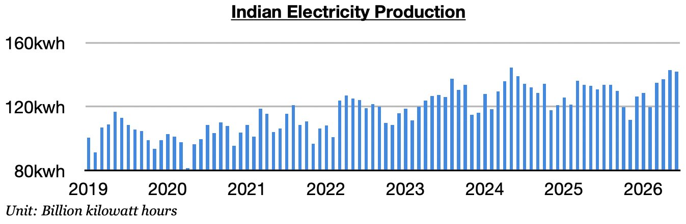
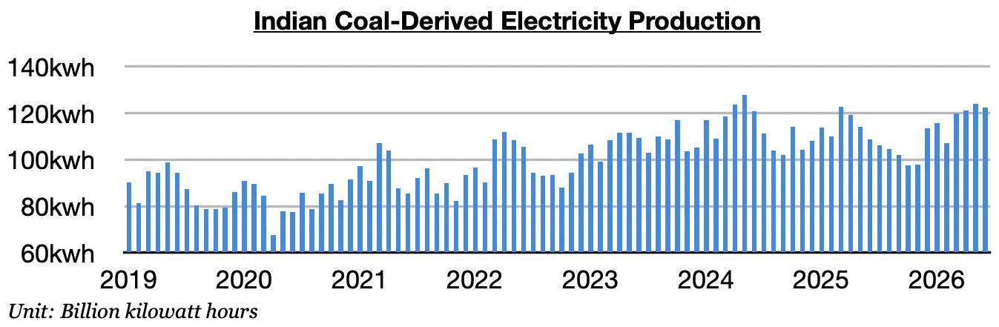
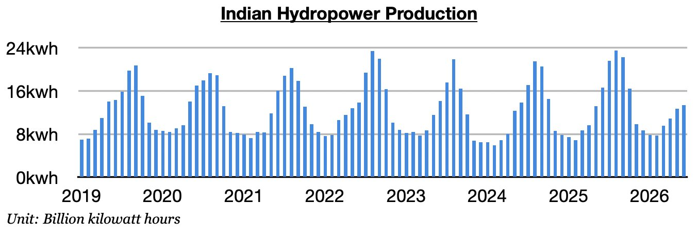

# India's Drastic Improvement Continues

**Date:** July 10, 2026  
**Publisher:** Breakwave Advisors | **Category:** Market Insights  
**Original URL:** [https://www.breakwaveadvisors.com/insights/2026/7/10/indias-drastic-improvement-continues](https://www.breakwaveadvisors.com/insights/2026/7/10/indias-drastic-improvement-continues)  

---

*By*[*Jeffrey Landsberg*](https://www.linkedin.com/in/jeffrey-landsberg-70ab957/)

As we discussed in Commodore Research's most recent Weekly Executive Report, India produced approximately 142 billion kilowatt hours of electricity last month. This is down month-on-month by 900 million kilowatt hours (-1%), up year-on-year by 11.1 billion kilowatt hours (9%), and is the largest amount ever produced in the month of June. Electricity production has now increased year-on-year for three straight months. Previously, it had contracted in eight of the prior twelve months.

> **Figure 1: Chart 1**  
> [Local Asset](file:///C:/Users/Dell/Github/Shipping/corpus/03-breakwave/insights/2026/assets/2026-07-10_indias-drastic-improvement-continues_img_chart1_145aa7c2cc7c.jpg)

Coal-derived electricity generation totaled approximately 122.4 billion kilowatt hours. This is down month-on-month by 1.6 billion kilowatt hours (-1%), up year-on-year by 13.8 billion kilowatt hours (13%), and is the largest amount ever produced in June. Coal-derived generation has grown year-on-year for three straight months. Previously, it had fallen on a year-on-year basis in nine of the prior twelve months, which marked the**only time this decade**that such an event had occurred. As we have stressed in our Weekly Executive Reports, the war in Iran has been drastically changing thermal coal demand. Temperatures in India have also been warmer than usual.

> **Figure 2: Chart 2**  
> [Local Asset](file:///C:/Users/Dell/Github/Shipping/corpus/03-breakwave/insights/2026/assets/2026-07-10_indias-drastic-improvement-continues_img_chart2_411e031d290c.jpg)

Hydropower output totaled approximately 13.4 billion kilowatt hours. This is up month-on-month by 700 million kilowatt hours (6%) but is down year-on-year by 3.2 billion kilowatt hours (-19%). Hydropower output has fallen year-on-year for two straight months. Previously, it had grown year-on-year for twenty straight months.

> **Figure 3: Chart 3**  
> [Local Asset](file:///C:/Users/Dell/Github/Shipping/corpus/03-breakwave/insights/2026/assets/2026-07-10_indias-drastic-improvement-continues_img_chart3_317ba45a63ff.jpg)

---

**Tags:** Coal, Commodities, Drybulk  
