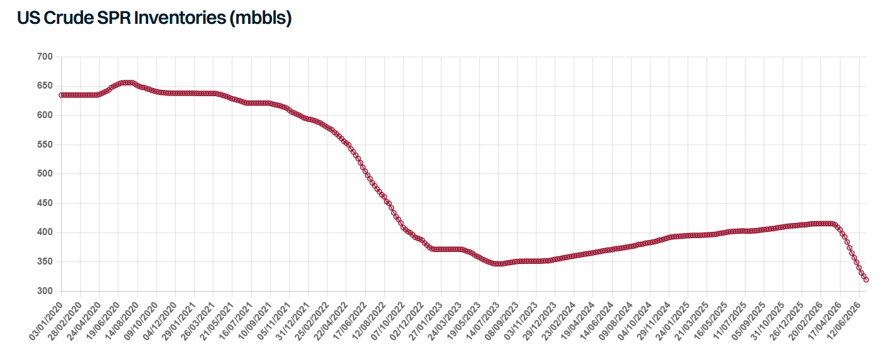

# Can the US Keep It Up?

**Date:** July 13, 2026  
**Publisher:** Breakwave Advisors | **Category:** Market Insights  
**Original URL:** [https://www.breakwaveadvisors.com/insights/2026/7/13/can-the-us-keep-it-up](https://www.breakwaveadvisors.com/insights/2026/7/13/can-the-us-keep-it-up)  

---

> **Figure 1: Oil Drilling**  
> **Interactive Data & Source:** [Gibsons Co](https://www.gibsons.co.uk/market-reports) | [Local Asset](file:///C:/Users/Dell/Github/Shipping/corpus/03-breakwave/insights/2026/assets/2026-07-13_can-the-us-keep-it-up_img_oil-drilling_b002be8ead60.jpg)

Over the course of more than 100 days of the Strait of Hormuz closure, the US proved to be the single most important source of replacement barrels, both for crude and clean products. The increase in US crude exports has been nothing short of spectacular: in the second quarter of the year, exports averaged around 5.2 mbd, up by 1.4 mbd compared to the 2025 average. The biggest growth was seen in long haul trade to Asia, which doubled from the 2025 baseline. Unquestionably, this growth was for the most part fuelled by the colossal US SPR release, helped by a modest increase in domestic US production. A similar trend was observed for clean exports, though increases here have been more modest. Total clean exports averaged close to 3 mbd in Q2, 450 kbd above their 2025 baseline, with the biggest gains in absolute terms seen in trade to Europe, Africa and Asia.

With the ceasefire unravelling and attacks in the Strait resuming, exports from the Middle East Gulf are unlikely to recover anytime soon. The need for replacement barrels therefore remains significant but can the US continue to deliver at such elevated levels?

Commercial crude stocks are notably down to their lowest level for this time of the year since 2018. An even bigger drop is seen in SPR levels, which nosedived, falling to 319.5 mbbls in early July, their lowest level since 1983. Still, inventories are down by just 96 mbbls from late February (although 133 mbbls have been awarded), compared to the 172 mbbls announced in March, meaning more barrels are still to come, though it is unclear what will happen to the 39.5 mbbls not sold in the latest tender. Beyond that, further releases appear less likely, with growing concerns about the minimum SPR level needed to maintain functionality and the industry warning the reserve must stay at least 20% full (roughly 143 mbbls) for operational reasons. In any case, with domestic refining runs extremely elevated, US refiners could absorb much of the remaining release, limiting the volumes reaching the export market. Preliminary AIS data shows that weekly USG crude exports have been in steady decline since late May, falling last week to their lowest level in three months.

On the upside, US crude production is edging up, with the latest estimates from the EIA pointing to an increase of 200 kbd this year and a further 250 kbd in 2027. Projections have been revised up in recent months amid higher oil prices and hedging by producers. The rig count is also responding, up more than 40 units year on year after eight consecutive weekly gains. With geopolitical tensions escalating once again, and upward pressure on oil prices reemerging, further upward revisions to US crude output may also be on the cards. Nonetheless, rising production cannot fully offset the loss of SPR barrels once the current release programme runs its course.

Trade dynamics are similar for clean product exports. US refineries are running at peak utilization rates, at around 96% in June, one of the highest rates seen over the past two decades, with exports reaching as a result their record highest level last week, according to the EIA data. Yet, the extended period of elevated exports has led to a sharp draw in distillate inventories, with total stocks falling to their lowest level in over twenty years in mid-June, although levels modestly recovered since then. The situation in PADD 3 is less extreme, yet inventories there are also under pressure. Whilst the developing El Nino points to a below normal Atlantic hurricane season, with stocks this thin, even a single storm in the US Gulf could cause outsized disruption to the refining system; in addition, fairly light spring maintenance increases the chances of unplanned outages. Domestic distillate demand will also rise with the onset of the autumn harvest season. With this in mind, the peak in clean product exports has likely been reached, with flows likely to remain flat or trend lower in coming months.

Overall, the US has done the bulk of the heavy lifting in keeping global markets supplied through the crisis, but its capacity to keep doing so is diminishing. Should the renewed escalation in the Strait lead to another prolonged closure of Hormuz, the world will find itself in a much tougher spot. With global inventories rapidly depleted in recent months, this is a recipe for much tighter supply, higher prices and significant downside risk for tanker markets.

> **Figure 2: Στιγμιότυπο Οθόνης 2026 07 13 085459**  
> **Interactive Data & Source:** [Gibsons Co](https://www.gibsons.co.uk/market-reports) | [Local Asset](file:///C:/Users/Dell/Github/Shipping/corpus/03-breakwave/insights/2026/assets/2026-07-13_can-the-us-keep-it-up_img_cea3cf84ceb9ceb3cebcceb9cf8ccf84cf85_2bbe9544b2e7.png)

Data source:[Gibson Shipbrokers](https://www.gibsons.co.uk/market-reports)

---

**Tags:** Crude, Geopolitics, Tankers  
