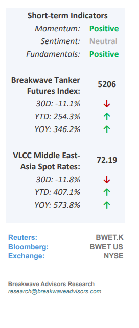
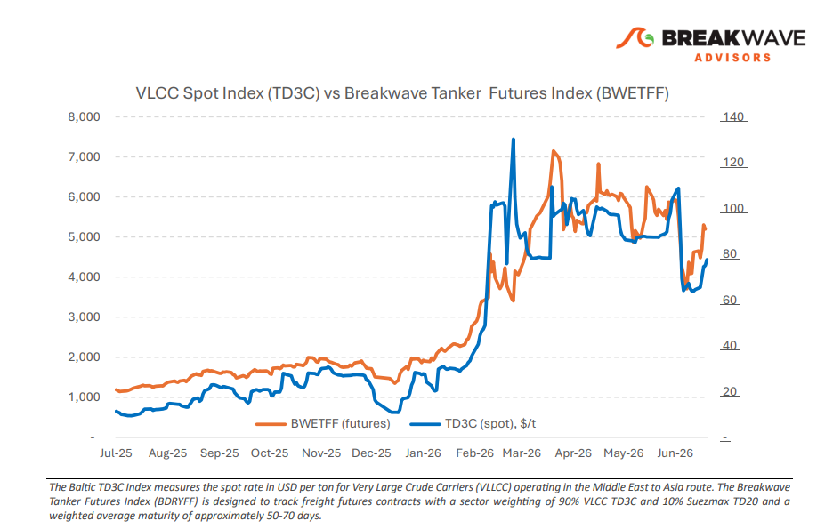
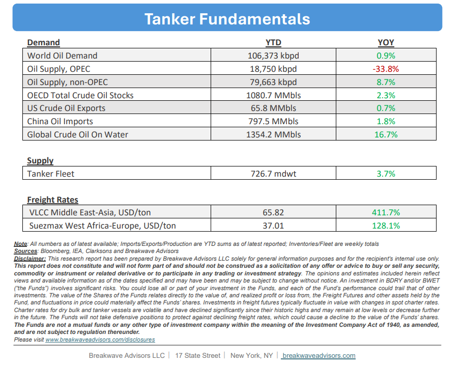

# Breakwave Bi-Weekly Tanker Report - July 14, 2026

**Date:** July 14, 2026  
**Publisher:** Breakwave Advisors | **Category:** Market Insights  
**Original URL:** [https://www.breakwaveadvisors.com/insights/7142026wetreportkjujun459bl7-kk78](https://www.breakwaveadvisors.com/insights/7142026wetreportkjujun459bl7-kk78)  

---

•**VLCC Market Reprices Hormuz Risk as Escalation Resumes**– What initially appeared to be a period of stabilization following the June 17 ceasefire has shifted back toward renewed geopolitical uncertainty. The**latest escalation**between the United States and Iran has interrupted the gradual recovery in commercial tanker activity through the Strait of Hormuz, with**shipowners once again adopting a more cautious approach**to Gulf transits. While Gulf crude exports recovered during June, commercial tanker traffic has slowed again amid renewed security concerns, highlighting that the recovery in oil flows has not been matched by a sustained normalization in commercial shipping. June nevertheless demonstrated the ability of Gulf producers to restore export volumes under improved operating conditions.**Saudi Arabia shipped approximately 34 million barrels**through the Strait following the ceasefire, while the UAE increased crude production to a record 4.1 million bpd, supported by higher output and expanded export activity. However, the latest escalation has**shifted market attention back toward transportation risk**, as renewed security concerns have again weighed on commercial tanker movements through the region. The renewed volatility has also reinforced the strategic importance of alternative export infrastructure.**Saudi Arabia is evaluating an expansion of its East-West Pipeline**by up to 2 million bpd, while ADNOC continues advancing its additional Fujairah export pipeline, targeted for completion in 2027. These initiatives underscore ongoing efforts by Gulf producers to expand export capacity outside the Strait, although Hormuz remains the region's primary crude export corridor.

> **Figure 1: Cea3cf84ceb9ceb3cebcceb9cf8ccf84cf85**  
> [Local Asset](file:///C:/Users/Dell/Github/Shipping/corpus/03-breakwave/insights/2026/assets/2026-07-14_7142026wetreportkjujun459bl7-kk78_img_cea3cf84ceb9ceb3cebcceb9cf8ccf84cf85_8fe690a0c72b.png)

•**Oil Prices Back on the Ascent as Risk Jumps**– Renewed**transit disruptions**in the**Strait of Hormuz**have reversed recent price trends, driving oil prices back toward the $80 threshold. While consistent Gulf exports, combined with non-OPEC production growth and tepid Chinese demand, initially fueled an oversupply narrative, a sharp contraction in both strategic and commercial global inventories have eroded the market's safety net and thus the risk of a disruption has increased. Historical data tracking the relationship between inventory benchmarks (both strategic and commercial) and**pricing suggests the establishment of a higher price**plateau. Consequently, the ongoing medium-term repricing of global market balances should continue to support elevated crude valuations although volatility will once again remain the main characteristic of this market.

•**Our Long-term View**– The tanker market has been recovering from a long period of staggered rates as the growth in new vessel supply shrunk while oil demand remained elevated in line with the global economy. The recent rapid increase in freight rates has led to significant new vessel ordering, with the orderbook now standing at above average levels, and although in the near term such a supply/demand misbalance is small, we expect a meaningful negative balance to develop longer term leading to a potential downcycle.

> **Figure 2: Στιγμιότυπο Οθόνης 2026 07 14 081821**  
> [Local Asset](file:///C:/Users/Dell/Github/Shipping/corpus/03-breakwave/insights/2026/assets/2026-07-14_7142026wetreportkjujun459bl7-kk78_img_cea3cf84ceb9ceb3cebcceb9cf8ccf84cf85_c6a720fea53b.png)

> **Figure 3: Στιγμιότυπο Οθόνης 2026 07 14 101016**  
> [Local Asset](file:///C:/Users/Dell/Github/Shipping/corpus/03-breakwave/insights/2026/assets/2026-07-14_7142026wetreportkjujun459bl7-kk78_img_cea3cf84ceb9ceb3cebcceb9cf8ccf84cf85_12eb12471815.png)

### Subscribe:
