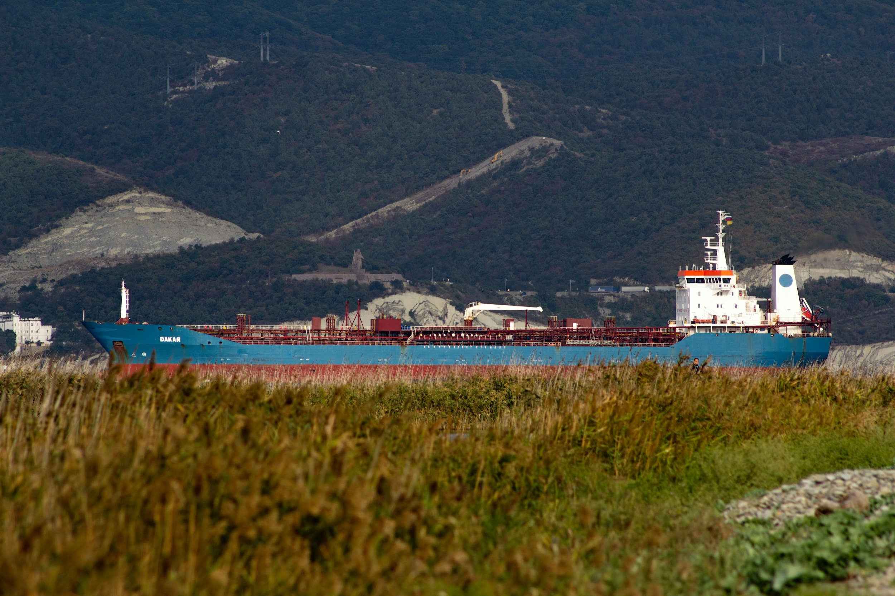

# The tanker newbuilding market

**Date:** July 14, 2026  
**Publisher:** Breakwave Advisors | **Category:** Market Insights  
**Original URL:** [https://www.breakwaveadvisors.com/insights/2026/7/14/the-tanker-newbuilding-market](https://www.breakwaveadvisors.com/insights/2026/7/14/the-tanker-newbuilding-market)  

---

> **Figure 1: Byeirini Diamantara&dimitris Roumeliotis**  
> *ByEirini Diamantara&Dimitris Roumeliotis*  
> **Interactive Data & Source:** [Linkedin](https://www.linkedin.com/in/eirini-diamantara-58b269105/) | [Local Asset](file:///C:/Users/Dell/Github/Shipping/corpus/03-breakwave/insights/2026/assets/2026-07-14_the-tanker-newbuilding-market_img_unsplash-image-ngxd3zwmifa_89b9419e105b.jpg)

The tanker newbuilding market has entered 2026 with considerably stronger momentum, reflecting growing confidence in long-term market fundamentals despite continued uncertainty surrounding environmental regulations and future propulsion technologies. As of mid-2026, the tanker fleet (>10,000 dwt) consists of 8,090 vessels, while the global orderbook has expanded to 1,535 ships, resulting in an orderbook-to-fleet ratio of 19.0%. This compares with an active fleet of 7,746 vessels and an orderbook of 1,220 vessels during the same period of 2025, when the ratio stood at 15.8%. While the fleet has grown by approximately 4.4% year-on-year, the orderbook has increased by almost 26%, highlighting a clear acceleration in investment activity across the sector.

The strongest forward supply remains concentrated in the larger crude tanker segments. VLCCs lead with an orderbook-to-fleet ratio of 31.4%, rising sharply from 11.5% in 2025 as the orderbook nearly tripled to 291 vessels. LR1/Panamax tankers also show a notable increase, with their ratio climbing to 29.4% from 19.1% a year earlier. Aframax/LR2 vessels maintain a healthy ratio of 20.0%, up from 17.5%, while MR2 tankers remain broadly stable at 16.3%. By contrast, the Handy/MR1 segment continues to display the lowest replacement activity, with an orderbook-to-fleet ratio of just 10.7%, despite improving from 7.7% in 2025. Overall, the figures suggest that owners are prioritising larger and more versatile tanker classes where long-term earnings visibility remains strongest.

Newbuilding deliveries have also accelerated during 2026. A total of 238 tankers have been delivered so far this year compared with just 111 during the corresponding period of 2025, representing an increase of more than 114%. Deliveries have risen across virtually every segment, led by MR2 tankers with 63 vessels, followed by Small Tankers (56), Aframax/LR2s (47), Suezmaxes (26) and VLCCs (19). The significant increase in deliveries reflects the exceptionally strong ordering cycle witnessed over recent years and confirms that fleet growth is gradually gathering pace after several years of historically limited supply additions.

Ordering activity has strengthened even more impressively. During the first half of 2026, owners placed 407 new tanker contracts compared with only 139 during the same period of 2025, an increase of almost 193%. VLCCs dominate contracting activity with 147 orders, followed by MR2 tankers with 82, Suezmaxes with 76 and Aframax/LR2 vessels with 66. The renewed appetite for large crude carriers is particularly striking and suggests that owners expect crude trade patterns and tonne-mile demand to remain supportive well into the next decade.

Greek owners continue to play a leading role in the tanker newbuilding market, although with a slightly different strategy. They have taken delivery of 73 vessels during 2026 compared with 93 in 2025, with Aframax/LR2s and Suezmaxes accounting for more than half of this year's deliveries. At the same time, Greek contracting activity has accelerated significantly. Greek owners have placed 147 newbuilding orders so far in 2026 versus 113 during the same period of 2025, representing more than one-third of all global tanker contracts signed this year. Their investment focus has been firmly centred on VLCCs, with 58 orders, followed by Suezmaxes with 40 and MR2 tankers with 30, underlining their continued confidence in the long-term prospects of the crude tanker market and their willingness to position themselves early in the next investment cycle.

Data source:[Xclusiv Shipbrokers Inc.](https://www.linkedin.com/company/xclusiv-shipbrokers-inc/)

---

**Tags:** Tanker, Markets, Shipping  
