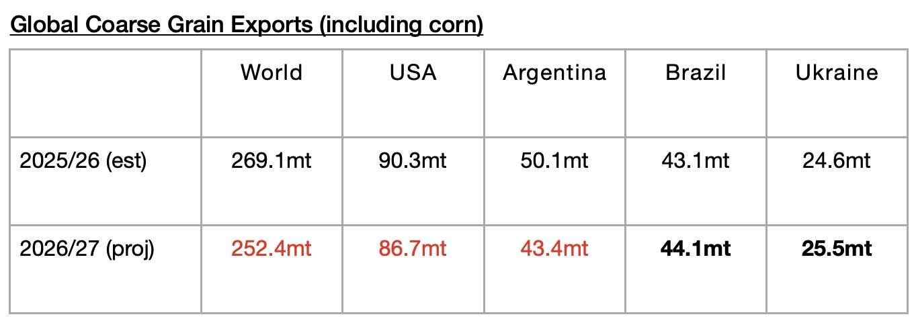

# Less Grain Exports Still Expected Next Season

**Date:** July 16, 2026  
**Publisher:** Breakwave Advisors | **Category:** Market Insights  
**Original URL:** [https://www.breakwaveadvisors.com/insights/2026/7/16/less-grain-exports-still-expected-next-season](https://www.breakwaveadvisors.com/insights/2026/7/16/less-grain-exports-still-expected-next-season)  

---

*By*[*Jeffrey Landsberg*](https://www.linkedin.com/in/jeffrey-landsberg-70ab957/)

The United States Department of Agriculture (USDA) has released its latest forecast for the upcoming 2026/27 season and is predicting that global coarse grain, wheat, soybean, and soymeal exports will total 744.3 million tons. This is 5 million tons (1%) more than the USDA predicted a month ago — but it is 23.6 million tons (-3%) less than is expected for the current 2025/26 season. Overall, a year-on-year decline in exports would be a headwind for the dry bulk market. Compared to the 705.5 million tons of grain that was shipped during the 2024/25 season, however, 744.3 million tons — if actually shipped — would mark an increase of 38.8 million tons (5%). Overall, 744.3 million tons represents an impressive amount of grain to be shipped, but it is less than the incredible 767.9 million tons that is currently expected for the current 2025/26 season.

The USDA is forecasting that global coarse grain exports in 2026/27 will total 252.4 million tons. This would mark a year-on-year decrease of 16.7 million tons (-6%) from the 2025/26 season. Coarse grain exports will remain the global grain market’s largest cargo by volume. Moderate year-on-year declines in coarse grain exports are expected from the United States and Argentina. Small year-on-year increases in coarse grain exports are expected from Brazil and Ukraine.

> **Figure 1: Chart**  
> [Local Asset](file:///C:/Users/Dell/Github/Shipping/corpus/03-breakwave/insights/2026/assets/2026-07-16_less-grain-exports-still-expected-next-season_img_chart_f5f70f1f5607.jpg)

---

**Tags:** Drybulk, Commodities, Markets  
