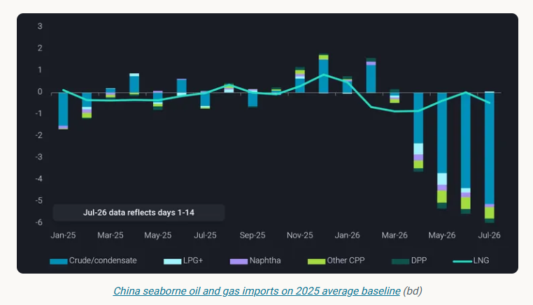
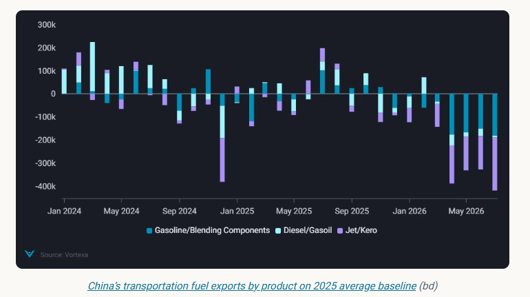
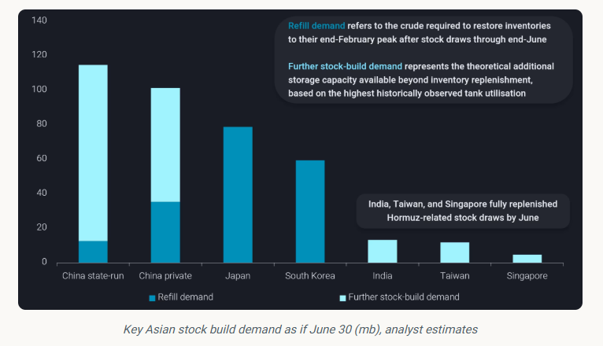
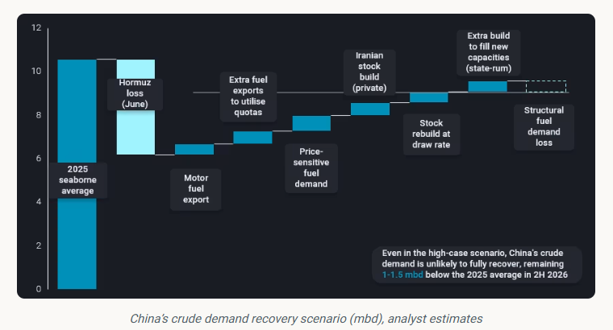

# How much of China's crude demand will return?

**Date:** July 17, 2026  
**Publisher:** Breakwave Advisors | **Category:** Market Insights  
**Original URL:** [https://www.breakwaveadvisors.com/insights/2026/7/17/how-much-of-chinas-crude-demand-will-return](https://www.breakwaveadvisors.com/insights/2026/7/17/how-much-of-chinas-crude-demand-will-return)  

---

In this blog, we use a high-case scenario to assess plausible recovery in China's crude demand under current policy settings and market conditions.

*By*[*Emma Li*](https://www.linkedin.com/in/emma-li-73003443/)

With crude benchmarks retreating from above $100/b, market attention is shifting from supply disruptions to the post-crisis rebalancing of global oil markets, despite continued uncertainty over physical trade flows.

Setting aside potential logistical disruptions, the global crude balance has already begun to shift. Gulf exports are recovering from recent lows, alternative suppliers continue to load above seasonal norms, while China's crude imports remain well below historical averages. As a result, crude loadings are once again outpacing crude discharges.

> **Figure 1: Στιγμιότυπο Οθόνης 2026 07 17 124922**  
> **Interactive Data & Source:** [Vortexa](https://www.vortexa.com//oil-gas-data-traders-analysts-data-scientists?gclid=Cj0KCQjw8_qRBhCXARIsAE2AtRZKOvMnbilZ_6_91d7huSFFy71pWLrnPwGwOHVzXsmsG-1a1mZnQw8aAt89EALw_wcB&hsa_acc=1782073842&hsa_ad=548425387665&hsa_cam=14746637662&hsa_grp=125038601902&hsa_kw=&hsa_mt=&hsa_net=adwords&hsa_src=g&hsa_tgt=dsa-1431852288425&hsa_ver=3&utm_campaign=%5BCD%5D%20-%20DSA%20-%20EMEA&utm_medium=cpc&utm_medium=ppc&utm_source=google&utm_source=adwords&utm_term=) | [Local Asset](file:///C:/Users/Dell/Github/Shipping/corpus/03-breakwave/insights/2026/assets/2026-07-17_how-much-of-chinas-crude-demand-will-return_img_cea3cf84ceb9ceb3cebcceb9cf8ccf84cf85_cf134fad3198.png)

China's oil imports declined for a fourth consecutive month in June, with crude imports running around 4.4mbd below the 2025 average. Seaborne crude arrivals fell to just over 6mbd—the lowest monthly level since at least 2016—while Middle Eastern imports declined to just 2mbd, down from an already decade-low level of around 3mbd in May.

The key question is therefore no longer whether supply will recover, but how quickly Chinese demand can respond.

## Near-Term Booster: Fuel Exports and State-Led Spending

China removed its fuel export restrictions in early July after more than three months of severely constrained motor fuel exports. However, exports are unlikely to rebound immediately. Besides the time required for refiners to secure cargo nominations and arrange shipments, Beijing has retained one important condition: refiners are required to maintain product inventories at or above end-February levels, preventing them from relying solely on inventory drawdowns to increase exports.

As a result, state-owned refiners will likely need to increase crude throughput in the coming weeks to support the reported objective of restoring motor fuel exports towards 2025 average levels during July.

> **Figure 2: Στιγμιότυπο Οθόνης 2026 07 17 124930**  
> **Interactive Data & Source:** [Vortexa](https://www.vortexa.com//oil-gas-data-traders-analysts-data-scientists?gclid=Cj0KCQjw8_qRBhCXARIsAE2AtRZKOvMnbilZ_6_91d7huSFFy71pWLrnPwGwOHVzXsmsG-1a1mZnQw8aAt89EALw_wcB&hsa_acc=1782073842&hsa_ad=548425387665&hsa_cam=14746637662&hsa_grp=125038601902&hsa_kw=&hsa_mt=&hsa_net=adwords&hsa_src=g&hsa_tgt=dsa-1431852288425&hsa_ver=3&utm_campaign=%5BCD%5D%20-%20DSA%20-%20EMEA&utm_medium=cpc&utm_medium=ppc&utm_source=google&utm_source=adwords&utm_term=) | [Local Asset](file:///C:/Users/Dell/Github/Shipping/corpus/03-breakwave/insights/2026/assets/2026-07-17_how-much-of-chinas-crude-demand-will-return_img_cea3cf84ceb9ceb3cebcceb9cf8ccf84cf85_d4a9f80b2c7b.png)

Under a high-case scenario, in which fuel exports recover during July and continue to increase through the remainder of the year to fully utilise the available export quotas, an increase of around 700kbd in motor fuel exports from Q2 levels could translate into approximately 1.2mbd of additional crude demand, assuming a 60% transportation fuel yield.

Another potential source of demand is the gradual resumption of state-led infrastructure projects.

Many public works were postponed during Q2 amid elevated oil prices and supply uncertainty, weighing on diesel consumption. With Beijing expected to step up government bond issuance in Q3, supporting a recovery in local government financing, some delayed projects—particularly upgrades and renovation works—could gradually resume.

However, the resulting uplift in oil demand is likely to be modest in the near term, as funding is expected to be directed first towards strategically prioritised projects. A broader recovery in infrastructure-related fuel consumption will likely emerge only once crude prices and physical supply conditions have stabilised.

In the near term, higher refinery runs would likely be supported by accelerated crude inventory drawdowns.

China's seaborne crude imports are currently estimated at only 6–7 mbd in July, broadly in line with Q2 levels. With the exception of Iranian barrels already floating in the South China Sea and cargoes from Russia's Far East, any newly purchased seaborne crude would generally require more than a month to arrive, leaving refiners increasingly reliant on existing inventories to bridge the gap.

## Mid-Term Catalyst: China's Strategic and Commercial Crude Stock Expansion

One of the key lessons from the Strait of Hormuz disruption is the strategic value of maintaining adequate crude inventories.

India and several Southeast Asian countries had largely replenished their inventory losses by June, reflecting their relatively limited storage capacity and smaller absolute stock draws.

Across China, Japan and South Korea, we estimate that around 180mb of crude inventories—including strategic and commercial stocks—were drawn down during the four months following the onset of the crisis. If these inventory losses were fully replenished within six months, they would generate approximately 1mbd of additional crude import demand.

However, such replenishment is unlikely to occur at a constant pace. Rather than rebuilding inventories as quickly as possible, refiners are likely to replenish stocks opportunistically during periods of lower crude prices.

In addition, China's immediate refill requirement is relatively modest. Unlike Japan and South Korea, China only began drawing down crude inventories in May, resulting in a smaller cumulative stock draw despite a comparable daily withdrawal rate.

> **Figure 3: Στιγμιότυπο Οθόνης 2026 07 17 124939**  
> **Interactive Data & Source:** [Vortexa](https://www.vortexa.com//oil-gas-data-traders-analysts-data-scientists?gclid=Cj0KCQjw8_qRBhCXARIsAE2AtRZKOvMnbilZ_6_91d7huSFFy71pWLrnPwGwOHVzXsmsG-1a1mZnQw8aAt89EALw_wcB&hsa_acc=1782073842&hsa_ad=548425387665&hsa_cam=14746637662&hsa_grp=125038601902&hsa_kw=&hsa_mt=&hsa_net=adwords&hsa_src=g&hsa_tgt=dsa-1431852288425&hsa_ver=3&utm_campaign=%5BCD%5D%20-%20DSA%20-%20EMEA&utm_medium=cpc&utm_medium=ppc&utm_source=google&utm_source=adwords&utm_term=) | [Local Asset](file:///C:/Users/Dell/Github/Shipping/corpus/03-breakwave/insights/2026/assets/2026-07-17_how-much-of-chinas-crude-demand-will-return_img_cea3cf84ceb9ceb3cebcceb9cf8ccf84cf85_6550e158628c.png)

The more significant source of demand lies in China's ongoing strategic storage expansion. More than 100mb of new state-controlled storage capacity, together with over 60mb of spare capacity in private commercial tanks, provides substantial room for further inventory accumulation.

Unlike refill demand, however, this represents discretionary rather than immediate demand, making the pace of stock building highly sensitive to crude prices, freight costs and confidence that Hormuz transit risks have eased.

Under a high-case scenario, these spare storage capacities could support approximately 1.6mbd of additional crude demand over a 100-day filling period.

## Long-Term Reality: Structural Demand Erosion Prevents a Full Recovery

In July, China's State Council announced series of energy transition targets, including new energy vehicles (NEVs) to account for 30% of the vehicle fleet by 2030, up from around 12% at end-2025.

However, the crisis has also accelerated structural changes in China's oil demand. Even with Brent back below $70/b and domestic retail fuel prices returning to pre-crisis levels, China's transportation fuel demand is unlikely to fully recover. Part of the demand destruction observed during the crisis now appears structural rather than cyclical.

The chart below illustrates our high-case scenario, which assumes the strongest plausible recovery in crude demand under current market conditions and policy settings. Under this scenario, a large share of the 4.4mbd of Hormuz-related demand loss could be offset by higher refinery throughput following the removal of fuel export restrictions, together with inventory replenishment and continued stock building.

> **Figure 4: Στιγμιότυπο Οθόνης 2026 07 17 124947**  
> **Interactive Data & Source:** [Vortexa](https://www.vortexa.com//oil-gas-data-traders-analysts-data-scientists?gclid=Cj0KCQjw8_qRBhCXARIsAE2AtRZKOvMnbilZ_6_91d7huSFFy71pWLrnPwGwOHVzXsmsG-1a1mZnQw8aAt89EALw_wcB&hsa_acc=1782073842&hsa_ad=548425387665&hsa_cam=14746637662&hsa_grp=125038601902&hsa_kw=&hsa_mt=&hsa_net=adwords&hsa_src=g&hsa_tgt=dsa-1431852288425&hsa_ver=3&utm_campaign=%5BCD%5D%20-%20DSA%20-%20EMEA&utm_medium=cpc&utm_medium=ppc&utm_source=google&utm_source=adwords&utm_term=) | [Local Asset](file:///C:/Users/Dell/Github/Shipping/corpus/03-breakwave/insights/2026/assets/2026-07-17_how-much-of-chinas-crude-demand-will-return_img_cea3cf84ceb9ceb3cebcceb9cf8ccf84cf85_5a44de72a9e9.png)

Domestic fuel demand is also expected to recover, although part of the decline in gasoline and diesel consumption appears structural rather than cyclical. We estimate domestic fuel demand fell by more than 1.2mbd during the crisis, with at least 0.4mbd unlikely to return.

Taken together, higher refinery runs, inventory replenishment and continued stock expansion could offset a substantial share of the crude demand lost during the Hormuz disruption. However, these drivers are fundamentally policy- and inventory-led rather than consumption-led. Structural headwinds—including weaker transportation fuel demand, rising EV penetration and subdued crude-chemical utilisation—are likely to cap any sustained recovery.

Even under our high-case scenario, China's crude demand is expected to remain 1.0–1.5 mbd below the 2025 average in the second half of 2026. In other words, the next phase of China's crude market will be defined less by stronger end-user demand than by refinery policy, export incentives and inventory management.

Data Source:[Vortexa](https://www.vortexa.com//oil-gas-data-traders-analysts-data-scientists?gclid=Cj0KCQjw8_qRBhCXARIsAE2AtRZKOvMnbilZ_6_91d7huSFFy71pWLrnPwGwOHVzXsmsG-1a1mZnQw8aAt89EALw_wcB&hsa_acc=1782073842&hsa_ad=548425387665&hsa_cam=14746637662&hsa_grp=125038601902&hsa_kw=&hsa_mt=&hsa_net=adwords&hsa_src=g&hsa_tgt=dsa-1431852288425&hsa_ver=3&utm_campaign=%5BCD%5D%20-%20DSA%20-%20EMEA&utm_medium=cpc&utm_medium=ppc&utm_source=google&utm_source=adwords&utm_term=)

---

**Tags:** Crude, Tankers, Markets  
