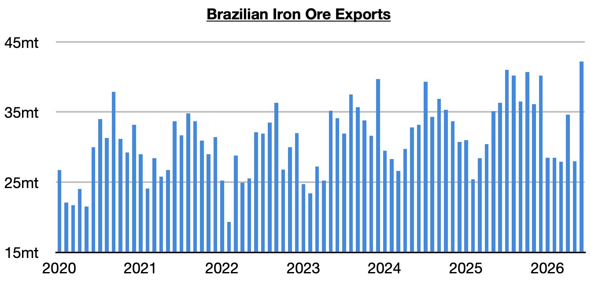
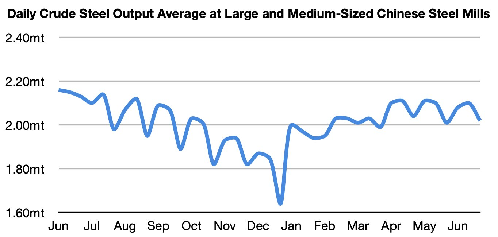

# Remaining Unabashedly Bullish on China's Iron Ore Imports

**Date:** July 20, 2026  
**Publisher:** Breakwave Advisors | **Category:** Market Insights  
**Original URL:** [https://www.breakwaveadvisors.com/insights/2026/7/20/remaining-unabashedly-bullish-on-chinas-iron-ore-imports](https://www.breakwaveadvisors.com/insights/2026/7/20/remaining-unabashedly-bullish-on-chinas-iron-ore-imports)  

---

*By*[*Jeffrey Landsberg*](https://www.linkedin.com/in/jeffrey-landsberg-70ab957/)

As we discussed in Commodore Research's most recent Weekly Executive Report, Brazil exported a record 42.2 million tons of iron ore last month. This is up from May by 14.2 million tons (51%) and up year-on-year by 5.9 million tons (16%). Significant — and not at all surprising to us — is that such great strength has occurred at the same time that China’s steel production has stayed in a contraction (and while there has been no great strength in steel production outside of China). The vast majority of Brazil's iron ore exports continue to be shipped to China.

> **Figure 1: Chart 1**  
> [Local Asset](file:///C:/Users/Dell/Github/Shipping/corpus/03-breakwave/insights/2026/assets/2026-07-20_remaining-unabashedly-bullish-on-chinas-iron-ore-imports_img_chart1_2c9fb46c8fb3.jpg)

The most recently released data shows that steel production at large and medium-sized mills in China averaged 2.02 million tons during June 21 - June 30. This is down 4% from mid-June and down 5% year-on-year. China's steel production has remained in a year-on-year contraction since September.

> **Figure 2: Chart 2**  
> [Local Asset](file:///C:/Users/Dell/Github/Shipping/corpus/03-breakwave/insights/2026/assets/2026-07-20_remaining-unabashedly-bullish-on-chinas-iron-ore-imports_img_chart2_0460a439befb.jpg)

China's iron ore imports most recently totaled 112.7 million tons in June. This is up month-on-month by 15 million tons (15%), up year-on-year by 6.7 million tons (6%), and has marked a record for the month of June. We have remained unabashedly bullish for China's iron ore imports -- despite periods of contraction in China's steel production and record high Chinese iron ore port stockpiles -- and we remain bullish. As we have stressed throughout the years even when many pundits turned bearish for China's iron ore import prospects, it is global iron ore mining that dictates China's iron ore import volume. We remain quite bullish even though China's steel production is still in a year-on-year contraction and even though iron ore port stockpiles remain close to their record high.

---

**Tags:** China, Ironore, Drybulk  
