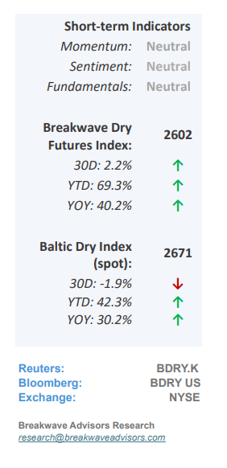
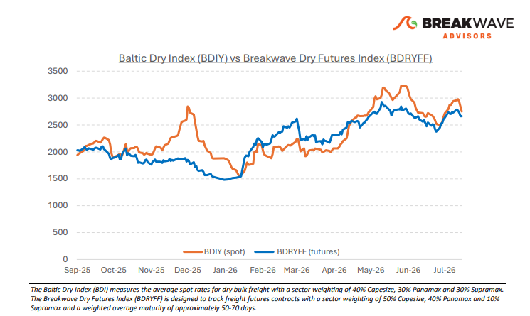
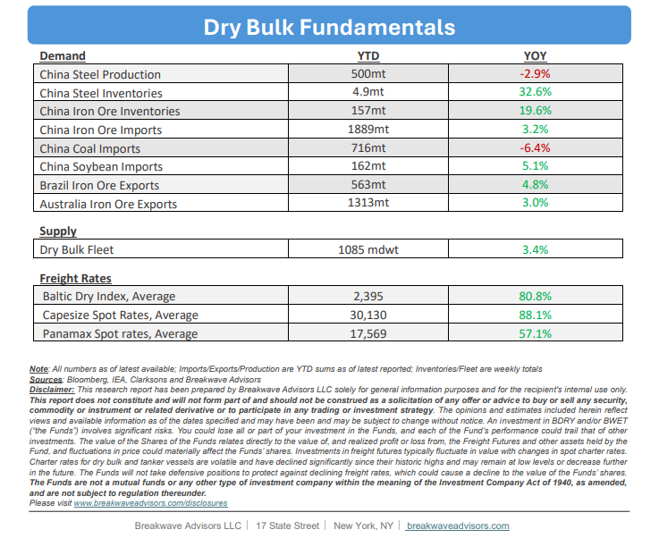

# Breakwave Bi-Weekly Dry Bulk Report - July 21, 2026

**Date:** July 21, 2026  
**Publisher:** Breakwave Advisors | **Category:** Market Insights  
**Original URL:** [https://www.breakwaveadvisors.com/insights/7212026db-report2026dryreportkk47bg](https://www.breakwaveadvisors.com/insights/7212026db-report2026dryreportkk47bg)  

---

•**Capesize Spot Rates Drop Fast as Inquiry Cools Down**– Despite a recent pullback that saw spot Capesize**rates drop approximately 10,000 points**within days, the fundamental outlook for the dry bulk shipping sector remains resilient, supported by**historically high absolute spot market**levels and robust cargo volumes. While Capesize performance has flattened year-over-year, Panamax rates remain firmly above prior-year levels, cushioning the broader cooling of market sentiment.**Current headwinds**, including rising bunker prices that squeeze owners' net earnings and the seasonal summer chartering lull, represent short-term volatility rather than a structural downturn, as evidenced by freight futures (FFAs) projecting a strong second half of the year across all asset classes. Furthermore, despite**valid medium-term anxieties**regarding global conflicts, a decelerating Chinese economy, and accelerating newbuild deliveries, healthy year-to-date volume growth confirms that demand-side fundamentals show no immediate signs of an impending slowdown.

> **Figure 1: Cea3cf84ceb9ceb3cebcceb9cf8ccf84cf85**  
> [Local Asset](file:///C:/Users/Dell/Github/Shipping/corpus/03-breakwave/insights/2026/assets/2026-07-21_7212026db-report2026dryreportkk47bg_img_cea3cf84ceb9ceb3cebcceb9cf8ccf84cf85_6d58e843e3c6.png)

•**Oil Price Volatility is a Factor for Dry Bulk Shipping**– While the ongoing US-Iran conflict and subsequent oil**price volatility**may appear to have a minimal direct impact on dry bulk shipping, they have**generated significant secondary effects**that have supported robust freight rates since early March. Specifically, heightened price volatility and fuel availability constraints have prolonged bunkering operations, thereby extending average voyage durations and effectively reducing available vessel supply. Concurrently, elevated fuel costs and restricted liquefied natural gas (LNG) availability have driven**a global surge in coal consumption,**increasing ocean transportation demand. These dual factors have served as the primary catalysts for strength within the dry bulk sector, particularly for smaller vessel classes, and are projected to sustain market momentum for the duration of the conflict.

•**Our Long-term View**– The last few years have been characterized by increased geopolitical uncertainty. Going forward, we expect such events to continue to affect global trade and have a meaningful impact on effective vessel supply. Combined with the potential for a multi-year cyclical rebound in China’s economic activity following the recent economic turmoil, dry bulk shipping should experience higher volatility on top of a secular tightness driven by stable bulk commodity demand and rather steady fleet growth.

> **Figure 2: Στιγμιότυπο Οθόνης 2026 07 21 000824**  
> [Local Asset](file:///C:/Users/Dell/Github/Shipping/corpus/03-breakwave/insights/2026/assets/2026-07-21_7212026db-report2026dryreportkk47bg_img_cea3cf84ceb9ceb3cebcceb9cf8ccf84cf85_2cde6eb999dc.png)

> **Figure 3: Στιγμιότυπο Οθόνης 2026 07 21 000835**  
> [Local Asset](file:///C:/Users/Dell/Github/Shipping/corpus/03-breakwave/insights/2026/assets/2026-07-21_7212026db-report2026dryreportkk47bg_img_cea3cf84ceb9ceb3cebcceb9cf8ccf84cf85_259a7d507d9d.png)

### Subscribe:
