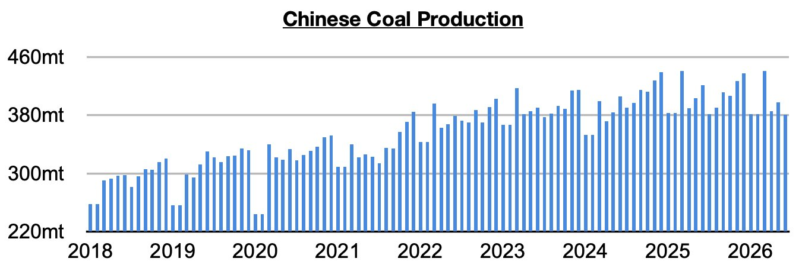
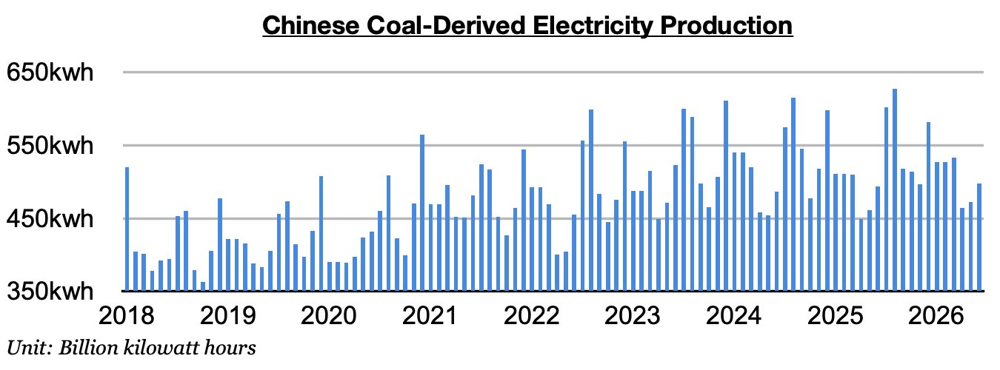

# Near-Term Prospects For China's Coal Imports Remain Very Bullish

**Date:** July 24, 2026  
**Publisher:** Breakwave Advisors | **Category:** Market Insights  
**Original URL:** [https://www.breakwaveadvisors.com/insights/2026/7/24/near-term-prospects-for-chinas-coal-imports-remain-very-bullish](https://www.breakwaveadvisors.com/insights/2026/7/24/near-term-prospects-for-chinas-coal-imports-remain-very-bullish)  

---

*By*[*Jeffrey Landsberg*](https://www.linkedin.com/in/jeffrey-landsberg-70ab957/)

As we discussed in Commodore Research's most recent Weekly Executive Report, China’s coal output totaled 380.9 million tons in June. This is down month-on-month by 16.3 million tons (-4%) and down year-on-year by 40.2 million tons (-10%). Last month's 10% year-on-year contraction has marked the largest contraction since 2026. Also remaining significant is that the last time there was any year-on-year growth was back in June 2025.

> **Figure 1: Chart 1 (1)**  
> [Local Asset](file:///C:/Users/Dell/Github/Shipping/corpus/03-breakwave/insights/2026/assets/2026-07-24_near-term-prospects-for-chinas-coal-imports-remain-very-bullish_img_chart128129_5807b30747e1.jpg)

Coal-derived electricity generation totaled 498 billion kilowatt hours. This is up month-on-month by 25.4 billion kilowatt hours (5%) and up year-on-year by 4.1 billion kilowatt hours (1%). Very helpful for coal import demand and the dry bulk market is that China's coal-derived electricity generation has now fared better than domestic coal production for six straight months. Before these last six months, coal-derived electricity generation had fared worse than domestic coal production in three of the prior four months. Going forward, we remain very bullish for China's coal import prospects.

> **Figure 2: Chart 2 (1)**  
> [Local Asset](file:///C:/Users/Dell/Github/Shipping/corpus/03-breakwave/insights/2026/assets/2026-07-24_near-term-prospects-for-chinas-coal-imports-remain-very-bullish_img_chart228129_9300cae22254.jpg)

---

**Tags:** China, Coal, Commodities  
