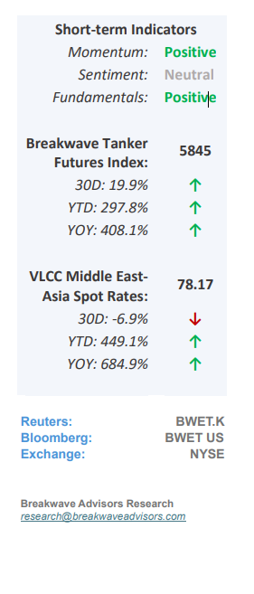
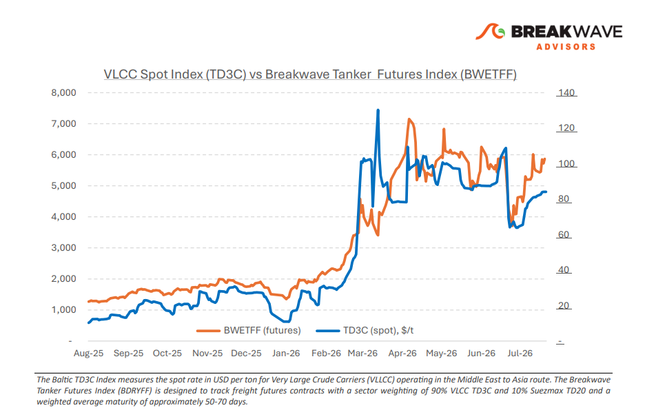
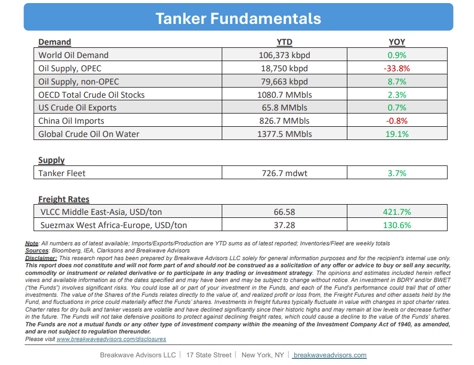

# Breakwave Bi-Weekly Tanker Report - July 28, 2026

**Date:** July 28, 2026  
**Publisher:** Breakwave Advisors | **Category:** Market Insights  
**Original URL:** [https://www.breakwaveadvisors.com/insights/7282026wetreportkjj2026jul4jj](https://www.breakwaveadvisors.com/insights/7282026wetreportkjj2026jul4jj)  

---

•**Geopolitical Risk Premium Broadens**– As July comes to an end, the VLCC market has**reverted to pricing geopolitical risk**as the dominant driver of freight formation, reversing the gradual stabilization that followed the June ceasefire. The latest escalation has**expanded**market attention beyond the Strait of Hormuz to**include the Red Sea**following renewed Houthi attacks, with freight increasingly reflecting operational risk across the Middle East's two principal crude export corridors rather than underlying supply-demand fundamentals. This shift comes despite continued diplomatic efforts. Oman remains the principal intermediary between Washington and Tehran, with recent reports indicating renewed negotiations and a temporary pause in direct military action. While these developments may help contain further escalation, they have yet to restore confidence in commercial shipping, leaving chartering sentiment primarily driven by security considerations.**Commercial tanker traffic continues**through both the Strait of Hormuz and the Red Sea, demonstrating that neither corridor has ceased operating. However, voyage exposure, insurance costs and routing flexibility have become increasingly**important components of fixture negotiations,**reinforcing the geopolitical premium embedded in VLCC freight. For the VLCC market, the key freight dynamic is the potential extension of voyage distances rather than a reduction in crude export volumes.**Broader rerouting**around the Cape of Good Hope would**increase tonne-mile demand**while tightening effective vessel supply, supporting freight even if Gulf export programs remain largely unchanged.

> **Figure 1: Cea3cf84ceb9ceb3cebcceb9cf8ccf84cf85**  
> [Local Asset](file:///C:/Users/Dell/Github/Shipping/corpus/03-breakwave/insights/2026/assets/2026-07-28_7282026wetreportkjj2026jul4jj_img_cea3cf84ceb9ceb3cebcceb9cf8ccf84cf85_e857d3244640.png)

•**Oil Prices Jump as Hormuz Flows Slow Down**– Volatility has returned in the oil markets following the renewed attacks by both US and Iran. The**recent mini glut**that followed the exit of more than 100mb from the Persian Gulf las month seem to**have now finished**and low inventories around the global should me the main driver of oil prices going forward. As such,**we expect**to see oil prices pushing higher, with Brent once again forecasted to settle**above $100 per barrel**. Although volatility around headlines as it relates to potential ceasefire agreements should play a major role in price direction, fundamentals should begin to drive prices more that before as there is the safety margin is now much smaller given the major drawdown in inventories over the past several months.

•**Our Long-term View**– The tanker market has been recovering from a long period of staggered rates as the growth in new vessel supply shrunk while oil demand remained elevated in line with the global economy. The recent rapid increase in freight rates has led to significant new vessel ordering, with the orderbook now standing at above average levels, and although in the near term such a supply/demand misbalance is small, we expect a meaningful negative balance to develop longer term leading to a potential downcycle.

> **Figure 2: Στιγμιότυπο Οθόνης 2026 07 28 090425**  
> [Local Asset](file:///C:/Users/Dell/Github/Shipping/corpus/03-breakwave/insights/2026/assets/2026-07-28_7282026wetreportkjj2026jul4jj_img_cea3cf84ceb9ceb3cebcceb9cf8ccf84cf85_e8a2b06ff829.png)

> **Figure 3: Στιγμιότυπο Οθόνης 2026 07 28 090440**  
> [Local Asset](file:///C:/Users/Dell/Github/Shipping/corpus/03-breakwave/insights/2026/assets/2026-07-28_7282026wetreportkjj2026jul4jj_img_cea3cf84ceb9ceb3cebcceb9cf8ccf84cf85_6c2b410f55bb.png)

### Subscribe:
