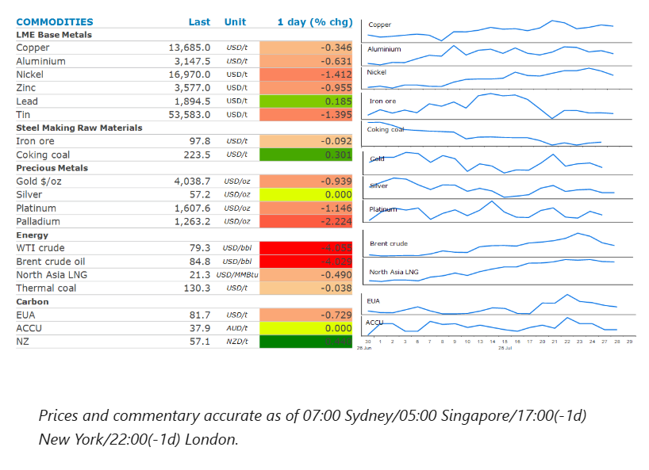
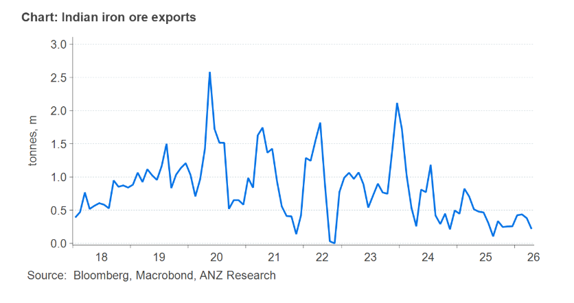

# Prospect of Middle East peace talks pushes oil lower

**Date:** July 29, 2026  
**Publisher:** Breakwave Advisors | **Category:** Market Insights  
**Original URL:** [https://www.breakwaveadvisors.com/insights/2026/7/29/prospect-of-middle-east-peace-talks-pushes-oil-lower](https://www.breakwaveadvisors.com/insights/2026/7/29/prospect-of-middle-east-peace-talks-pushes-oil-lower)  

---

The prospect of peace talks in the Middle East pushed the energy sector lower. The rest of the complex also fell amid subdued risk appetite from investors.

> **Figure 1: Στιγμιότυπο Οθόνης 2026 07 29 102916**  
> **Interactive Data & Source:** [Linkedin](https://www.linkedin.com/newsletters/commodities-wrap-6692196755876012032/?fbclid=IwAR3kiXJqZdxmp9ZcRwBNI7FsBySI-XSC0pfPur1qzjt7OZp7PTE59Tsl1QI) | [Local Asset](file:///C:/Users/Dell/Github/Shipping/corpus/03-breakwave/insights/2026/assets/2026-07-29_prospect-of-middle-east-peace-talks-pushes-oil-lower_img_cea3cf84ceb9ceb3cebcceb9cf8ccf84cf85_dd23cb02c196.png)

### Market Commentary

**Crude oil**extended recent losses as traders positioned for potential progress towards peace talks in the Middle East conflict. Israeli Prime Minister Benjamin Netanyahu met US President Donald Trump in Washington, laying the groundwork for further diplomacy. Trump later said that there was a good chance talks with Iran would make progress. Even so, Iran has made no request to negotiate with the US, nor have they made any request for a ceasefire. Efforts to reopen the Strait of Hormuz have also failed. A compromise proposal from Oman was flatly rejected by Iran. It continues to insist that it will completely manage all inbound traffic along its northern route and would partially manage outbound traffic with Oman on the southern route. Meanwhile, shipping traffic through Hormuz remained muted on Tuesday. Moreover, threats to oil flows in the Red Sea remained heightened. Saudi Arabia said that it intercepted several drones and missiles targeting oil facilities in the Eastern Province.

**Natural gas**in Europe and Asia fell alongside oil prices on hopes that talks between Iran and Oman could lead to the resumption of shipping through the Strait. However, Qatar remains cautious over any reopening. It recently extended its force majeure on LNG shipments to Europe and Asia. This comes amid signs of stronger demand. China’s**LNG**imports are set to climb for a third straight month as it prepares for stronger demand. Deliveries are forecast to hit 5.6mt in July, up 5.3% according to ship tracking data. This follows an 8.3% increase in June. China’s LNG inventories are said to have been heavily depleted over the past six months. However, higher than normal temperatures are pushing summer electricity demand higher. LNG imports are important in peak demand periods to top up domestic supplies. Egypt has also been active in the LNG spot market as it tries to cope with surging demand amid soaring temperatures. Weak domestic supply has seen it rely on imports in recent years. It’s been trying to secure cargoes for August delivery.

**Copper**fell along with most other metals as investors remained concerned about tighter monetary policy. Sentiment has also been weighed down by the selloff in AI-related stocks. Spending on infrastructure within the sector has been a key driver of demand for the red metal. This offset signs of rising supply-side issues. Spot prices have jumped above later-dated futures in recent sessions, indicating a tight physical market. Tight supplies of mined copper were also in focus. Chile’s state-owned copper producer, Codelco, warned that it faces another difficult year for production. Chairman Bernardo Fontaine said there is no possibility of reaching a previous target of 1.7mt within four or five years. In March, the company delivered a 2026 production guidance range of 1.33-1.36mt.**Gold**also declined ahead of the FOMC meeting, where further rate hikes are likely to be discussed. Interest rate swaps imply about a 33% chance of a 25bp rate hike.

**Iron ore**was steady around USD98/t as traders kept an eye on wage talks between BHP and workers at its Port Hedland operations. Talks ended without any agreement, leaving the risk of strikes and possible supply disruptions on the table. However, supply-side issues are also emerging in India. Its top producing state; Odisha is increasing quality control checks on local miners which is disrupting domestic and export sales. The state is the country’s top exporter of low-grade iron ore to China.

### Chart of the Day

India is not a major iron ore exporter. It accounts for only about 2% of imports into China. In 2025, that amounted to only 5mt, well down on 10-12mt per year being achieved in recent years. However, the country makes up a far larger slice of the low-grade ore used by Chinese mills to reduce costs. Excluding pellets, about 90% of low-grade ore shipments from Odisha are bound for China.

> **Figure 2: Στιγμιότυπο Οθόνης 2026 07 29 103016**  
> **Interactive Data & Source:** [Linkedin](https://www.linkedin.com/newsletters/commodities-wrap-6692196755876012032/?fbclid=IwAR3kiXJqZdxmp9ZcRwBNI7FsBySI-XSC0pfPur1qzjt7OZp7PTE59Tsl1QI) | [Local Asset](file:///C:/Users/Dell/Github/Shipping/corpus/03-breakwave/insights/2026/assets/2026-07-29_prospect-of-middle-east-peace-talks-pushes-oil-lower_img_cea3cf84ceb9ceb3cebcceb9cf8ccf84cf85_0191f74b21e1.png)

Data source:[Commodities Wrap](https://www.linkedin.com/newsletters/commodities-wrap-6692196755876012032/?fbclid=IwAR3kiXJqZdxmp9ZcRwBNI7FsBySI-XSC0pfPur1qzjt7OZp7PTE59Tsl1QI)

---

**Tags:** Crude, Commodities, Shipping  
