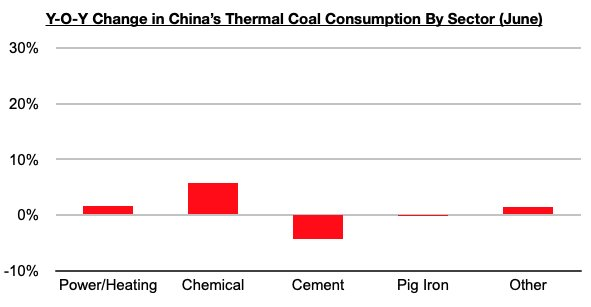
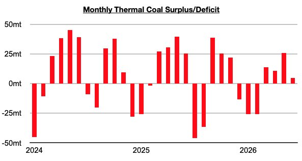
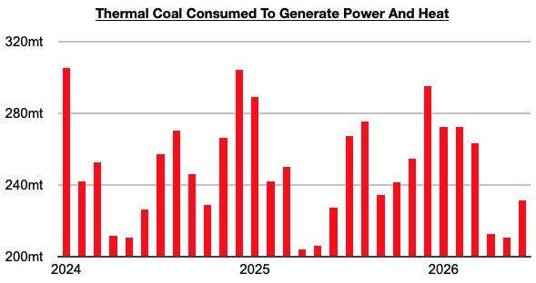

# Near-Term Prospects For China's Coal Imports Remain Bullish

**Date:** July 31, 2026  
**Publisher:** Breakwave Advisors | **Category:** Market Insights  
**Original URL:** [https://www.breakwaveadvisors.com/insights/2026/7/31/near-term-prospects-for-chinas-coal-imports-remain-bullish](https://www.breakwaveadvisors.com/insights/2026/7/31/near-term-prospects-for-chinas-coal-imports-remain-bullish)  

---

*By*[*Jeffrey Landsberg*](https://www.linkedin.com/in/jeffrey-landsberg-70ab957/)

As we discussed in Commodore Research's most recent Weekly China Report, An in-depth examination of China’s most recent thermal coal consumption data by industry (June data) shows that the consumption of thermal coal for power generation and heating, consumption in the chemical industry, and consumption for other industrial needs again grew on a year-on-year basis. Consumption for the production of cement and consumption for the production of pig iron contracted on a year-on-year basis.

> **Figure 1: Chart 1**  
> [Local Asset](file:///C:/Users/Dell/Github/Shipping/corpus/03-breakwave/insights/2026/assets/2026-07-31_near-term-prospects-for-chinas-coal-imports-remain-bullish_img_chart1_4c947e8008bc.jpg)

Consumption for power generation and heating, of course, remains the primary driver of thermal coal consumption. Consumption for power generation and heating has now increased on a year-on-year basis for six straight months. Previously, it had contracted on a year-on-year basis in three of the prior four months.

> **Figure 2: Chart 2**  
> [Local Asset](file:///C:/Users/Dell/Github/Shipping/corpus/03-breakwave/insights/2026/assets/2026-07-31_near-term-prospects-for-chinas-coal-imports-remain-bullish_img_chart2_b6e641dff40e.jpg)

Coal imports prospects are very promising for the near term. July normally sees even greater strength in power generation and heating, and even more strength is also then normally seen every August. This seasonality will occur at the same time that coal production is coming under new government-mandated pressure (due to the catastrophic coal mine accident in Shanxi province). It is also very encouraging that consumption for power generation and heating has increased on a year-on-year basis during each of the last six months.

> **Figure 3: Chart 3**  
> [Local Asset](file:///C:/Users/Dell/Github/Shipping/corpus/03-breakwave/insights/2026/assets/2026-07-31_near-term-prospects-for-chinas-coal-imports-remain-bullish_img_chart3_08cbf48b68cb.jpg)

---

**Tags:** Drybulk, China, Coal  
