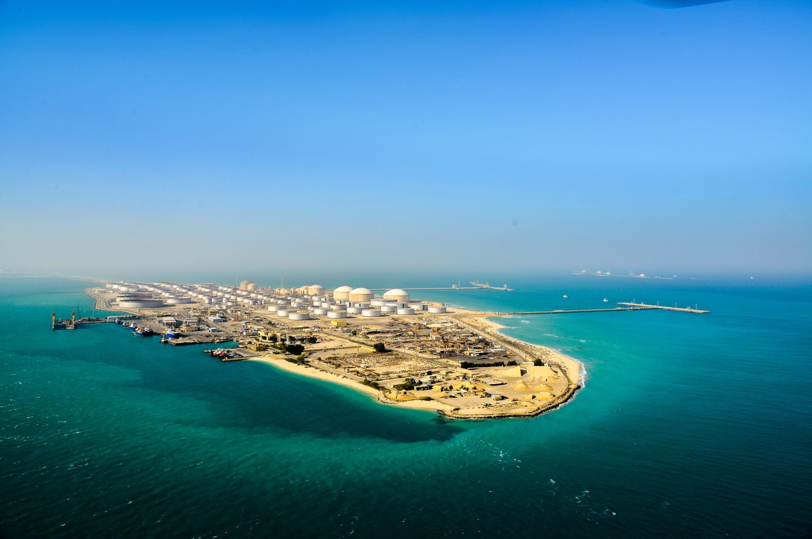
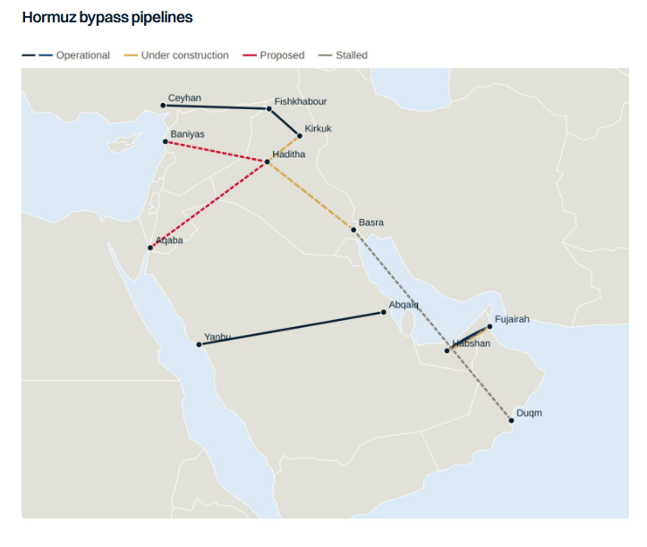

# Prisoners of Geography

**Date:** August 03, 2026  
**Publisher:** Breakwave Advisors | **Category:** Market Insights  
**Original URL:** [https://www.breakwaveadvisors.com/insights/2026/8/3/prisoners-of-geography](https://www.breakwaveadvisors.com/insights/2026/8/3/prisoners-of-geography)  

---

> **Figure 1: Ras Tanura Island**  
> **Interactive Data & Source:** [Gibsons Co](https://www.gibsons.co.uk/market-reports) | [Local Asset](file:///C:/Users/Dell/Github/Shipping/corpus/03-breakwave/insights/2026/assets/2026-08-03_prisoners-of-geography_img_ras-tanura-island_a2d0afa64376.jpg)

As the War in the Middle East drags on, Middle East exporters continue to adapt operations as best they can, with their specific geography and access to routes bypassing the Strait of Hormuz being the primary success factor. Saudi Arabia, the UAE and Oman, who all have access to domestic ports outside Hormuz, have emerged as the “winners”, but still lack sufficient alternative export routes. Iraq has access to the Mediterranean via Turkey and has been trucking fuel oil via Syria but is vulnerable to regional politics and bilateral relations. As regional producers push ahead with expanding their export options outside of Hormuz, monitoring the development of these projects is critical to determining longer term demand trends for tankers.

### Saudi Arabia:

Saudi Arabia is considering expanding its pipeline to the Red Sea by up to 2mbd. Kuwait has said it is in discussions with Riyadh on how to expand the system to accommodate Kuwaiti barrels. It was also reported that refined products were under consideration, yet no timelines were given. However, the main bottleneck is Yanbu loading capacity, with infrastructure improvements at the port needed to realise the full existing 7mbd capacity of the East-West pipeline. Crude loadings at Yanbu averaged 4.65mbd, testing infrastructure to the limit compared to the previous record of 1.7mbd.

### United Arab Emirates:

The UAE is pushing ahead with a second pipeline to Fujairah, which will double capacity to 3.6mbd and provide a sufficient hedge to any future Hormuz disruption. The pipeline could be operational later in 2027 once the associated port infrastructure is complete.

### Iraq:

Iraq, which has been one of the countries most impacted by the Hormuz closure, has long held access to export routes via Turkey to the Mediterranean. Technically, capacity in this route is 1.6mbd but given damage and corrosion to the federally controlled line, only the KRG section is operational. Exports via Turkey at times reached 600kbd, however flows have barely exceeded 200kbd since it restarted in late 2025. Even with the Hormuz closure, Iraq has been unable to leverage this alternative export route. Therefore, the country is now developing a 2.25mbd pipeline connecting Basrah to the Kirkuk-Ceyhan system at Haditha, intending to expand export capacity significantly, if repairs can be made to restore export capacity to Turkey back to 1.5mbd (even if port capacity is insufficient). A second 1mbd pipeline from Haditha to Aqaba in Jordan has also been proposed whilst a MOU was recently agreed with Syria for an 800km 2.5mbd pipeline from Haditha to Baniyas. The timeline for both projects is unclear. A further project linking Basrah to Duqm in Oman appears to have stalled.

### Impact on Tankers:

The key will be which pipelines actually get built and what utilisation levels they run to. Prior to this year, exports from Yanbu rarely exceeded a third of export capacity. The same could be true for Iraqi westbound pipelines which would primarily be used to service European demand. Asian buyers would prefer to load out of the Gulf in “normal” circumstances and given the demand growth is primarily in the East, westbound export routes would likely be underutilised. In the UAE, the impact on tankers would be limited. If exports permanently shift to Fujairah, a small loss in demand would materialise, but this would likely be offset by rising Emirati production. The biggest impact therefore is likely to be on tankers carrying Iraqi volumes to Europe on VLCCs and Suezmaxes, which averaged around 700kbd in 2025. The impact on product tankers is likely to be negligible, with only Saudi Arabia currently considering a products pipeline to the Red Sea.

However, as much as these projects are designed to be an insurance policy for Gulf producers, they would also do the same for tankers, meaning that if the situation in Hormuz were to remain in place for years, or be repeated in the future, the market would be less vulnerable to a loss of cargo than before. Yet, pipelines themselves face security challenges, being hard to defend, particularly in countries where rebel groups and foreign-backed militias also operate, compounded by an era where low-cost drone warfare reduces the sophistication required to disrupt exports.

> **Figure 2: Στιγμιότυπο Οθόνης 2026 08 03 095533**  
> **Interactive Data & Source:** [Gibsons Co](https://www.gibsons.co.uk/market-reports) | [Local Asset](file:///C:/Users/Dell/Github/Shipping/corpus/03-breakwave/insights/2026/assets/2026-08-03_prisoners-of-geography_img_cea3cf84ceb9ceb3cebcceb9cf8ccf84cf85_6883bf22c3bf.png)

Data source:[Gibson Shipbrokers](https://www.gibsons.co.uk/market-reports)

---

**Tags:** Shipping, Markets, Tankers  
