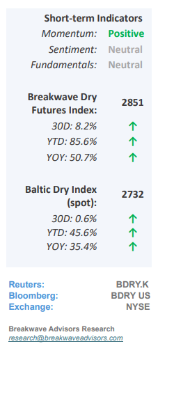
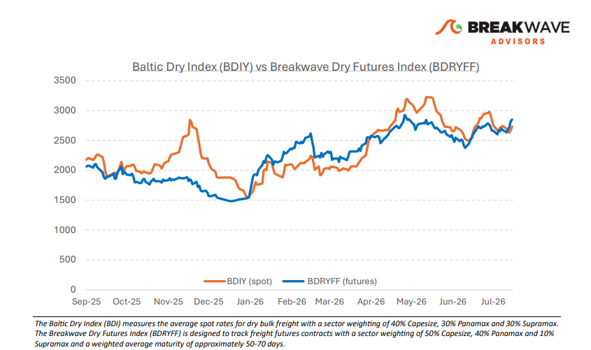
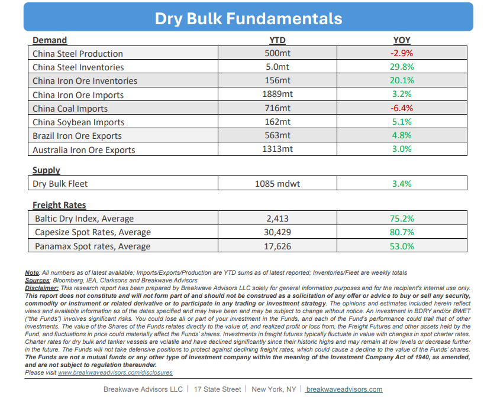

# Breakwave Bi-Weekly Dry Bulk Report - August 4, 2026

**Date:** August 04, 2026  
**Publisher:** Breakwave Advisors | **Category:** Market Insights  
**Original URL:** [https://www.breakwaveadvisors.com/insights/842026db-report2026jjh478kl](https://www.breakwaveadvisors.com/insights/842026db-report2026jjh478kl)  

---

•**Dry Bulk Rate Volatility Collapses as Spot Rates Remain High**– The dry bulk market continues to trade at historically elevated levels with no immediate signs of a correction, while freight rate volatility has collapsed to multi-year lows. Current spot rate strength is primarily sustained by structural vessel supply constraints, driven by ongoing geopolitical disruptions and an intensive global drydocking schedule. However, downside risks are accumulating as weakening demand for iron ore in China, the sector's primary trading commodity, threatens to disrupt the market balance. Because freight rates are fundamentally demand-driven and supplyenabled, the absence of sustained demand growth is gradually tilting the mediumterm outlook. While pinpointing the exact catalyst for a market correction remains challenging, investors should look past the current period of price stability, as macroeconomic fundamentals will ultimately drive medium-term freight dynamics. However, shipowners have been riding a very strong market for multiple years in a row and thus maintain extremely healthy cash balances to weather a potential storm, unlike the 2010’ crisis when major companies where forced to reorganize.

> **Figure 1: Cea3cf84ceb9ceb3cebcceb9cf8ccf84cf85**  
> [Local Asset](file:///C:/Users/Dell/Github/Shipping/corpus/03-breakwave/insights/2026/assets/2026-08-04_842026db-report2026jjh478kl_img_cea3cf84ceb9ceb3cebcceb9cf8ccf84cf85_01b9e6ae0714.png)

•**Iron Ore Prices Drop to 2-Year Lows**– Iron ore prices have retraced to the lower bound of their $90/t to $100/t range, hovering near two-year lows due to subdued Chinese steel demand and elevated portside inventories. While first-half imports remained resilient, sustaining this momentum through the second half appears unlikely without a substantial macroeconomic stimulus package from China. Concurrently, a five-year trend of high inflation, elevated fuel costs, and historically steep freight rates has driven miners' breakeven thresholds significantly above the previous decade averages, threatening the net profitability of several major Atlanticbasin producers once overhead is factored in. Consequently, prices are projected to drift lower in the near term, likely triggering production curtailments that will possibly contract the global seaborne iron ore trade for the remainder of the year.

•**Our Long-term View**– The last few years have been characterized by increased geopolitical uncertainty. Going forward, we expect such events to continue to affect global trade and have a meaningful impact on effective vessel supply. Combined with the potential for a multi-year cyclical rebound in China’s economic activity following the recent economic turmoil, dry bulk shipping should experience higher volatility on top of a secular tightness driven by stable bulk commodity demand and rather steady but elevated fleet growth.

> **Figure 2: Στιγμιότυπο Οθόνης 2026 08 03 230628**  
> [Local Asset](file:///C:/Users/Dell/Github/Shipping/corpus/03-breakwave/insights/2026/assets/2026-08-04_842026db-report2026jjh478kl_img_cea3cf84ceb9ceb3cebcceb9cf8ccf84cf85_cbb3576b6a82.png)

> **Figure 3: Στιγμιότυπο Οθόνης 2026 08 03 230640**  
> [Local Asset](file:///C:/Users/Dell/Github/Shipping/corpus/03-breakwave/insights/2026/assets/2026-08-04_842026db-report2026jjh478kl_img_cea3cf84ceb9ceb3cebcceb9cf8ccf84cf85_e9919527f0cb.png)

### Subscribe:
