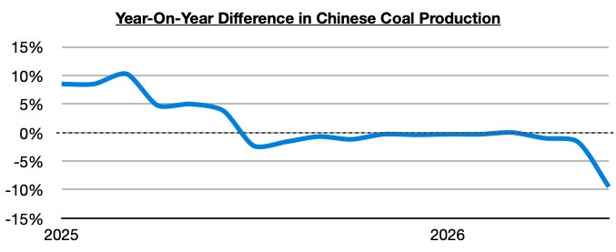
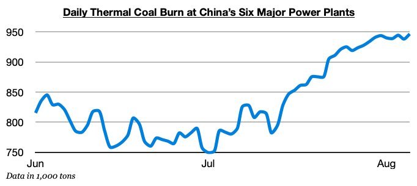

# China's Coal Import Prospects Remain Very Bullish

**Date:** August 06, 2026  
**Publisher:** Breakwave Advisors | **Category:** Market Insights  
**Original URL:** [https://www.breakwaveadvisors.com/insights/2026/8/6/chinas-coal-import-prospects-remain-very-bullish](https://www.breakwaveadvisors.com/insights/2026/8/6/chinas-coal-import-prospects-remain-very-bullish)  

---

*By*[*Jeffrey Landsberg*](https://www.linkedin.com/in/jeffrey-landsberg-70ab957/)

As we have continued to discuss in Commodore Research's Weekly Executive Reports and Weekly China Reports, it has remained incredibly helpful for the dry bulk market that coal production in China is coming under significant government-mandated pressure following May’s catastrophic coal mine accident.

> **Figure 1: Chart 1**  
> [Local Asset](file:///C:/Users/Dell/Github/Shipping/corpus/03-breakwave/insights/2026/assets/2026-08-06_chinas-coal-import-prospects-remain-very-bullish_img_chart1_90877a3247b7.jpg)

Also very helpful is that thermal coal burn is surging. Thermal coal burn at China’s six major power plants has set another 2026 record this week and remains well above last year's burn level. July started out slow, but this summer continues to experience a drastic change. Overall, we remain very bullish for China's near-term coal import prospects.

> **Figure 2: Chart 2**  
> [Local Asset](file:///C:/Users/Dell/Github/Shipping/corpus/03-breakwave/insights/2026/assets/2026-08-06_chinas-coal-import-prospects-remain-very-bullish_img_chart2_d2e4b53a5f56.jpg)

---

**Tags:** Drybulk, China, Coal  
